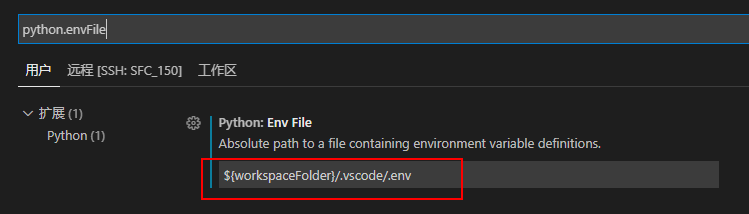
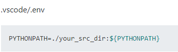

# 问题: 使用sys.path.append(xxxpath)方式添加包的搜索路径后，代码虽然可以正常执行，但pylint会有告警提示．
解决方法：配置pylintArgs＋设置PYTHONPATH包搜索路径
```
    "python.linting.pylintArgs": [
        "--errors-only",
        "--disable=E0401"
    ],
```
## 在vscode中设置PYTHONPATH
1. 设置环境配置文件. 默认是`${workspaceFolder}/.env`,我修改为`${workspaceFolder}/.vscode/.env`


2. 在.env文件中配置需要的环境变量．


```
# 我的settings.json文件
{
    "python.pythonPath": "E:\\anaconda3\\envs\\py37_tf2x\\python.exe",
    "python.dataScience.sendSelectionToInteractiveWindow": true,
    "editor.fontSize": 17,
    "terminal.integrated.shell.windows": "C:\\Windows\\System32\\cmd.exe",
    "editor.minimap.enabled": false,
    "window.zoomLevel": 0,
    "remote.SSH.showLoginTerminal": true,
    "remote.SSH.useLocalServer": false,
    "remote.SSH.configFile": "C:\\Users\\gjy\\.ssh\\config",
    "remote.SSH.remotePlatform": {
        "SFC_150": "linux"
    },
    "git.ignoreLegacyWarning": true,
    "terminal.integrated.shell.linux": "/bin/bash",
    "editor.fontFamily": "'Microsoft YaHei Mono', Consolas, 'Courier New', monospace",
    "terminal.integrated.fontWeight": 50,
    "terminal.integrated.fontSize": 16,
    "diffEditor.ignoreTrimWhitespace": true,
    "terminal.integrated.inheritEnv": false,
    "python.linting.pylintArgs": [
        "--errors-only",
        "--disable=E0401"
    ],
    "python.terminal.activateEnvironment": false,
    "terminal.integrated.env.linux": {
    },
    "python.envFile": "${workspaceFolder}/.vscode/.env"
}
```