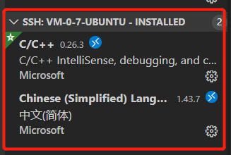

# VS开发环境配置
[VS远程开发环境配置](https://blog.csdn.net/qq_45224600/article/details/104944858)

## 配置远程开发环境
vscode上安装Remote Development插件，并进行远程配置。

调试运行C++代码，需要安装的插件



## 配置tasks.json
从菜单栏选择Terminal>Configure Default Build Task, 在下拉栏里选择C/C++: g++ build active file. 这会生成tasks.json文件。
-- 对应编译任务
```
{
// 有关 tasks.json 格式的文档，请参见
    // https://go.microsoft.com/fwlink/?LinkId=733558
    "version": "2.0.0",
    "tasks": [
        {
            "type": "shell",
            "label": "g++ build active file",
            "command": "/usr/bin/g++",
            "args": [
                "-std=c++11",
                "-g",
                "${file}",
                "-o",
                "${fileDirname}/${fileBasenameNoExtension}"
            ],
            "options": {
                "cwd": "/usr/bin"
            },
            "problemMatcher": [
                "$gcc"
            ],
            "group": {
                "kind": "build",
                "isDefault": true
            }
        },
        {   //删除二进制文件
            "type": "shell",
            "label": "delete output file",
            "command": "rm",
            "args": [
                "${fileDirname}/${fileBasenameNoExtension}"
            ],
            "presentation": {
                "reveal": "silent", //删除过程不切换终端（专注程序输出）
            }
        }
    ]
}

```


## 配置launch.json
在菜单栏选择Debug>Add Configuration, 选择C++ (GDB/LLDB), 在下拉栏中选择g++ build and debug active file.这会创建launch.json。
-- 对应debug
```
{
    // 使用 IntelliSense 了解相关属性。 
    // 悬停以查看现有属性的描述。
    // 欲了解更多信息，请访问: https://go.microsoft.com/fwlink/?linkid=830387
    "version": "0.2.0",
    "configurations": [
        {
            "name": "g++ build and debug active file",
            "type": "cppdbg",
            "request": "launch",
            "program": "${fileDirname}/${fileBasenameNoExtension}",
            "args": [],
            "stopAtEntry": false,
            "cwd": "${workspaceFolder}",
            "environment": [],
            "externalConsole": false,
            "MIMode": "gdb",
            "setupCommands": [
                {
                    "description": "为 gdb 启用整齐打印",
                    "text": "-enable-pretty-printing",
                    "ignoreFailures": true
                }
            ],
            "preLaunchTask": "g++ build active file",
            "postDebugTask": "delete output file",
            "miDebuggerPath": "/usr/bin/gdb"
        }
    ]
}

```
