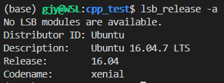
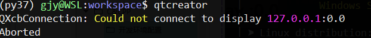
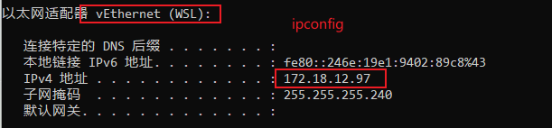
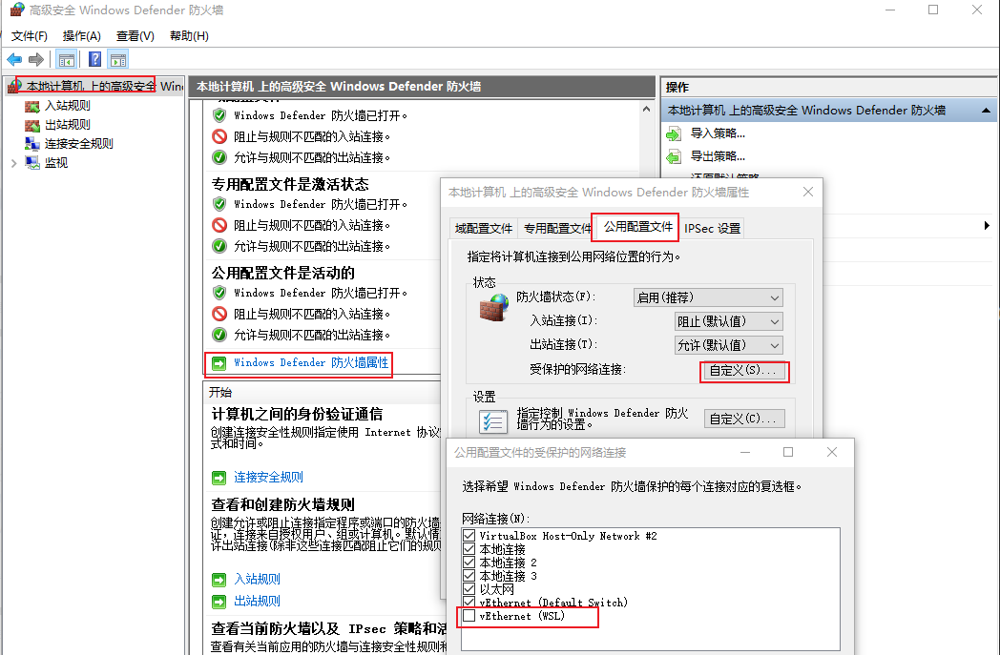

# WSL 安装
[wsl安装](https://zhuanlan.zhihu.com/p/466001838)

# WSL+Qt环境配置

参考： [https://blog.csdn.net/xuanwolanxue/article/details/108636640](https://blog.csdn.net/xuanwolanxue/article/details/108636640)

## 环境
宿主系统： Windows10
虚拟环境： WSL2
系统环境：Ubuntu 16.04


## 相关包的安装
在WSL2的Ubuntu环境下如何安装Qt以及QtCreator，核心内容就是如下几条命令：
sudo apt-get update
sudo apt-get install build-essential gdb
sudo apt-get install qtcreator
sudo apt-get install qt5-default
sudo apt-get install libfontconfig1
sudo apt-get install mesa-common-dev
sudo apt-get upgrade

## 图形界面配置
直接通过MobaXterm就可以执行带UI的应用(因为mobaxterm自带xserver)。
相关报错及处理方法：
1. QXcbConnection: Could not connect to display XXX

解决方法：配置DISPLAY环境变量

`export DISPLAY=172.18.12.97:0.0`

2. 防火墙配置
为WSL禁用整个防火墙


```
powershell.exe -Command "Set-NetFirewallProfile -DisabledInterfaceAliases \"vEthernet (WSL)\""
```

VSCode+X11+GUI配置参考:
[win10上WSL+vscode+xserver](https://blog.csdn.net/dinghua4921/article/details/101731738/)
[vscode + remote x11插件 +xserver 终端实现远程GUI显示](https://www.jianshu.com/p/66875a1f294b)