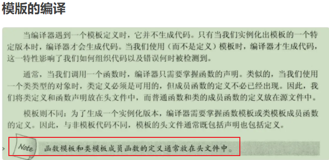
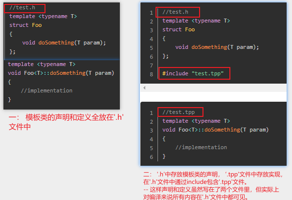
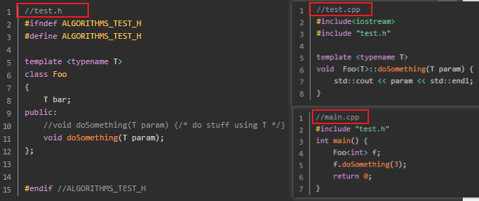
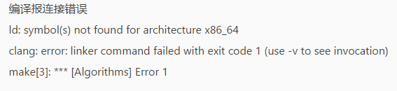

# 模板类
**模板类的声明和定义不要分别放在'.h'和'.cpp'中。建议，模板的声明和定义都放在'.h'文件中。**
因为模板类只有在'实例化模板'时才会创建出真正可以使用的类。

如果采取'.h'文件存放模板声明， '.cpp'文件存放模板定义的结构。那么在其它cpp文件中通过'#include包含该头文件'并试图实例化模板时,将出现编译报错。-- 究其原因是因为模板只有在'被使用'时才会知道自己长什么样。

### 正确的模板声明和定义结构

### 错误的模板声明和定义结构

参考[https://www.jianshu.com/p/bd2e05aabf7a](https://www.jianshu.com/p/bd2e05aabf7a)