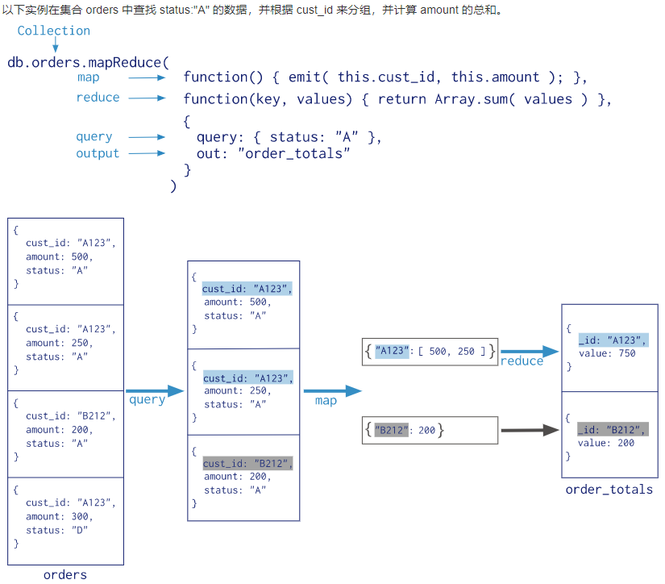

# MongoDB高级教程

## MongoDB 关系

MonogoDB文档间可以通过嵌入和引用来建立联系。
MongoDB 中的关系可以是：
1:1 (1对1)
1: N (1对多)
N: 1 (多对1)
N: N (多对多)
```
// user结构
{
   "_id": ObjectId("52ffc33cd85242f436000001"),
   "name": "张三",
   "contact": "987654321",
   "dob": "01-01-1991"
}

// address结构
{
   "_id":ObjectId("52ffc4a5d85242602e000000"),
   "building": "XX街道,YY号",
   "pincode": 123456,
   "state": "湖南",
   "city": "怀化"
}
```

## 嵌入式关系
```
{
   "_id":ObjectId("52ffc33cd85242f436000001"),
   "contact": "987654321",
   "dob": "01-01-1991",
   "name": "张三",
   "address": [
      {
         "building": "XX街道,YY号",
         "pincode": 123456,
         "state": "湖南",
         "city": "怀化"
      },
      {
         "building": "XXX街道,YYY号,
         "pincode": 456789,
         "state": "湖南",
         "city": "长沙"
      }
   ]
}

// 用户的地址信息查询
db.users.findOne({"name":"张三"},{"address":1})
```

## 引用式关系
```
{
   "_id":ObjectId("52ffc33cd85242f436000001"),
   "contact": "987654321",
   "dob": "01-01-1991",
   "name": "Tom Benzamin",
   "address_ids": [
      ObjectId("52ffc4a5d85242602e000000"),
      ObjectId("52ffc4a5d85242602e000001")
   ]
}

// 用户的地址信息查询
var result = db.users.findOne({"name":"张三"},{"address_ids":1})
var addresses = db.address.find({"_id":{"$in":result["address_ids"]}})
```


**MongoDB 引用有两种**：
* 手动引用（Manual References）
* DBRefs
一个文档从多个集合中引用文档时，我们应该使用 DBRefs.


**DBRef的形式**：
   ` { $ref :XXX, $id : XXX, $db :XXXX  }`
**三个字段表示的意义为**：
* $ref：集合名称
* $id：引用的id
* $db: 数据库名称，可选参数
```
{
   "_id":ObjectId("52ffc33cd85242f436000001"),
   "contact": "987654321",
   "dob": "01-01-1991",
   "name": "Tom Benzamin",
   "address":{
     "home": {"$ref": "address_home", "$id": ObjectId("52ffc4a5d85242602e000000")},
     "office": {"$ref": "address_office", "$id": ObjectId("52ffc4a5d85242602e000001")}
   }
}

// 用户的地址信息查询
var user = db.users.findOne({"name": "张三"})
var dbRef = user.address.home
db[dbRef.$ref].findOne({"_id":ObjectId(dbRef.$id)})
```

## MongoDB 覆盖索引查询
官方的MongoDB的文档中说明，覆盖查询是以下的查询：
所有的查询字段是索引的一部分
所有的查询返回字段在同一个索引中

使用覆盖索引查询时要注意，由于在查询中_id会默认返回，如果_id上没有创建索引，那么就不会使用覆盖索引查询。

## MongoDB 查询分析
MongoDB 查询分析可以确保我们所建立的索引是否有效，是查询语句性能分析的重要工具。
MongoDB 查询分析常用函数有：explain() 和 hint()。


## MongoDB 原子操作
mongodb不支持事务，但是mongodb提供了许多原子操作，比如文档的保存，修改，删除等，都是原子操作。

### 原子操作常用命令
**$set**
用来指定一个键并更新键值，若键不存在并创建。{ $set : { field : value } }
**$unset**
用来删除一个键。{ $unset : { field : 1} }
**$inc**
$inc可以对文档的某个值为数字型（只能为满足要求的数字）的键进行增减的操作。{ $inc : { field : value } }
**$push**
将数据追加到数组字段中, 如果指定的数组字段不存在则会创建一个数组字段。
用法：{ $push : { field : value } }
**$pushAll**
同$push,只是一次可以追加多个值到一个数组字段内。{ $pushAll : { field : value_array } }
**$pull**
从数组field内删除一个值等于value的元素。{ $pull : { field : _value } }
**$addToSet**
增加一个值到数组内，而且只有当这个值不在数组内才增加。
**$pop**
删除数组的第一个或最后一个元素： { $pop : { field : 1 } }，  { $pop : { field : -1 } }
**$rename**
修改字段名称： { $rename : { old_field_name : new_field_name } }
**$bit**
位操作，integer类型。 {$bit : { field : {and : 5}}}


```Eg
// 可以使用 db.collection.findAndModify() 方法来查找并更新
book = {
          _id: 123456789,
          title: "MongoDB: The Definitive Guide",
          author: [ "Kristina Chodorow", "Mike Dirolf" ],
          published_date: ISODate("2010-09-24"),
          pages: 216,
          language: "English",
          publisher_id: "oreilly",
          available: 3,
          checkout: [ { by: "joe", date: ISODate("2012-10-15") } ]
        }
db.books.insert(book)

db.books.findAndModify ( {
   query: {
            _id: 123456789,
            available: { $gt: 0 }
          },
   update: {
             $inc: { available: -1 },
             $push: { checkout: { by: "abc", date: new Date() } }
           }
} )
```

## MongoDB 高级索引
```
{
   "address": {
      "city": "Los Angeles",
      "state": "California",
      "pincode": "123"
   },
   "tags": [
      "music",
      "cricket",
      "blogs"
   ],
   "name": "Tom Benzamin"
}

// 为数组 tags 创建索引时，会为 music、cricket、blogs三个值建立单独的索引
db.users.ensureIndex({"tags":1})
db.users.find({tags:"cricket"}) // 使用索引

// 对子文档建立索引
db.users.ensureIndex({"address.city":1,"address.state":1,"address.pincode":1})
db.users.find({"address.city":"Los Angeles"}) // 使用索引
```

## 索引限制
**索引不能被以下的查询使用**:
1. 正则表达式及非操作符，如 $nin, $not, 等。
2. 算术运算符，如 $mod, 等。
3. $where 子句
所以，检测你的语句是否使用索引是一个好的习惯，可以用explain来查看。


## MongoDB Map Reduce
MapReduce 命令
```
db.collection.mapReduce(
   function() {emit(key,value);},  //map 函数
   function(key,values) {return reduceFunction},   //reduce 函数
   { // 其他参数
      out: collection,
      query: document,
      sort: document,
      limit: number
   }
)
```
使用 MapReduce 要实现 Map 函数和 Reduce 函数,
Map 函数调用 emit(key, value), 遍历 collection 中所有的记录, 将 key 与 value 传递给 Reduce 函数进行处理。
**参数说明**:
map：映射函数 (生成键值对序列,作为 reduce 函数参数)。
reduce 统计函数，reduce函数的任务就是将key-values变成key-value，也就是把values数组变成一个单一的值value。。
out 统计结果存放集合 (不指定则使用临时集合,在客户端断开后自动删除)。
query 一个筛选条件，只有满足条件的文档才会调用map函数。（query。limit，sort可以随意组合）
sort 和limit结合的sort排序参数（也是在发往map函数前给文档排序），可以优化分组机制
limit 发往map函数的文档数量的上限（要是没有limit，单独使用sort的用处不大）




## MongoDB 正则表达式
MongoDB 使用 $regex 操作符来设置匹配字符串的正则表达式。
MongoDB使用PCRE (Perl Compatible Regular Expression) 作为正则表达式语言。
```
db.posts.find({post_text:{$regex:"runoob"}})
db.posts.find({post_text:/runoob/}) // 效果同上
```

**不区分大小写的正则表达式**
如果检索需要不区分大小写，我们可以设置 $options 为 $i。
```
db.posts.find({post_text:{$regex:"runoob",$options:"$i"}})
db.posts.find({post_text:eval("/runoob/i") // 效果同上
```


