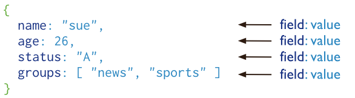
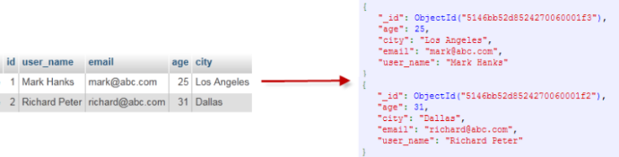
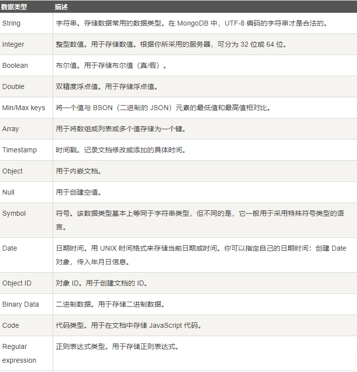
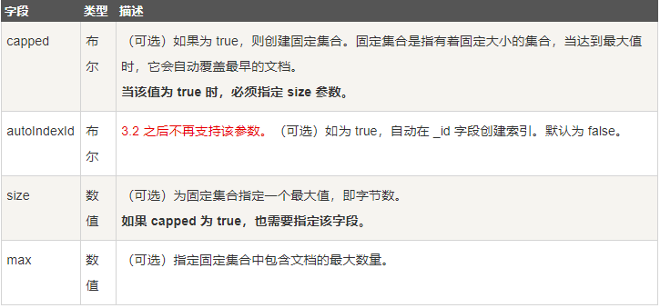
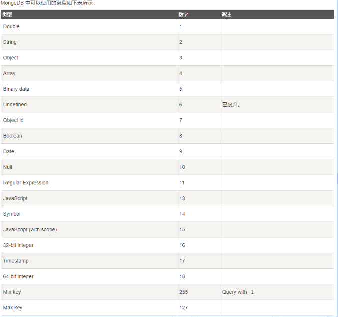
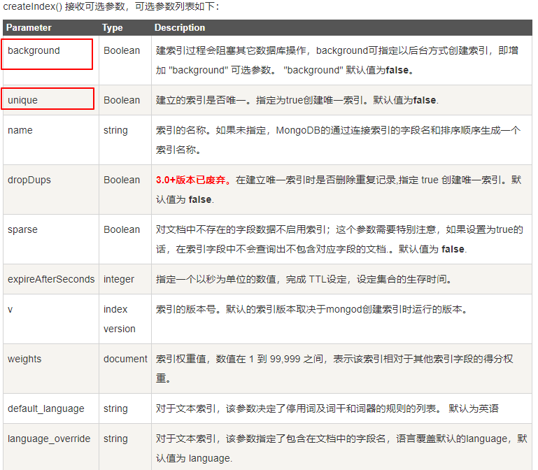

```
# 默认配置文件路径
/etc/mongod.conf

# 启动服务
sudo systemctl start mongod
# 验证MongoDB是否已成功启动
sudo systemctl status mongod
# 系统启动时自动启动服务
sudo systemctl enable mongod
# 停止MongoDB
sudo systemctl stop mongod
# 重新启动MongoDB
sudo systemctl restart mongod
# 停止MongoDB
sudo service mongod stop
# 删除软件包
sudo apt-get purge mongodb-org*

```

## 在 WSL (Ubuntu 20.04) 上安装 MongoDB（版本 5.0）：
[wsl-database: wsl安装mongodb](https://learn.microsoft.com/zh-cn/windows/wsl/tutorials/wsl-database)
[service mongod start启动失败问题](https://blog.csdn.net/dta0502/article/details/84647982)

```
sudo service mongodb status 用于检查数据库的状态。 如果没有正在运行的数据库，应该会看到 [Fail] 响应。
sudo service mongodb start 用于开始运行数据库。 应会看到 [Ok] 响应。
sudo service mongodb stop 用于停止运行数据库。
```


# MonogoDB

MongoDB 将数据存储为一个文档，数据结构由键值(key=>value)对组成。
MongoDB 文档类似于 JSON 对象。字段值可以包含其他文档，数组及文档数组。



## 主要特点
1. 可以在MongoDB记录中设置任何属性的索引 (如：FirstName="Sameer",Address="8 Gandhi Road")来实现更快的排序。
2. Mongo支持丰富的查询表达式。查询指令使用JSON形式的标记，可轻易查询文档中内嵌的对象及数组。
3. MongoDb 使用update()命令可以实现替换完成的文档（数据）或者一些指定的数据字段 。
4. Mongodb中的Map/reduce主要是用来对数据进行批量处理和聚合操作。
    Map函数调用emit(key,value)遍历集合中所有的记录，将key与value传给Reduce函数进行处理。

## MongoDB 工具
有几种可用于MongoDB的管理工具。
**监控**
MongoDB提供了网络和系统监控工具Munin
Gangila是MongoDB高性能的系统监视的工具
基于图形界面的开源工具 Cacti, 用于查看CPU负载, 网络带宽利用率
**GUI**
Database Master — Windows的mongodb管理工具

**mongostat**
mongostat是mongodb自带的命令行状态检测工具。它会间隔固定时间获取mongodb的当前运行状态，并输出。
如果你发现数据库突然变慢或者有其他问题的话，你第一手的操作就考虑采用mongostat来查看mongo的状态。
**mongotop**
mongotop是mongodb下的一个内置工具，mongotop提供了一个方法，用来跟踪一个MongoDB的实例，查看哪些大量的时间花费在读取和写入数据。
mongotop提供每个集合的水平的统计数据。

## Windows下MongoDB服务相关命令
**Note**：以管理员身份运行cmd.exe
0. 安装服务: (默认Mongodb; 配置文件中通过serviceName指定)
    D:/Software/mongodb4/bin/mongod.exe --config "D:/Software/mongodb4/mongod.cfg" --install 
1. 启动服务：net start [Mongodb服务名]。
    eg: net start MongoDB
2. 停止服务：net stop [Mongodb服务名]。
    eg: net stop MongoDB
3. 移除 MongoDB 服务
   eg: mongod.exe --remove
4. 进入终端: mongo

## MongoDB常用命令
1. 显示所有数据库：show dbs
2.创建/切换数据库( 不存在创建,存在则切换): use dbname
    删除数据库:  db.dropDatabase() -- 需要先切换到指定数据库
3. 显示数据库所有表: show collections
    创建collection: db.createCollection("t_runoob")
    删除collection: db.t_runoob.drop()
4. 切换到执行表: use tablename
5. 创建表索引：db.tablename.ensureIndex({"id":1,"resource_id":1})//在表tablename的字段id,resource_id建立索引
6. 获取正在进行的操作：db.currentOp()


## MonogDB基础概念
| SQL术语/概念 | SQL术语/概念 |           SQL术语/概念            |
| ----------- | ----------- | -------------------------------- |
| database    | database    | 数据库                            |
| table       | collection  | 数据库表/集合                      |
| row         | document    | 数据记录行/文档                    |
| column      | field       | 数据字段/域                       |
| index       | index       | 索引                              |
| table joins |             | 表连接,MongoDB不支持               |
| primary key | primary key | 主键,MongoDB自动将_id字段设置为主键 |



**数据库名**: 小写的C语言标识符.最多64字节.

**特殊作用的数据库**
1. admin： 从权限的角度来看，这是"root"数据库。
2. local: 这个数据永远不会被复制，可以用来存储限于本地单台服务器的任意集合
3. config: 当Mongo用于分片设置时，config数据库在内部使用，用于保存分片的相关信息。

**需要注意的是**:
1. 文档中的键/值对是有序的。
2. 文档中的值不仅可以是在双引号里面的字符串，还可以是其他几种数据类型（甚至可以是整个嵌入的文档)。
3. MongoDB区分类型和大小写。
4. MongoDB的文档不能有重复的键。
5. 文档的键是字符串。除了少数例外情况，键可以使用任意UTF-8字符。


## capped collections
Capped collections 就是固定大小的collection
Capped collections : 可高性能自动的维护对象的插入顺序, 以及队列过期的特性(过期按照插入的顺序).
Capped collections 可以按照文档的插入顺序保存到集合中，而且这些文档在磁盘上存放位置也是按照插入顺序来保存的，
所以当我们更新Capped collections 中文档的时候，更新后的文档不可以超过之前文档的大小.

在 capped collection 中，你能添加新的对象。
能进行更新，然而，对象不会增加存储空间。如果增加，更新就会失败 。
使用 Capped Collection 不能删除一个文档，可以使用 drop() 方法删除 collection 所有的行。
删除之后，你必须显式的重新创建这个 collection。


## 元数据
数据库的信息是存储在集合中。它们使用了系统的命名空间：dbname.system.*


### MongoDB 几种常用的数据类型




**ObjectId**

可以通过 getTimestamp 函数来从ObjectId当中获取文档的创建时间
```
var newObject = ObjectId()
newObject.getTimestamp()
```
MongoDB中存储的文档必须有一个"_id"键。这个键的值可以是任何类型的，默认是个ObjectId对象。

## 标准 URI 连接语法：
mongodb://[username:password@]host1[:port1][,host2[:port2],...[,hostN[:portN]]][/[database][?options]]
options: 'key1=value1[&key2=value2[&...]]'

## MongoDB 创建集合
db.createCollection(name, options)
options: 可选参数, 指定有关内存大小及索引的选项



## 插入文档
db.collection.insert(): 若插入的数据主键已经存在，则会抛 org.springframework.dao.DuplicateKeyException 异常
db.collection.insertOne(): 用于向集合插入一个新文档.
db.collection.insertMany(): 用于向集合插入一个多个文档
db.collection.replaceOne(): 如果 _id 主键存在则更新数据，如果不存在就插入数据
```
db.COLLECTION_NAME.insert(document)

var document = db.collection.insertOne({"a": 3})

var res = db.collection.insertMany([{"b": 3}, {'c': 4}])
```
**参数说明**:
document：要写入的文档。
writeConcern：写入策略，默认为 1，即要求确认写操作，0 是不要求。
ordered：指定是否按顺序写入，默认 true，按顺序写入。

 **更新文档**
update() 方法: 用于更新已存在的文档。语法格式如下：
```
db.collection.update(
   <query>,
   <update>,
   {
     upsert: <boolean>,
     multi: <boolean>,
     writeConcern: <document>
   }
)
```
**参数说明**：
query : update的查询条件，类似sql update查询内where后面的。
update : update的对象和一些更新的操作符（如$,$inc...）等，也可以理解为sql update查询内set后面的
upsert : 可选，这个参数的意思是，如果不存在update的记录，是否插入objNew,true为插入，默认是false，不插入。
multi : 可选，mongodb 默认是false,只更新找到的第一条记录，如果这个参数为true,就把按条件查出来多条记录全部更新。
writeConcern :可选，抛出异常的级别

## MongoDB 删除文档
MongoDB remove()函数是用来移除集合中的数据。
在执行remove()函数前先执行find()命令来判断执行的条件是否正确，是一个比较好的习惯。
```
db.collection.remove(
   <query>,
   {
     justOne: <boolean>,
     writeConcern: <document>
   }
)
```
**参数说明**:
query :（可选）删除的文档的条件。
justOne : （可选）如果设为 true 或 1，则只删除一个文档，如果不设置该参数，或使用默认值 false，则删除所有匹配条件的文档。
writeConcern :（可选）抛出异常的级别。

## MongoDB 查询文档
```
db.collection.find(query, projection)
```
**参数说明**:
query ：可选，使用查询操作符指定查询条件
projection ：可选(默认返回所有字段)，指定要返回的字段(_id字段默认包含)。

**PS**: findOne() 只返回一个文档

### MongoDB查询条件写法
|  操作	   |                       格式                        |                  范例                  |                      说明                      |
| ---------- | ------------------------------------------------- | -------------------------------------- | ---------------------------------------------- |
| 等于       | {key:value}                                       | db.col.find({"age":26})                | where age=26                                   |
| 小于       | {key:{$lt:value}}                                 | db.col.find({"age":{$lt:35}})          | where age<35                                   |
| 小于或等于  | {key:{$lte:value}}                                | db.col.find({"age":{$gt:35}})          | where age<=35                                  |
| 大于       | {key:{$gt:value}}                                 | db.col.find({"age":{$gt:35}})          | where age>35                                   |
| 大于或等于  | {key:{$gte:value}}	                             | db.col.find({"age":{$gte:35}})         | where age>=35                                  |
| 不等于      | {key:{$ne:value}}                                 | db.col.find({"age":{$ne:35}})          | where age!=35                                  |
| ---------  | ------------------                                | ------------------------------         | -------------                                  |
| and条件	 | {key:{条件1, 条件2, ...}, key2:{条件1, 条件2, ...}} | {age:{$gt:18, $lt:35}, name:'张三'}    | where (age>18 and age<35) <br> and name='张三' |
| or条件	     | {$or:[条件1, 条件2, ...]}                          | {$or:[{age:{$gt:35}}, {age:{$lt:18}}]} | where age>35 or age<18                         |

**MongoDB AND 条件**
MongoDB 的 find() 方法可以传入多个键(key)，每个键(key)以逗号隔开，即常规 SQL 的 AND 条件。
```
# 同一个key的and条件
db.col.find({key:{条件1, 条件2, ...}})
# 不同key之间的and条件
db.col.find({key1:value1, key2:value2, ...})
```

**MongoDB OR 条件**
MongoDB OR 条件语句使用了关键字 $or,语法格式如下：
```
db.col.find(
   {
      $or: [
         {key1: value1}, {key2:value2}
      ]
   }
)
```


### MongoDB $type 操作符
$type操作符是基于BSON类型来检索集合中匹配的数据类型，并返回结果


## Limit与Skip方法
limit(): 指定最大返回记录条数 -- 类比mysql limit
`db.COLLECTION_NAME.find().limit(NUMBER)`

skip(): 跳过指定数量的数据
`db.COLLECTION_NAME.find().skip(NUMBER)`

skip + limit 可以实现分页功能 == 但效率很低,应该避免使用.

## 排序
使用 sort() 方法对数据进行排序，sort() 方法可以通过参数指定排序的字段，并使用 1(升序排列) 和 -1(降序排列) 来指定排序的方式.
`db.COLLECTION_NAME.find().sort({key1:orderType, key2:orderType, ...})`

## 索引
createIndex() 创建索引
`db.collection.createIndex(keys, options)`
keys 值为你要创建的索引字段; 1按升序创建索引，-1按降序创建索引.
```
db.col.createIndex({"title":1})

// 可以设置使用多个字段创建索引（关系型数据库中称作复合索引）。
db.col.createIndex({"title":1, "description":-1})
```


**索引的其他操作**:
1. 查看集合索引
db.col.getIndexes()
2. 查看集合索引大小
db.col.totalIndexSize()
3. 删除集合所有索引
db.col.dropIndexes()
4. 删除集合指定索引
db.col.dropIndex("索引名称")

## 聚合
aggregate() 方法
`db.COLLECTION_NAME.aggregate(AGGREGATE_OPERATION)`

```Eg
 db.mycol.aggregate([{$group : {_id : "$by_user", num_tutorial : {$sum : 1}}}])
```


常用聚合函数:
|  表达式   |  描述   |  实例   |
| --- | --- | --- |
|  $sum   |  计算总和   | db.col.aggregate([{$group : {_id : "$name", group_sum_age : {$sum : "$age"}}}]) <br>db.col.aggregate([{$group : {_id : "$name", group_name_count : {$sum : 1}}}])   |
| $avg    | 计算平均值    |  db.col.aggregate([{$group : {_id : "$name", group_avg_age : {$avg : "$age"}}}])   |
| $min  |  最小值   |  db.col.aggregate([{$group : {_id : "$name", group_min_age : {$min : "$age"}}}])   |
| $max    |  最大值   | db.col.aggregate([{$group : {_id : "$name", group_max_age : {$max : "$age"}}}])      |
| $push   | 将分组数据收集到一个数组中    | db.col.aggregate([{$group : {_id : "$name", group_array_age : {$push: "$age"}}}])    |
| $addToSet    | 将分组数据收集到一个数组中,<br>但不创建副本   |  db.col.aggregate([{$group : {_id : "$name", group_set_age : {$addToSet : "$age"}}}])   |
| $first    |  根据排序取第一个数据   | db.col.aggregate([{$group : {_id : "$name", group_first_age : {$first : "$age"}}}])    |
| $last    |  根据排序取最后一个数据   |  db.col.aggregate([{$group : {_id : "$name", group_first_age : {$last : "$age"}}}])    |


## 管道
MongoDB的聚合管道将MongoDB文档**在一个管道处理完毕后将结果传递给下一个管道处理**。管道操作是可以重复的。
**聚合框架中常用的几个操作**:
* $project：修改输入文档的结构。可以用来重命名、增加或删除域，也可以用于创建计算结果以及嵌套文档。
* $match：用于过滤数据，只输出符合条件的文档。$match使用MongoDB的标准查询操作。
* $limit：用来限制MongoDB聚合管道返回的文档数。
* $skip：在聚合管道中跳过指定数量的文档，并返回余下的文档。
* $unwind：将文档中的某一个数组类型字段拆分成多条，每条包含数组中的一个值。
* $group：将集合中的文档分组，可用于统计结果。
* $sort：将输入文档排序后输出。
* $geoNear：输出接近某一地理位置的有序文档。


**Note**: 管道中的操作是按照顺序进行的.

```Eg
 //  管道连接多个操作
 db.col.aggregate([
    { $project: // 取指定字段
       {_id: 0, // 默认会返回,不需要返回时要显示说明
		name: 1,
		age: 1}
	},
	{ $match: // 过滤上一个管道返回的数据
		{age: { $gte: 18, $lte: 35 }}
	},
	{ $group: // 对上一个管道返回的数据进行分组
		{ _id: '$name', group_count: { $sum: 1 }}
	},
	{ $sort: // 上一个管道返回的数据数据进行排序
		{'_id': 1, 'group_count': 1}
	},
	]
 )
```


## 常用函数
### 时间相关
* $dayOfYear: 返回该日期是这一年的第几天(全年 366 天).
* $dayOfMonth: 返回该日期是这一个月的第几天(1到31).
* $dayOfWeek: 返回的是这个周的星期几(1:星期日,7:星期六).
* $year: 返回该日期的年份部分.
* $month: 返回该日期的月份部分( 1 到 12).
* $week: 返回该日期是所在年的第几个星期( 0 到 53).
* $hour: 返回该日期的小时部分.
* $minute: 返回该日期的分钟部分.
* $second: 返回该日期的秒部分(以0到59之间的数字形式返回日期的第二部分,但可以是60来计算闰秒).
* $millisecond:返回该日期的毫秒部分( 0 到 999).
* $dateToString: { $dateToString: { format: , date: } }.


## Code Eg
```mongodb
use test
db.col.drop() // 清空
db.col.insert({
    name: '张3', 
    addr: '湖南 张家界',
    age: 26,
    tags: ['蓝球', '程序员', '电影'],
})
db.col.insert({
    name: '张3', 
    addr: '湖南 吉首',
    age: 18,
    tags: ['学生', '游泳'],
})
db.col.insert({
    name: '张一', 
    addr: '广西 桂林',
    age: 38,
    tags: ['教师', '电影'],
})
 
db.col.insert({
    name: '李四', 
    addr: '湖南 长沙',
    age: 17,
    tags: ['学生', '跑步'],
})
db.col.insert({
    name: '李四', 
    addr: '山西 太原',
    age: 32,
    tags: ['银行', '摄影'],
})

db.col.insert({
    name: '王五', 
    addr: '云南 昆明',
    age: 36,
    tags: ['旅游', '航模'],
})
db.col.insert({
    name: '王五', 
    addr: '湖北 武汉',
    age: 25,
    tags: ['工程师', '航模'],
})
db.col.insert({
    name: '王三', 
    addr: '河南 开封',
    age: 50,
    tags: ['象棋'],
})

 db.col.find() // 查询全部
 db.col.find({}, {'name':true, 'addr':true}) // 查询全部,但只返回指定列
 
 
// ----- 更新操作 -----
// db.col.update({'name':'李四'}, {$set:{'age':33}}) // 更新找到的第一条记录
 db.col.update({'name':'张3'}, {$set:{'name':'张三'}}, {multi:true}) // 更新所有记录
 db.col.update({'name':'张三'}, {$set:{'addr':'北京'}, '$push': {'tags': {$each: ['钢琴', '动漫'], $sort:1}}}) // 向tags数组中添加多个元素,并进行排序

// ----- 删除操作 -----
// db.col.find({'name': '张三'})
// db.col.remove({'name': '张三'}) // 删除所有满足查询条件的数据
// db.col.find()
// db.col.remove({'name': '李四'}, true) //删除满足查询条件的第一条数据
// db.col.find()
// db.col.remove({}) // 删除所有数据
// db.col.find()


 // ----- 条件查询 -----
 db.col.find({age:18}) // where age=18
 db.col.find({age:{$gt:18}}) // where age>18
 db.col.find({age:{$gte:18}}) // where age>=18
 db.col.find({age:{$lt:35}}) // where age<35
 db.col.find({age:{$gt:18, $lt:35}}) // where age>18 and age<35
 db.col.find({age:{$gt:18}, name:'李四'}) // where age>18 and name='李四'
 db.col.find({age:{$gt:18, $lt:30}, name:'李四'}) // where (age>18 and age<30) and name='李四'
 db.col.find({$or:[{age:{$lt:18}}, {age:{$gt:35}}]}) // where age<18 or age>35
 db.col.find({$or:[{age:{$lt:18}}, {name:'李四'}]}) // where age<18 or name='李四'
 
 db.col.find({name:'李四', $or:[{age:{$lt:18}}, {age:{$gt:35}}]}) // where name='李四' and ( age<18 or age>35) 
 db.col.find({$or: [{age:{$lt:18}, name:'李四'}, {age:{$gt:35}, name:'李四'}]}) // where (age<18 and name='李四') or (age>35 and name='李四')
 
 // ----- 模糊查询 -----
 db.col.find({'name':/张/}) // 模糊查询,包含'张'
 db.col.find({'name':/^张/}) // 模糊查询,以'张'开头
 db.col.find({'name':/三$/}) // 模糊查询,以'三'结尾
 db.col.find({'name': {'$regex': '张'}}) // 模糊查询,包含'张'
 db.col.find({'name': {'$regex': '^张'}}) // 模糊查询,以'张'开头
 db.col.find({'name': {'$regex': '三$'}}) // 模糊查询,以'三'结尾


// ----- 按类型查询 -----
 db.col.insert({
    name: '李七', 
    addr: '河南 洛阳',
    age: '50', // String类型
    tags: ['音乐', '滑雪'],
 })
 
 // 查看age字段中类型为string的记录
 db.col.find({"age" : {$type : 'string'}}) // db.col.find({"age" : {$type : 2}})
 // 查看age字段中类型为double的记录
 db.col.find({"age" : {$type : 'double'}}) // db.col.find({"age" : {$type : 1}})

 // 返回前5条记录
 db.col.find().limit(5)
 // 取第[6, 10]条记录
 db.col.find().skip(5).limit(5)
 
 // 按name字段长序,按age字段降序
 db.col.find().sort({'name': 1, 'age': -1})

 // ----- 管道连接多个操作 -----
 db.col.aggregate([
   { $project: { // 取指定字段
    		_id: 0, // 默认会返回,不需要返回时要显示说明
    		name: 1,
    		age: 1
	    }
	},
	{ $match: // 过滤上一个管道返回的数据
		{age: { $gte: 18, $lte: 35 }}
	},
	{ $group: // 对上一个管道返回的数据进行分组
		{ _id: '$name', group_count: { $sum: 1 }}
	},
	{ $sort: // 上一个管道返回的数据数据进行排序
		{'_id': 1, 'group_count': 1}
	}
	]
 )

// 使用findAndModify()函数,更新满足条件的第一条
db.col.findAndModify ( {
   query: {
			name: /^张/,
            age: { $gt: 18 }
          },
   update: {
             $inc: { age: -1 },
             $addToSet: { tags: '电影' }
           }
} )


// 使用mapReduce统计同名人数
db.col.mapReduce(
	function() {emit(this.name, 1);},
	function(key, values) {return Array.sum(values)},
	{
		query: {age: {$gt: 18}},
		out: "post_total"
	}
)

```


