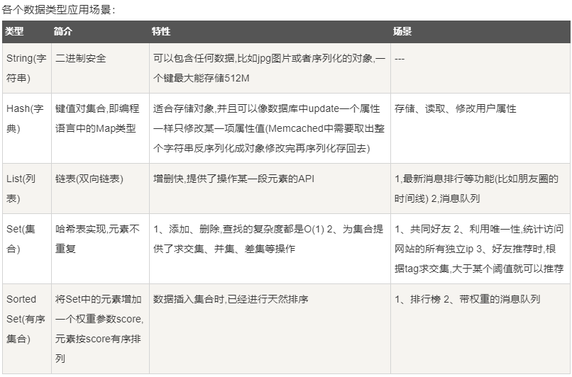

# redis

## 服务&配置
开启服务: redis-server
客户端：redis-cli
获取配置: CONFIG GET CONFIG_SETTING_NAME
    eg: CONFIG GET loglevel # 获取日志级别配置
          CONFIG GET * # 获取所有配置信息
来修改配置: CONFIG SET CONFIG_SETTING_NAME NEW_CONFIG_VALUE
    eg: CONFIG SET loglevel "notice"
         CONFIG SET dir "/data/redis_data"
配置字段说明: [https://www.runoob.com/redis/redis-conf.html](https://www.runoob.com/redis/redis-conf.html)

## redis 的启动、关闭 判断其是否在运行中
* 检查后台进程是否正在运行
    ps -ef | grep redis
* 检测6379端口是否在监听
    netstat -lntp | grep 6379
* 使用配置文件启动redis服务
    reids-server /etc/redis/redis.conf
* 使用redis-cli客户端检测连接是否正常
    ./reids-cli -h 127.0.0.1 -p 6379
* 查看redis密码
    可查看 redis 安装根目录下的配置文件：redis-conf 中 requirepass 后面的内容
* 启动redis
    /etc/init.d/redis start
* 关闭redis
    redis-cli shutdown

## 常用命令
[http://redisdoc.com/index.html](http://redisdoc.com/index.html)
[http://doc.redisfans.com/](http://doc.redisfans.com/)

1. SELECT命令更换数据库:
    SELECT db_index
2. 删除key:
    **删除指定key**:
        DEL keyName
    **删除当前数据库中的所有Key**:
        flushdb
    **删除所有数据库中的key**:
        flushall
3. 查找所有符合给定模式(pattern)的 key:
    格式: KEYS pattern
    KEYS *     # 显示所有key
4. 返回key所储存的值的类型**:
    TYPE keyName
5. 从当前数据库中随机返回一个key:
    RANDOMKEY
6. 给key设置过期时间:
    EXPIRE keyName seconds
    EXPIREAT keyName timestamp
    PEXPIRE keyName milliseconds
7. 返回给定key的剩余生存时间(TTL, time to live):
    TTL keyName  # 秒
    PTTL keyName # 毫秒

##  五种数据类型: 

1. string(字符串):
```redis
    SET keyName "redisTest"
    GET keyName 
```
SET keyName value [EX seconds] [PX milliseconds] [NX|XX] 
设置 key 为保持字符串 value. 如果 key 已经拥有一个值,它将被覆盖; 无论其类型如何,成功的SET操作将丢弃与密钥关联的任何先前生存时间 :
* EX seconds  -- 设置指定的过期时间，以秒为单位。
* PX milliseconds  -- 设置指定的过期时间，以毫秒为单位。
* NX -- 仅在密钥不存在时设置密钥。
* XX -- 仅在密钥已存在时才设置密钥。
    redis字符串命令: https://www.runoob.com/redis/redis-strings.html
2. hash(哈希):
```redis
    HMSET keyName hashKey1 "hashValue1" hashKey2 "hashValue2" #在keyName上创建一个hash:hashKey1=>"hashValue1",...
    HGET keyName hashKey1
    HGETALL keyName # 获取键名keyName下的所有hash键值对
    HKEYS keyName
    HVALS keyName
    HDEL keyName hashKey1
```
    redis哈希命令: https://www.runoob.com/redis/redis-hashes.html
3. list(列表):
```redis
    LPUSH keyName value1
    LPUSH keyName value2
    LRANGE keyName 0 10
    LLEN keyName  # 查看长度
    Redis列表命令: https://www.runoob.com/redis/redis-lists.html
```
4. set(集合):
```redis
    SADD keyName setMember1
    SADD keyName setMember2
    SMEMBERS keyName
    SCARD keyName  # 获取列表长度

```
5. zset(有序集合): 
```redis
    https://www.runoob.com/redis/redis-sets.html
    zset与set一样不允许重复的成员;但zset的每个元素会关联一个double类型的分数(分数是可重复的).
    redis通过该分数来为集合中的成员进行从小到大的排序.
    格式:  ZADD keyName memberScore setMember1
    ZADD keyName 0 setMember1
    ZADD keyName 0 setMember2
    ZADD keyName 1 setMember3
    ZRANGE keyName 0 -1 WITHSCORES   # 按score递增排列返回所有元素
    ZRANGEBYSCORE keyName 0 -1 WITHSCORES # 按score递减排列返回所有元素
    ZINCRBY keyName increment setMember1 # 给集合成员setMember1的分数加上增量increment
```
    Redis有序集合命令: https://www.runoob.com/redis/redis-sorted-sets.html

# 查看key的内存占用
`MEMORY USAGE`


## Note(注意点)
### redis中值的类型是bytes--字节类型
redis值是byte类型的,就是要使用这些值得转换编码！
python-redis连接redis的提供了decode_responses参数，将它设置为True就可以自动转换编码了。

### 连接redis
**两种方式**
1. 直接连接
```python
# decode_responses=True: 解决获取的值类型是bytes字节问题
r = redis.Redis(host='localhost', port='6379', db=0, decode_responses=True) # 在构建Redis对象时传递配置连接参数
```
2. 使用连接池
```
pool = redis.ConnectionPool(host='localhost', port=6379, db=0, decode_responses=True) # 在创建连接池对象时传递配置连接
r = redis.Redis(connection_pool=pool)
```

3. error演示
```python
# 以下写法无法正常转换编码
pool = redis.ConnectionPool(host='localhost', port=6379, db=0)
r = redis.Redis(connection_pool=pool, decode_responses=True)
```


## 常见问题
0. redis-cli中文乱码:
    redis-cli --raw
1. **问题1**:
    client.hset("recall_cate", 1, [1, 2, 30000])
    redis.exceptions.DataError: Invalid input of type: 'list'. Convert to a bytes, string, int or float first.
    **原因**: 
        redis高版本要求:用户应确保存入的key,value必须是bytes,string或者number三种类型,
           如果有布尔类型,None类型或者其他用户自定义类型,必须显式转换为上述三种合法类型再存入redis,否则会报错.
    **解决方法**:
        1. python使用低版本的redis, 建议使用2.10.6版本.
        2. 改进业务代码,将字典数据显式转换为字符串,避免以后出现潜在问题(推荐)


3. 