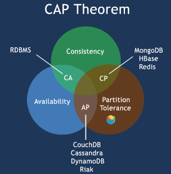

# 基础概念

**CAP定理（CAP theorem）**:
它指出对于一个分布式计算系统来说，不可能同时满足以下三点:
1. 一致性(Consistency):  (所有节点在同一时间具有相同的数据)
2. 可用性(Availability) :(保证每个请求不管成功或者失败都有响应)
3. 分隔容忍(Partition tolerance): (系统中任意信息的丢失或失败不会影响系统的继续运作)

## NoSQL 数据库分类

|     类型      |               部分代表                |                                          特点                                          |
| ------------- | ------------------------------------ | ------------------------------------------------------------------------------------- |
| 列存储        | Hbase Cassandra Hypertable  | 方便存储结构化和半结构化数据，方便做数据压缩，对针对某一列或者某几列的查询有非常大的IO优势      |
| 文档存储      | MongoDB CouchDB                   | 文档存储一般用类似json的格式存储，存储的内容是文档型的。这样也就有机会对某些字段建立索引        |
| key-value存储 | Redis                                | 可以通过key快速查询到其value。一般来说,存储不管value的格式，照单全收。（Redis包含了其他功能） |

