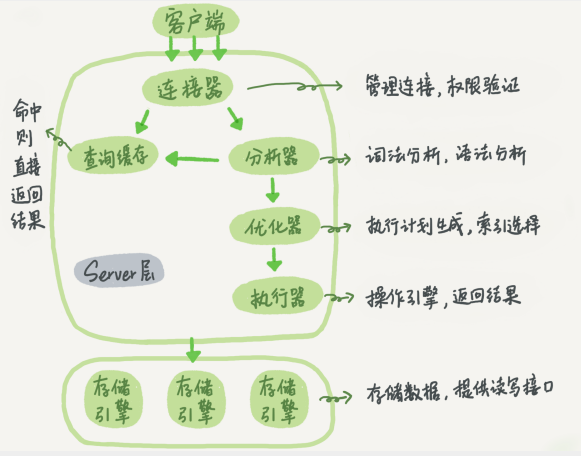

# 1.mysql架构
# SQL查询执行过程

## Server 层:
### 连接器:
连接器负责跟客户端建立连接、获取权限、维持和管理连接.
建议使用长连接,并定期(或在执行大内存占用的查询后)断开长连接(也可通过mysql_reset_connection来重新初始化连接资源);
MySQL 在执行过程中临时使用的内存是管理在连接对象里面的,需要初始化连接或断连来进行内存释放.

### 查询缓存
大多数情况下我会建议你不要使用查询缓存，为什么呢？因为查询缓存往往弊大于利
查询缓存的失效非常频繁，只要有对一个表的更新，这个表上所有的查询缓存都会被清空。
MySQL 8.0 版本直接将查询缓存的整块功能删掉了

### 分析器
词法分析,语法分析

### 优化器
优化器是在表里面有多个索引的时候，决定使用哪个索引；或者在一个语句有多表关联（join）的时候，决定各个表的连接顺序。

### 执行器
开始执行的时候，要先判断一下你对这个表 T 有没有执行查询的权限.
如果有权限，就打开表继续执行。打开表的时候，执行器就会根据表的引擎定义，去使用这个引擎提供的接口。

数据库的慢查询日志中的 rows_examined 字段，表示这个语句执行过程中扫描了多少行。
这个值就是在执行器每次调用引擎获取数据行的时候累加的。
在有些场景下，执行器调用一次，在引擎内部则扫描了多行，因此引擎扫描行数跟 rows_examined 并不是完全相同的。

## 常识
1. InnoDB 的数据是按数据页为单位来读写的。
   也就是说，当需要读一条记录的时候，并不是将这个记录本身从磁盘读出来，而是以页为单位，将其整体读入内存。在 InnoDB 中，每个数据页的大小默认是 16KB。

多版本并发控制（MVCC）

查看执行情况:
    show processlist

查询锁的占用情况:
    如果你用的是 MySQL 5.7 版本，可以通过 sys.innodb_lock_waits 表查到
    select * from t sys.innodb_lock_waits where locked_table='`test`.`t`'

