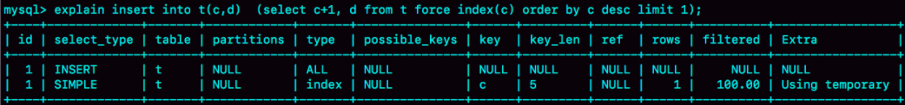

# 临时表相关


### 怎么判断是不是相对 Server 层没有新建临时表
一个最直观的判断方法是看命令执行后影响的行数，没有新建临时表的话新建的行数是0。


### 临时表在使用上有以下几个特点
1. 建表语法是 create temporary table …。
2. 一个临时表只能被创建它的 session 访问，对其他线程不可见。所以，图中 session A 创建的临时表 t，对于 session B 就是不可见的。
3. 临时表可以与普通表同名。session A 内有同名的临时表和普通表的时候，show create 语句，以及增删改查语句访问的是临时表。
4. show tables 命令不显示临时表。
5. 由于临时表只能被创建它的 session 访问，所以**在这个 session 结束的时候，会自动删除临时表**。

### insert into .. (select ... from ...) 如果子查询的表与insert的表是同一个,则会使用临时表
```sql
insert into t(c,d)  (select c+1, d from t force index(c) order by c desc limit 1);
```


这种一边遍历数据，一边更新数据的情况，需要使用临时表.并且构建临时表时,走的是表t的全表扫描.
如果读出来的数据直接写回原表，就可能在遍历过程中，读到刚刚插入的记录，新插入的记录如果参与计算逻辑，就跟语义不符。

优化方法: 主动创建内存临时表
```sql
create temporary table temp_t(c int,d int) engine=memory;
insert into temp_t (select c+1, d from t force index(c) order by c desc limit 1);
insert into t select * from temp_t;
drop table temp_t;
```


