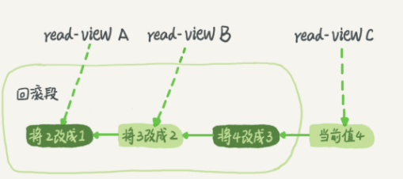

# 事务
**隔离性**:
 ACID（Atomicity、Consistency、Isolation、Durability，即原子性、一致性、隔离性、持久性）

### SQL 标准的事务隔离级别包括：
**读未提交（read uncommitted）**
一个事务还没提交时，它做的变更就能被别的事务看到
在实现上,直接返回记录上的最新值，没有视图概念

**读提交（read committed）**
一个事务提交之后，它做的变更才会被其他事务看到
在实现上,访问视图是在每个 SQL 语句开始执行的时候创建的

**可重复读（repeatable read）**
可重复读是InnoDB默认的隔离级别
一个事务执行过程中看到的数据，总是跟这个事务在启动时看到的数据是一致的
在实现上,访问视图是在事务启动时创建的，整个事务存在期间都用这个视图.
可重复读隔离级别下，该事务看不到别的事务修改的数据,但事务是可以看到自己刚刚修改的数据的.

**串行化（serializable ）**
对于同一行记录，“写”会加“写锁”，“读”会加“读锁”
在实现上,直接用加锁的方式来避免并行访问

### 事务隔离的实现
在 MySQL 中，实际上每条记录在更新的时候都会同时记录一条回滚操作.
同一条记录在系统中可以存在多个版本，就是数据库的多版本并发控制（MVCC）

系统会判断，当没有事务再需要用到这些回滚日志时，回滚日志会被删除。


## 事务的启动方式
1. 显式启动事务语句， begin 或 start transaction。配套的提交语句是 commit，回滚语句是 rollback。
2. set autocommit=0，这个命令会将这个线程的自动提交关掉。意味着如果你只执行一个 select 语句，这个事务就启动了，而且并不会自动提交。这个事务持续存在直到你主动执行 commit 或 rollback 语句，或者断开连接.-- 在长连接时，会导致意外的长事务。

## 建议
1. 建议尽量不要使用长事务
 -- 长事务意味着系统里面会存在很老的事务视图。由于这些事务随时可能访问数据库里面的任何数据，所以这个事务提交之前，数据库里面它可能用到的回滚记录都必须保留，这就会导致大量占用存储空间。
 -- 除了对回滚段的影响，长事务还占用锁资源
2. 建议 set autocommit=1, 通过显式语句的方式来启动事务


## 事务查询
可以在 information_schema 库的 innodb_trx 这个表中查询长事务
```sql
select * from information_schema.innodb_trx 
where TIME_TO_SEC(timediff(now(), trx_started))>60
```