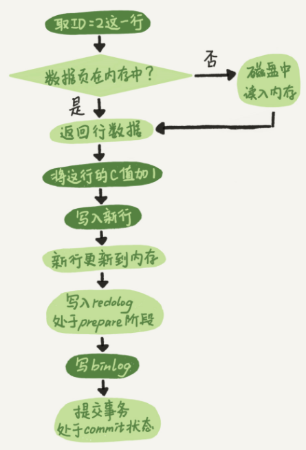
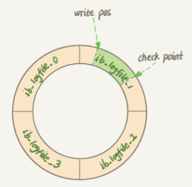
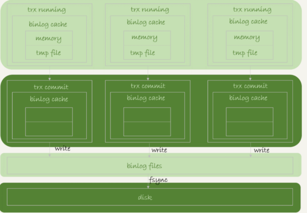
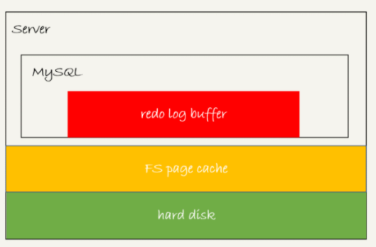
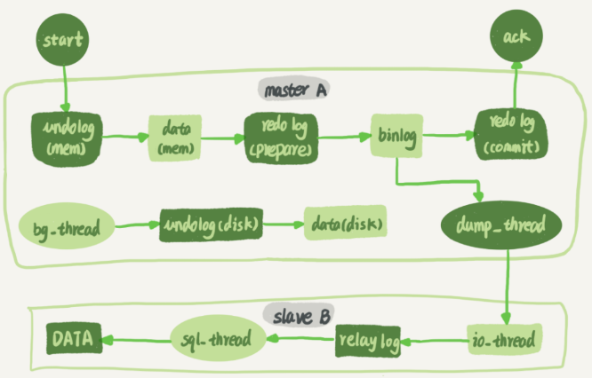

# 日志与主备相关
## 更新语句与 InnoDB的redo log(重做日志)和 binlog(归档日志)
```
create table T(ID int primary key, c int);
update T set c=c+1 where ID=2;
```

redo log 的写入分为两个步骤：prepare 和 commit，这就是"两阶段提交"。
"redo log"的两阶段提交是为了让两份日志之间的逻辑一致


### redo log(重做日志) == InnoDB
WAL(Write-Ahead Logging): 先写日志文件，并在合适的时候根据日志文件更新数据库记录.
写日志的方式是顺序IO,更新数据库操作是随机IO,随机IO相比顺序IO有一个寻址的过程,所以顺序写盘更快.

InnoDB 的 redo log 是固定大小的(比如可以配置为一组 4 个文件，每个文件的大小是 1GB), 循环写.

write pos 是当前记录的位置, checkpoint 是当前要擦除的位置.
write pos ==> checkpoint 之间是空着的部分;
当write pos 追上 checkpoint时,不能再执行新的更新,得停下来先擦掉一些记录,把 checkpoint 推进一下。

**crash-safe**:
有了 redo log，InnoDB 就可以保证即使数据库发生异常重启，之前提交的记录都不会丢失，这个能力称为 crash-safe。


### binlog(归档日志) == Server 层

#### redo log 与binlog日志有以下三点不同:
1. redo log 是 InnoDB 引擎特有的；binlog 是 MySQL 的 Server 层实现的，所有引擎都可以使用。
2. redo log 是物理日志，记录的是“在某个数据页上做了什么修改”；binlog 是逻辑日志，记录的是这个语句的原始逻辑，比如"给 ID=2 这一行的 c 字段加 1"
3. redo log 是循环写的，空间固定会用完；binlog 是可以追加写入的。“追加写”是指 binlog 文件写到一定大小后会切换到下一个，并不会覆盖以前的日志。


#### 日志配置建议
1. innodb_flush_log_at_trx_commit设置成 1; 表示每次事务的 redo log 都直接持久化到磁盘.
2. sync_binlog 设置成1，表示每次事务的 binlog 都持久化到磁盘


## MySQL 写入 binlog 和 redo log 的流程
### binlog 的写入逻辑：
    事务执行过程中，先把日志写到 binlog cache，
    事务提交的时候，再把 binlog cache 写到 binlog 文件中。

一个事务的 binlog 是不能被拆开的，因此不论这个事务多大，也要确保一次性写入


#### write 和 fsync 的时机，是由参数 sync_binlog 控制的
sync_binlog=0 的时候，表示每次提交事务都只 write，不 fsync；
sync_binlog=1 的时候，表示每次提交事务都会执行 fsync；
sync_binlog=N(N>1) 的时候，表示每次提交事务都 write，但累积 N 个事务后才 fsync。

### redo log 的写入机制


### XID
binlog与redo log通过XID进行关联


#### InnoDB 提供了 innodb_flush_log_at_trx_commit 参数控制 redo log 的写入策略
innodb_flush_log_at_trx_commit有三种可能取值：
设置为 0 的时候，表示每次事务提交时都只是把 redo log 留在 redo log buffer 中 ;
设置为 1 的时候，表示每次事务提交时都将 redo log 直接持久化到磁盘；
设置为 2 的时候，表示每次事务提交时都只是把 redo log 写到 page cache。

InnoDB 有一个后台线程，每隔 1 秒，就会把 redo log buffer 中的日志，调用 write 写到文件系统的 page cache，然后调用 fsync 持久化到磁盘。

**WAL 机制主要得益于两个方面**：
redo log 和 binlog 都是顺序写，磁盘的顺序写比随机写速度要快；
组提交机制，可以大幅度降低磁盘的 IOPS 消耗。

**MySQL 的“双 1”配置**:
指的就是 sync_binlog 和 innodb_flush_log_at_trx_commit 都设置成 1。
也就是说，一个事务完整提交前，需要等待两次刷盘，一次是 redo log（prepare 阶段），一次是 binlog。


## MySQL是怎么保证主备一致的





**binlog 有三种格式**：
1. statement： 当 binlog_format=statement 时，binlog 里面记录的就是 SQL 语句的原文;有些 statement 格式的 binlog 可能会导致主备不一致(eg: delete from t  where a>=4 and t_modified<='2018-11-10' limit 1; -- a,t_modified都是索引,mysql选择不同索引时会出现不一致 )
2. row： 当 binlog_format 使用 row 格式的时候，binlog 里面记录了真实操作的行
3. mixed： 它是前两种格式的混合。MySQL 自己会判断这条 SQL 语句是否可能引起主备不一致，如果有可能，就用 row 格式，否则就用 statement 格式。
-- 线上一般设置成row格式


## mysqlbinlog工具

用 mysqlbinlog 工具解析出来，然后把解析结果整个发给 MySQL 执行
mysqlbinlog master.000001  --start-position=2738 --stop-position=2973 | mysql -h127.0.0.1 -P13000 -u$user -p$pwd;
-- 这个命令的意思是，将 master.000001 文件里面从第 2738 字节到第 2973 字节中间这段内容解析出来，放到 MySQL 去执行。


## 大事务会导致主备延迟
不要一次性地用 delete 语句删除太多数据。其实，这就是一个典型的大事务场景。


一般现在的数据库运维系统都有备库延迟监控，其实就是在备库上执行 show slave status，采集 seconds_behind_master 的值。
