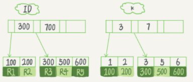

# 索引
**三种常见、也比较简单的数据结构**:
哈希表 -- 适用于只有等值查询的场景
有序数组 -- 等值查询和范围查询场景中的性能就都非常优秀; 但更新成本太高
搜索树 -- 适用等值查询和范围查询场景; 二叉树的速度搜索速度最高,但要同时考滤到IO速度,因此一般使用N叉树


在InnoDB中，表都是根据主键顺序以索引的形式存放的.每一个索引在InnoDB里面对应一棵B+树。

## 索引类型分为主键索引和非主键索引
1. 主键索引的叶子节点存的是整行数据。在InnoDB里，主键索引也被称为聚簇索引（clustered index）。
2. 非主键索引的叶子节点内容是主键的值。在InnoDB里，非主键索引也被称为二级索引（secondary index）。

```sql
create table T(
    id int primary key, 
    k int not null, 
    name varchar(16),
    index (k))engine=InnoDB;
```
表中 R1~R5 的 (ID,k) 值分别为 (100,1)、(200,2)、(300,3)、(500,5) 和 (600,6)


## 基于主键索引和普通索引的查询有什么区别:
1. select * from T where 主键字段=500: 主键查询方式，则只需要搜索主键索引这棵B+树；
2. select * from T where 非主键字段 =5: 普通索引查询方式，由于非主键索引是二级索引,所以需要多扫描一棵索引树.

## 从性能和存储空间方面考量,自增主键往往是更合理的选择
自增主键的插入数据模式，正符合了我们前面提到的递增插入的场景。每次插入一条新记录，都是追加操作，都不涉及到挪动其他记录，也不会触发叶子节点的分裂

-- 当表只有一个索引时,可以不用自增主键.
-- 但当表中有不只一个索引时,使用自增主键更合理(因为每个非主键索引的叶子节点上都是主键的值,并且自增索引更方便维护)

数据库索引知识点总结：[https://segmentfault.com/a/1190000019080654](https://segmentfault.com/a/1190000019080654)
覆盖索引、索引下推：[https://www.jianshu.com/p/bdc9e57ccf8b](https://www.jianshu.com/p/bdc9e57ccf8b)
前缀索引与索引选择：[https://www.cnblogs.com/balfish/p/9003794.html](https://www.cnblogs.com/balfish/p/9003794.html)


## 覆盖索引
由于覆盖索引可以减少树的搜索次数(减少回表)，显著提升查询性能，所以使用覆盖索引是一个常用的性能优化手段

## 最左前缀原则
 B+ 树这种索引结构，可以利用索引的“最左前缀”，来定位记录。
 **在建立联合索引的时候，如何安排索引内的字段顺序**:
1. 评估标准是，索引的复用能力。因为可以支持最左前缀，所以当已经有了 (a,b) 这个联合索引后，一般就不需要单独在 a 上建立索引了
2. 空间: 如name 字段是比 age 字段大的, 那我就建议你创建一个（name,age) 的联合索引和一个 (age) 的单字段索引(而不是(age,name)和name)。

## 索引下推
索引下推旨在 在“仅能利用最左前缀索的场景”下（而不是能利用全部联合索引），对不在最左前缀索引中的其他联合索引字段加以利用——在遍历索引时，就用这些其他字段进行过滤(where条件里的匹配)。过滤会减少遍历索引查出的主键条数，从而减少回表次数，提示整体性能。 
如果查询利用到了索引下推ICP技术，在Explain输出的Extra字段中会有“Using index condition”。

## 自适应哈希索引（AHI）

## 普通索引 &  唯一索引 
### 等值查询
`sql: select id from T where k=5`
 普通牵引在执行'等值查询'时会继续遍历到第一个不相等的值才会结束;
 而唯一索引等值查询，命中则结束
-- 性能差距微乎其微

## Change buffer
当需要更新一个数据页时，如果数据页在内存中就直接更新;
而如果这个数据页还没有在内存中的话，在不影响数据一致性的前提下，InnoDB 会将这些更新操作缓存在 change buffer 中，这样就不需要从磁盘中读入这个数据页了。在下次查询需要访问这个数据页的时候，将数据页读入内存，然后执行 change buffer 中与这个页有关的操作。通过这种方式就能保证这个数据逻辑的正确性。-- 这样在执行更新操作时不需要更新磁盘,而是在更新操作之后的读操作时才更新磁盘 == 适用于更新多读少的场景

-- 唯一索引因为所有的更新操作都需要判断是否违反唯一性约束(需要将数据页读入内存),因此没必要使用change buffer.

### merge
将 change buffer 中的操作应用到原数据页，得到最新结果的过程称为 merge.
除了访问这个数据页会触发 merge 外，系统有后台线程会定期 merge。在数据库正常关闭（shutdown）的过程中，也会执行 merge 操作。

### 索引选择和实践
普通索引和唯一索引应该怎么选择。这两类索引在查询能力上是没差别的，主要考虑的是对更新性能的影响,建议尽量选择普通索引.
如果所有的更新后面，都马上伴随着对这个记录的查询，那么你应该关闭 change buffer。而在其他情况下，change buffer 都能提升更新性能。


## MySQL为什么有时候会选错索引
选择索引是优化器的工作; 

优化器会根据统计信息预测扫描行数，优化器选择索引时会综合都考虑扫描行数,是否使用临时表、是否排序等因素。

对于由于索引统计信息不准确导致的问题，你可以用 analyze table 来解决。
主键预测扫描行数: 主键是直接按照表的行数来估计的 -- 而表的行数，优化器直接用的是 show table status 的值。

## 给字符串加索引
MySQL 是支持前缀索引的(可以定义字符串的一部分作为索引);
默认地，如果你创建索引的语句不指定前缀长度，那么索引就会包含整个字符串。
取字段fieldname的前N位做为索引 alter table tableName add index indexName(fieldname(N));

使用前缀索引就用不上覆盖索引对查询性能的优化了-- 也就是说必须进行回表.


## 索引失效
1. 条件字段函数操作: 对索引字段做函数操作，可能会破坏索引值的有序性, 优化器会放弃走树搜索功能。
2. 隐式类型转换: 在 MySQL 中，字符串和数字做比较的话，是将字符串转换成数字。--相当于使用cast函数
3. 隐式字符编码转换

联合表时最好是在驱动表的索引字段上加函数操作，如果是在被驱动表的索引字段上加函数操作,会导致被驱动表放弃使用索引而走全表扫描.


## 自增ID
InnoDB只保证了自增 id 是递增的，但不保证是连续的.
类似 insert … select 这样的批量插入数据的语句，自增锁还是要等语句结束后才被释放.
对于批量插入数据的语句(不知道要预先申请多少个id)，MySQL 有一个批量申请自增 id 的策略：同一个语句去申请自增 id，每次申请到的自增 id 个数都是上一次的两倍.
批量插入数据: 包含的语句类型是 insert … select、replace … select 和 load data 语句
