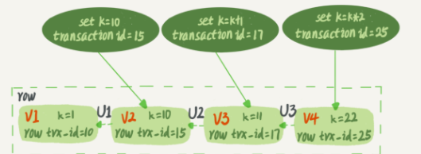

# 重点问题记录

## 执行阶段分析
Q: 如果表 T 中没有字段 k，而你执行了这个语句 select * from T where k=1, 那肯定是会报“不存在这个列”的错误： "Unknown column  'k'  in 'where clause'".你觉得这个错误是在我们上面提到的哪个阶段报出来的呢？
A: 分析器的词法分析阶段


## 备份周期
Q:定期全量备份的周期“取决于系统重要性，有的是一天一备，有的是一周一备”。
那么在什么场景下，一天一备会比一周一备更有优势呢？或者说，它影响了这个数据库系统的哪个指标？
A: '最长恢复时间' 更短


# 索引
## 索引重建问题
```sql
create table T(
    id int primary key, 
    k int not null, 
    name varchar(16),
    index (k))engine=InnoDB;
```
对于上面的表 T，如果你要重建索引 k，你的两个 SQL 语句可以这么写：
```sql
alter table T drop index k;
alter table T add index(k);
```
如果你要重建主键索引，也可以这么写：
```sql
alter table T drop primary key;
alter table T add primary key(id);
```
Q: 问题是，对于上面这两个重建索引的作法，说出你的理解。如果有不合适的，为什么，更好的方法是什么？
A: 对于普通索引k的重建是合理的.
    但对于主键id的重建不合理,会导致整个表重建,连着执行这两个语句的话,前面对普通索引k的重建就白做了.
    这两个语句，你可以用这个语句代替 ： alter table T engine=InnoDB

## 联合索引与单索引是否需要的问题
DBA小吕在入职新公司的时候，就发现自己接手维护的库里面，有这么一个表，表结构定义类似这样的：
```sql
CREATE TABLE `geek` (
  `a` int(11) NOT NULL,
  `b` int(11) NOT NULL,
  `c` int(11) NOT NULL,
  `d` int(11) NOT NULL,
  PRIMARY KEY (`a`,`b`),
  KEY `c` (`c`),
  KEY `ca` (`c`,`a`),
  KEY `cb` (`c`,`b`)
) ENGINE=InnoDB;
```

公司的同事告诉他说,由于历史原因,这个表需要a,b做联合主键,这个小吕理解了。
但是,学过本章内容的小吕又纳闷了,既然主键包含了a、b这两个字段,那意味着单独在字段c上创建一个索引，就已经包含了三个字段了呀，为什么要创建“ca”“cb”这两个索引？

同事告诉他，是因为他们的业务里面有这样的两种语句：
```sql
select * from geek where c=N order by a limit 1;
select * from geek where c=N order by b limit 1;
```

Q: 问题是: 这位同事的解释对吗，为了这两个查询模式，这两个索引是否都是必须的？为什么呢？
A:
1. 如果c列上重复率很低的情况下,两个索引都可以不用建。因为如果过滤只剩下几条数据,排序也不影响
2. 如果C列重复度比较高,就需要建立(c,b)的联合索引了,来消除排序了。因为在数据量大的情况下,排序是一个非常耗时的操作,
3. 很有可能还需要磁盘临时表来做排序。而且如果没有(c,b)联合索引,limit 1仅仅表示返回给客户端一条数据,没有起到限制扫描行数的作用
4. ca列上的索引,由于满足最左前缀,不用加。因为c是固定值,那么a列就是有序的.那么这里limit 1就很好限制了只用精准扫描一条数据.
5. 所以有时候如果在where条件建立索引的效率差的情况下,在order by limit这一列建索引也是很好的方案,排好序,在回表,只要过滤出满足条件的limit行,就能及时停止扫描

PS: 
InnoDB会把主键字段放到索引定义字段后面，同时也会去重。
所以，当主键是(a,b)的时候，
定义为c的索引，实际上是（c,a,b);
定义为(c,a)的索引，实际上是(c,a,b)


## 备库使用–single-transaction进行备份时,若主库做了DDL操作,备库会有什么现象
Q: 备份一般都会在备库上执行，你在用–single-transaction 方法做逻辑备份的过程中，如果主库上的一个小表做了一个 DDL，比如给一个表上加了一列。这时候，从备库上会看到什么现象呢？
A: [答案](https://time.geekbang.org/column/article/70215)


## 行锁 & 死锁[检测]
Q:如果你要删除一个表里面的前 10000 行数据，有以下三种方法可以做到：
1. 第一种，直接执行 delete from T limit 10000;
2. 第二种，在一个连接中循环执行 20 次 delete from T limit 500;
3. 第三种，在 20 个连接中同时执行 delete from T limit 500。


## “快照”在 MVCC 里是怎么工作的
数据表中的一行记录，其实可能有多个版本 (row)，每个版本有自己的 row trx_id。


对于重复读: 一个事务启动的时候，能够看到所有已经提交的事务结果。但是之后，这个事务执行期间，其他事务的更新对它不可见。

在实现上, InnoDB 为每个事务构造了一个数组，用来保存这个事务启动瞬间，所有已经'启动了但还没提交'的事务 ID。


## 事务的可重复读的能力是怎么实现的
可重复读的核心就是一致性读（consistent read）；而事务更新数据的时候，只能用当前读。如果当前的记录的行锁被其他事务占用的话，就需要进入锁等待。
而当前读，总是读取已经提交完成的最新版本.

更新数据都是先进行当前读再写的, 除了 update 语句外，select 语句如果加锁，也是当前读。

InnoDB 的行数据有多个版本，每个数据版本有自己的 row trx_id，每个事务或者语句有自己的一致性视图。普通查询语句是一致性读，一致性读会根据 row trx_id 和一致性视图确定数据版本的可见性。
1. 对于可重复读，查询只承认在事务启动前就已经提交完成的数据；
2. 对于读提交，查询只承认在语句启动前就已经提交完成的数据；