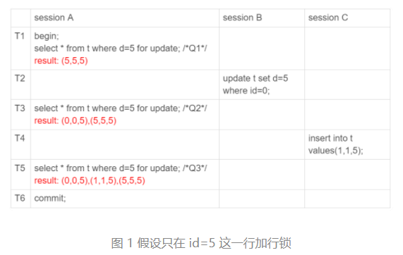

# 锁
根据加锁的范围，MySQL 里面的锁大致可以分成全局锁、表级锁和行锁三类

## 全局锁

MySQL 提供了一个加全局读锁的方法，命令是 ```Flush tables with read lock (FTWRL)```。
当你需要让整个库处于只读状态的时候，可以使用这个命令.
全局锁的典型使用场景是，做全库逻辑备份.


## 表锁
MySQL 里面表级别的锁有两种：一种是表锁，一种是元数据锁（meta data lock，MDL)。

表锁的语法是 lock tables … read/write. 可以用 unlock tables 主动释放锁，也可以在客户端断开的时候自动释放。需要注意，lock tables 语法除了会限制别的线程的读写外，也限定了本线程接下来的操作对象。

另一类表级的锁是 MDL（metadata lock). MDL 不需要显式使用，在访问一个表的时候会被自动加上

事务中的 MDL 锁，在语句执行开始时申请，但是语句结束后并不会马上释放，而会等到整个事务提交后再释放


## 两阶段协议
在 InnoDB 事务中，行锁是在需要的时候才加上的，但并不是不需要了就立刻释放，而是要等到事务结束时才释放。这个就是两阶段锁协议


## 死锁和死锁检测
**死锁**
当并发系统中不同线程出现循环资源依赖，涉及的线程都在等待别的线程释放资源时，就会导致这几个线程都进入无限等待的状态，称为死锁.

**死锁检测**
当出现死锁以后，有两种策略：
1. 一种策略是，直接进入等待，直到超时。这个超时时间可以通过参数 innodb_lock_wait_timeout 来设置。
2. 另一种策略是，发起死锁检测，发现死锁后，主动回滚死锁链条中的某一个事务，让其他事务得以继续执行。将参数 innodb_deadlock_detect 设置为 on，表示开启这个逻辑。


行锁, 读锁, 写锁, Gap锁(间隙锁)
select * from t where c = xx for update; # c不是索引时会加哪些锁 # TODO 
select * from t where c = xx lock in share mode; 
间隙锁是在可重复读隔离级别下才会生效的.

nex-key lock：间隙锁 + 行; 左开右闭


## 幻读
幻读指的是一个事务在前后两次查询同一个范围的时候，后一次查询看到了前一次查询没有看到的行。


说明：
在可重复读隔离级别下，普通的查询是快照读，是不会看到别的事务插入的数据的。因此，幻读在“当前读”下才会出现。
上面 session B 的修改结果，被 session A 之后的 select 语句用“当前读”看到，不能称为幻读。幻读仅专指“新插入的行”。


## 加锁规则
加锁规则，包含了两个“原则”、两个“优化”和一个“bug”。
1. 原则 1：加锁的基本单位是 next-key lock。next-key lock 是前开后闭区间。
2. 原则 2：查找过程中访问到的对象才会加锁。
3. 优化 1：**唯一索引**上的等值查询，给唯一索引加锁的时候，next-key lock 退化为行锁。
4. 优化 2：(非唯一/唯一)索引上的等值查询，向右遍历到第一个值不满足等值条件的位置，next-key lock 退化为间隙锁(左右都是开区间)。
5. 一个 bug：唯一索引上的范围查询会访问到不满足条件的第一个值为止。

Note: 在分析加锁规则的时候可以用 next-key lock 来分析。但是要知道，具体执行的时候，是要分成间隙锁和行锁两段来执行的。

可重复读隔离级别遵守两阶段锁协议，所有加锁的资源，都是在事务提交或者回滚的时候才释放的。


锁就是加在索引上的，这是 InnoDB 的一个基础设定.


