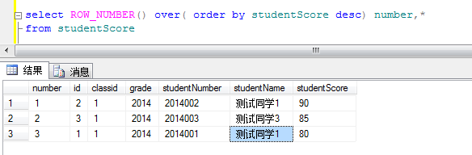
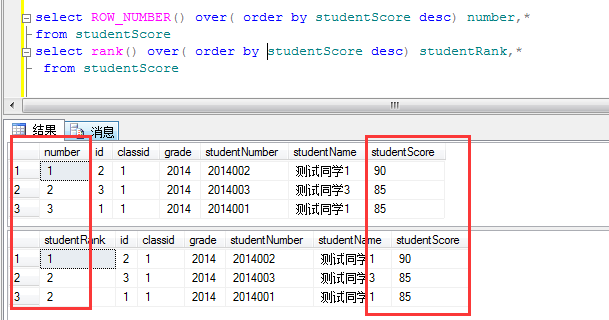
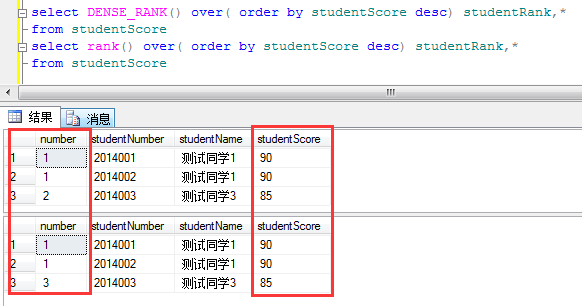
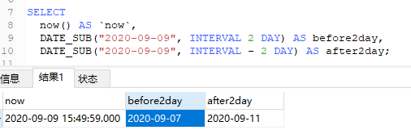

# 技术类_SQL

## 一些基本操作
### IF(cond, expr1,expr2)
IF(cond, expr1,expr2) 如果条件cond成立,IF(...)返回expr1,否则返回expr2.

### IFNULL(expression, alt_value)
IFNULL(expression, alt_value)函数用于判断第一个表达式是否为 NULL，如果为 NULL 则返回第二个参数的值，如果不为 NULL 则返回第一个参数的值。

# 数据库相关
查询指定表的字段名与对应类型:
```
select column_name,column_comment,data_type 
from information_schema.columns 
where table_name='表名' and table_schema='数据库名';
```

## union 与 union all
UNION因为要进行重复值扫描，所以效率低。如果合并没有刻意要删除重复行，那么就使用UNION All.
UNION ALL要求要联合的SQL语句字段个数必须一样，而且字段类型要"相容"(一致).

union 语法：（去重、默认规则排序）
```
select employee_id,job_id from employees 
union
select employee_id,job_id from job_history 
```
union all 语法
```
select employee_id,job_id from employees 
union all
select employee_id,job_id from job_history 
```
注意事项
* union 和 union all都可以将多个结果集合并，而不仅仅是两个，你可以将多个结果集串起来。
* 使用union和union all必须保证各个select 集合的结果有相同个数的列，并且每个列的类型是一样的。但列名则不一定需要相同，oracle会将第一个结果的列名作为结果集的列名。例如下面是一个例子：
```
select empno,ename from emp 
union 
select deptno,dname from dept 
```
* 没有必要在每一个select结果集中使用order by子句来进行排序，我们可以在最后使用一条order by来对整个结果进行排序。例如：
```
select empno,ename from emp 
union 
select deptno,dname from dept 
order by ename;
```

## 查询表的字段信息
```
SELECT
	column_name,
	column_comment,
	data_type
FROM
	information_schema.COLUMNS
WHERE
	table_name = 'table_name'
    AND table_schema = 'db_name';
```
数字类型：["TINYINT", "SMALLINT", "INT", "INTEGER", "BIGINT", "FLOAT", "DOUBLE", "DECIMAL"]

## OVER 与　SQL四大排名函数(ROW_NUMBER、RANK、DENSE_RANK、NTILE)
### 理解over()函数
[理解over()函数 https://www.cnblogs.com/linjiqin/archive/2012/04/05/2433633.html](https://www.cnblogs.com/linjiqin/archive/2012/04/05/2433633.html)

[sql排名函数 https://blog.csdn.net/shaiguchun9503/article/details/82349050](https://blog.csdn.net/shaiguchun9503/article/details/82349050)
1. ROW_NUMBER
    ROW_NUMBER()函数作用就是将select查询到的数据按指定方式进行编号(注意:这个编号是连续的)．他不能用做于学生成绩的排名，一般多用于分页查询
    
2. RANK
RANK()函数，某一个字段进行排名，排名可以相同，有相同排名时后面的排名顺延(如有两个第一名时，排名为1,1,3,4,...)．

3. DENSE_RANK
    DENSE_RANK()函数也是排名函数，与RANK()不同的是有相同排名时后面的排名不顺延(如有两个第一名时，排名为1,1,2,3,...)
    
4. NTILE
    ...

## DATE_SUB(日期表达式, INTERVAL expr type) 
mySql函; SQL DATE_SUB 将从一个datetime中减去一个时间值.


## Mysql踩坑
### Mysql关于同时使用Group by 和Order by问题
Mysql使用group by 分组语句时，order by语句会失效,直接返回group by 语句结果的第一条记录.


### 怎么实现组内排序


## 字段惟一性验证

单字段惟一性验证
```
select count(fieldx), COUNT(DISTINCT fieldx)
from tablename;
```
多字段惟一性验证
```
# 检查在表tablename中字段fieldx与fieldy的组合是否惟一．如果组合不惟一将返回数据，如果组合惟一将返回空.
    SELECT fieldx, fieldy
    FROM tablename
    GROUP BY fieldx, fieldy
    HAVING count(*) > 1
```

### 删除分区
```
 alter table tablename drop if exists partition(collect_date='2020-10-25')
```


### 查看分区
```
show partitions advt_quantity_data_1000;
```

### 查看建表语句
```
show create table tablename;
```


## hive
### MSCK REPAIR TABLE
用来解决通过hdfs dfs -put或者hdfs api写入hive分区表的数据在hive中无法被查询到的问题
```
MSCK REPAIR TABLE table_name
```

### 添加分区
```
ALTER TABLE tableName ADD IF NOT EXISTS PARTITION (partcol=partVal, partcol2=partVal2)
      LOCATION 'oss://salepredict/xxx/partcol=partVal/partcol2=partVal2';
```

### 查询表的创建时间
```
SELECT table_name,create_time FROM information_schema.TABLES WHERE table_name = 'tableName';
```

### mycli工具 -- 一个增强的mysql连接工具(自动补全)
mycli -hHOST -uUSER -pPASSWORD

### 在sql客户端将select结果导出到文件:
mycli(或mysql) -hHOST -uUSER -PPORT -e "use dbname; select * from tablename;" > filename.txt
参数说明:
+ N: 代表输出SQL语句执行结果中不带第一行的字段名称
+ e: 表示要执行SQL语句


## 函数
### count
count() 是一个聚合函数，对于返回的结果集，一行行地判断，如果 count 函数的参数不是 NULL，累计值就加 1，否则不加。最后返回累计值。
count(*)、count(主键 id) 和 count(1) 都表示返回满足条件的结果集的总行数；
而 count(字段), 则表示返回满足条件的数据行里面，参数“字段”不为 NULL 的总个数.
按照效率排序的话，count(字段) < count(主键 id) < count(1)≈count(*) ;统计行数,推荐使用 count(*).
 

## oracle 分组排序收集
-- 分组-组内排序 - 收集
-- 对classes为1的年级，按地区分组，并在组内按age排序，按记录的name按list返回
```
select regions, LISTAGG(name, ',') WITHIN GROUP(ORDER BY age) res_name_list
FROM student_table
WHERE classes=1
GROUP BY regions;
```

