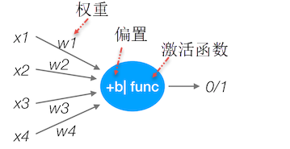

# 神经网络_NN

* 神经网络的特点:
  1. 每个连接都有个权值
  2. 同一层神经元之间没有连接
  3. 最后的输出结果对应的层也称之为全连接层
* 组成：
  1. 输入层：神经网络的第一层，原始的样本数据
  2. 输出层：神经网络的最后一层，最终的计算结果
  3. 隐藏层：其余的中间层都被称为隐藏层（hidden layer）
  4. 权重（weight）：就是之前所说的参数，这里被称为一个神经节点的权重。
  5. 激活函数（activation function）：激活函数是两层神经元之间的映射函数。常见的激活函数有：sigmoid,tanh,Relu...

# 感知机(PLA: Perceptron Learning Algorithm)

# 神经网络多分类原理与反向传播原理

+ 说明神经网络的softmax以及分类损失计算公式:
  - Softmax回归将神经网络输出转换成概率结果
     
  - 交叉熵损失
    
    对应二分类就是: $J(\theta)=-\frac{1}{m}\sum_{i=1}^m[y^{(i)}log(h_{\theta(x^{(i)})})+(1-y^{(i)})log(1-h_{\theta(x^{(i)})})]$; 其中m表示样本数

# 反向传播算法
反向传播算法实际就是：使用链式求导法则，反向层层推进，计算出每一层神经节点的偏导数，然后使用梯度下降，不断调整每一个节点的权重（也就是参数$\theta$），从而达到求得全局最小值的目的。

激活函数：
* tanh 函数（the hyperbolic tangent function，双曲正切函数）
    
    取值(-1, 1)

* ReLU 函数（the rectified linear unit，修正线性单元）
    
    max(0, kx)

* Leaky ReLU（带泄漏的 ReLU）
    

