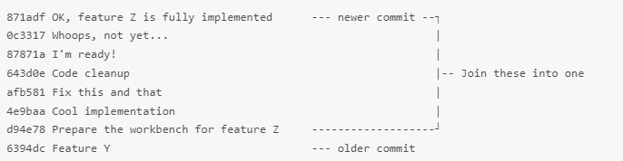
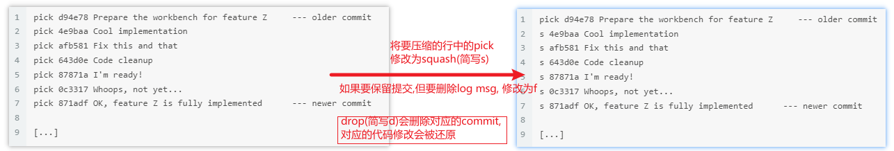

## 开发流程
```
i. 从develop分支拉取最新代码创建自己的本地开发分支gjy_dev
      在本地创建分支并切换到该分支: git checkout -b gjy_dev origin/develop
  或 使用最新的develop代码覆盖自己的开发分支gjy_dev
     0. git branch gjy_dev
     1. git fetch --all # 获取分支信息
     2. git reset --hard origin/develop
     3. git pull
ii. 开发者在其开发分支上(gjy_dev)，完成编码后commit
    git add <filename, ...>
    git commit -m "just do it"
iii. 将gjy_dev分支变基到develop的最新节点上。
    git pull --rebase origin develop
    冲突处理：
        0. git status
        1. 解决冲突
        2. git add <file>
        3. git rebase --continue
iv. 将开发分支提交到远程
    # 关联本地分支&远程分支(不存在时会创建)
    git push --set-upstream origin gjy_dev # [远程分支名为origin/gjy_dev]
    -f: 强制覆盖远程 
    

删除本地&远程分支:
    删除本地分支: git branch -d localBranchName
    删除远程分支: git push origin --delete remoteBranchName
    分支重命名: git branch -m old-branch new-branch 
```   

## 合并分支
```
# 示例: 将远程develop分支合并到本地test分支
无冲突时:
    1. git checkout test
    2. git merge origin/develop # 无冲突时'Fast-forward'
    3. git commit -m "merge develop->test"
    4. git push
有冲突时:
    1. git checkout test
    2. git merge origin/develop # 有冲突时会提示报错
    3. git status
        Unmerged paths: # 有冲突的文件,未合并
            (use "git add/rm <file>...") # 使用'git add/rm <file>' 标记已解决冲突/删除的文件
                both modified: 有冲突的文件
        Chanages not staged for commit: # 未提交的更改
            (use "git add  <file>..." to update what will be committed) # 使用'git add <file>'提交更改
            (use "git checkout -- <file>..." to discard changes in working directory) # 他用"git checkout -- <file>"丢弃工作目录中的更改
                modified: 修改但还未提交的文件
       
        Untracked files: 未跟踪的文件
            (use "git add  <file>..." to include in what will be committed) # 使用'git add <file>'将文件添加进仓库
    # 手动解决冲突后,依次对每个解决冲突的文件执行add命令来标记已解决冲突
    3. git add <file> # 注意: 不要使用'git add .'标记已解决冲突,这样会引入无关文件进来
    4. git commit -m "merge develop->test"
    5. git push
```

## 暂存stash
```
git stash save "暂存当前分支,先去xxx分支完成xxxx"
git stash pop [stash@N] # 将指定的堆栈内容(默认最新)弹出到当前分支(会将弹出的标记从堆栈中删除)
git stash apply [stash@N] # 将指定的堆栈内容(默认最新)应用到当前分支(不会将弹出的标记从堆栈中删除)
git stash list
git stash show
git stash clear
git stash drop 
git stash branch

## 建议
1. 最好只在一个分支上有一个stash, 每次都使用'git stash pop'
2. 当需要在多个分支上都stash时, 最好每个分支只保留一个stash.
   流程: `git stash pop stash@{X}` ==> 修改 ==> `git stash`
   
总结: 
1. git stash 之后版本库状态会恢复到最近一次提交完的状态; 新的修改会被保存起来, 将可以切换到其它分支
2. git stash pop 之前的修改,在pop之后会保留, 合并时有冲突会提示.
3. git stash 默认只会保存已经加入到版本管理中的文件.
```


## 压缩多个commit


1. 执行`git log`找到要压缩的最早commit的上一条COMMIT_HASH

2. 执行`git rebase --interactive COMMIT_HASH`进行压缩操作.
命令说明: 该命令会压缩COMMIT_HASH之后(不包含这个COMMIT_HASH)的所有commit; 即压缩范围为(COMMIT_HASH, 当前最新]
eg: git rebase --interactive 6394dc
3. 选择与压缩
执行上述命令后在编辑窗口中对提交列表进行合并操作, 展示的提交列表中最新提交在最下面.
squash [s]: 保留提交的修改, 压缩commit log.
f: 保留提交的修改, 删除commit log.
drop [d]: 删除提交的修改(相当有没有进行此次提交).
 


## 修改commit
```
修改最后一次commit
git commit --amend
```

## 其它操作
克隆一个远程库到本地:
    git clone git@github.com:jiaGuYuan/learngit.git

创建git仓库: 
    在指定的目录下执行 git init

将文件加入版本库: 
    git add 文件名(可以是目录,或多个文件名)

提交到仓库: 
    git commit -m "关于提交的说明"

回退到上一个版本: 
    git reset --hard HEAD^  (HEAD^^上上版本,HEAD~n前n个版本)
        
撤销修改: 
    1.你对工作区的修改已经提交到了版本库(执行了git commit),这时需要进行版本回退操作.
    2.你对工作区的文件的修改已经添加到版本库的暂存区时(执行了git add),但还没有提交到版本库时(没有git commit);
        git reset HEAD file可以把暂存区的修改撤销掉(unstage),重新放回工作区.
        git checkout -- file可以丢弃工作区的修改,使工作区(或工作区中的某些文件)恢复到上一次git add或git commit时的状态.
    3.对于修改后还没有被放到暂存区(没有执行 git add)的文件,只要执行git checkout -- file就可以了.

git使用远程覆盖本地:
    git fetch --all
    git reset --hard origin/master
    git pull
    

Git鼓励大量使用分支: 
    查看分支: git branch
    创建分支: git branch <name>
    切换分支: git checkout <name>
    创建+切换分支: git checkout -b <name>
    合并某分支到当前分支: git merge <name>
    删除分支: git branch -d <name>


清理历史记录(只保留最后一个版本):
    git checkout --orphan latest_branch # 将当前分支切换到 latest_branch
    git add -A                          # 把所有文件添加到当前分支
    git commit -am "commit message"     # 设置commit注释
    git branch -D master                # 删除主分支master(此时只剩下latest_branch)
    git branch -m master                # 将latest_branch重命名为master
    git push -f origin master           # 强制push,用当前内容冲刷掉git的内容(此处无法反悔)
    git branch --set-upstream-to origin/master master # 重新初始化分支结构


查看信息:
git:
    直接输入git将提示git的使用信息.

git status:
    查看仓库的状态,它会告诉我们什么文件被修改了,什么文件修改了但是还没有提交,什么文件是刚添加进来的等等.

git diff:
    查看difference,它能告诉我们我们在某个文件上所做的修改.
    git diff readme.txt ---将显示我们在readme.txt上所做的修改

git log:
    查看历史记录,它能告诉我们从最近到最远的提交日志.
    --pretty=oneline参数: 简化显示的内容.
    git log命令显示的内容有commit id(版本号),作者,日期,及该版本的修改.
    用带参数的git log也可以看到分支的合并情况:  git log --graph --pretty=oneline --abbrev-commit

git reflog:
    git reflog命令能够查看我们执行的每一次命令.

git branch:
    查看分支信息

git stash list:
    查看工作现场的信息

git remote:
    查看远程库的信息
    -v显示更详细的信息

git tag:
    查看所有标签

git show <tagname>:
    查看标签信息

信息: 
Fast-forward信息,Git告诉我们,这次合并是"快进模式",也就是直接把一个分支指向另一个分支的当前提交,所以合并速度非常快.


## .gitignore文件规则
语法规范（熟悉正则很容易理解）
    空行或是以#开头的行即注释行将被忽略；
    以斜杠 '/' 结尾表示目录；
    以星号 '*' 通配多个字符；
    以问号 '?' 通配单个字符
    以方括号 '[]' 包含单个字符的匹配列表；
    以叹号 '!' 表示不忽略(跟踪)匹配到的文件或目录；
    可以在前面添加斜杠 '/' 来避免递归,下面的例子中可以很明白的看出来与下一条的区别。

配置文件示例
    # 忽略后缀为.a的文件
    *.a
    # 但不忽略 lib.a, 尽管已经在前面忽略了.a文件
    !lib.a
    
    # 仅在当前目录下忽略 TODO.txt 文件,但不忽略子目录下的 subdir/TODO.txt
    /TODO.txt

    # 忽略 build/ 文件夹下的所有文件
    build/

    # 忽略 doc/notes.txt, 不忽略 doc/server/arch.txt
    doc/*.txt

    # 忽略在doc/下的所有.pdf 文件 
    doc/**/*.pdf

配置文件模板
Github 上为开发者提供了各种环境以及各种编程语言的 gitignore 文件配置模板:
    https://github.com/github/gitignore
python模板:
    url:https://github.com/github/gitignore/blob/master/Python.gitignore
    
    
    
问题:
报错: error SSL_connect: SSL_ERROR_SYSCALL in connection to github.com:443
    出现这种情况多半是因为设置了系统代理
    取消全局代理即可
    git config --global --unset http.proxy
    git config --global --unset https.proxy


