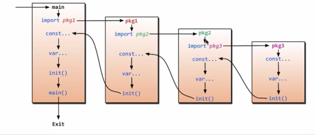
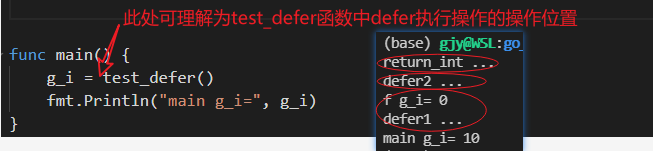
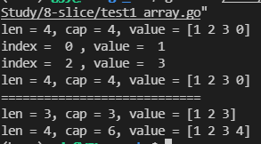
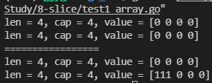
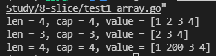
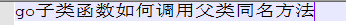
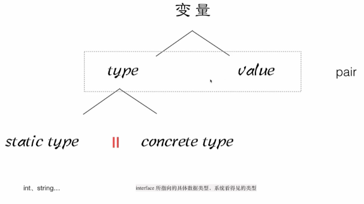

# 基础语法

```go
package main //程序的包名

import (
	"fmt"
	"time"
)

//main函数
func main() { //函数的{  一定是 和函数名在同一行的，否则编译错误
	//golang中的表达式，加";", 和不加 都可以，建议是不加
	fmt.Println("hello go!")

	var i int = 10
	var str string = "abc"
	fmt.Printf("i=%d, type(str)=%T\r\n", i, str)

	x, y := 100, 200
	fmt.Println(x, y)
	time.Sleep(1 * time.Second)
}

```

## 变量定义
```
// 定义单个变量
var varName type
var varName type = value
var varName = value
varName type = value
varName := value
// 定义多个变量
var (
    name string = 'gjy'
    age int = 26
)
```

## 常量
```
const varName type = value
// 使用const来定义枚举类型
const ( // iota有const中时,从初始值0开始每行加1
    RED = iota // 0
    GREEN      // 1
)
```


## 函数
```
// 返回单个值
func fool(param varType) returnType {
    // pass
    return XXX
}

// 返回多个值(匿名)
func fool(param varType) (returnType1, returnType2) {
    // pass
    return XXX, YYY
}

// 返回多个值(通过名称返回)
func fool(param varType) (r1 returnType1, r2 returnType2) {
    // pass
    // 注意: 有名返回值作用域与形参一样; 所以即使r1/r2没有显式赋值,也是有默认值的
    r1 = XXX
    r2 = YYY
    return
}
```

## 导包与执行流程


## defer关键字
defer指定的操作在函数执行结束之后(退出作用域之前)执行.(defer可以方便的用于资源关闭)
```go
package main
import "fmt"

var g_i = 0
func return_int() int {
	fmt.Println("return_int ...")
	return 10
}

func func_defer() {
	fmt.Println("f g_i=", g_i)
	fmt.Println("defer1 ...")
}

func test_defer() int {
  // defer指定多个操作时,定义顺序类似压栈,执行顺序类似出栈.
	defer func_defer()
	defer fmt.Println("defer2 ...")
	return return_int()
}

func main() {
	g_i = test_defer()
	fmt.Println("main g_i=", g_i)
}
```
defer的操作在return执行之后,函数实际返回之前进行.



## 定长数组/变长数组(slice)
### 初始化 & 遍历
```
package main
import "fmt"

func main() {

    //定长数组,初始化
    var myArray1 = [4]int{1, 2, 3}
    fmt.Printf("len = %d, cap = %d, value = %v\r\n",
        len(myArray1), cap(myArray1), myArray1)

    // 遍历
    for index, value := range myArray1 {
        if index%2 == 0 {
            fmt.Println("index = ", index, ", value = ", value)
            // value = 10 // value是元素值的副本,不会实际影响myArray1
            // myArray1[index] = 10 // 会实际影响myArray1
        }
    }
    fmt.Printf("len = %d, cap = %d, value = %v\r\n",
        len(myArray1), cap(myArray1), myArray1)

    // append(myArray1, 4) // 定长数组不能append

    fmt.Println("============================")
    //slice(变长数组),初始化
    var myArray2 = []int{1, 2, 3}
    fmt.Printf("len = %d, cap = %d, value = %v\r\n",
        len(myArray2), cap(myArray2), myArray2)

    // 向slice追加元素时, 可能会导致slice扩容
    myArray2 = append(myArray2, 4)
    fmt.Printf("len = %d, cap = %d, value = %v\r\n",
        len(myArray2), cap(myArray2), myArray2)
}

```



### 数组/slice做参数
```go
// 定长数组做为形参时,是传值(副本)
func func_test_array(myArray [4]int) {
	fmt.Printf("len = %d, cap = %d, value = %v\r\n",
		len(myArray), cap(myArray), myArray)
	myArray[0] = 111
}

// 变长数组做为形参时,是传引用
func func_test_slice(myArray []int) {
	fmt.Printf("len = %d, cap = %d, value = %v\r\n",
		len(myArray), cap(myArray), myArray)
	myArray[0] = 111
}

func main() {
	var myArray1 [4]int
	func_test_array(myArray1)
	fmt.Printf("len = %d, cap = %d, value = %v\r\n",
		len(myArray1), cap(myArray1), myArray1)

	fmt.Println("=================")
	var myArray2 []int = make([]int, 4)
	func_test_slice(myArray2)
	fmt.Printf("len = %d, cap = %d, value = %v\r\n",
		len(myArray2), cap(myArray2), myArray2)
}
```


### 切片(切片类型相当于可变长数组)
```go
func main() {
	var myArray = [4]int{1, 2, 3, 4}
	fmt.Printf("len = %d, cap = %d, value = %v\r\n",
		len(myArray), cap(myArray), myArray)

	// 从myArray切片[1,4)元素
	mySlice := myArray[1:4]  // 初始化切片对象
	fmt.Printf("len = %d, cap = %d, value = %v\r\n",
		len(mySlice), cap(mySlice), mySlice)

	// 切片可理解为原数组的视图(修改切片数据,就是修改原数组)
	mySlice[0] = 200
	fmt.Printf("len = %d, cap = %d, value = %v\r\n",
		len(myArray), cap(myArray), myArray)
	
    // 声明切片对象 并赋值
    var slice []int
    slice = myArray[1:4] 
    slice = append(slice, 5)  // 向slice切片对象追加元素的写法(必须赋值才行)
    fmt.Printf("len = %d, cap = %d, value = %v\r\n",
		len(slice), cap(slice), slice)
}
```



## map
### 初始化
```go
    // 三种定义方式
    //===> 第一种声明方式 map[keyType]valueType
    //声明myMap1是一种map类型 key是string， value是string
    var myMap1 map[string]string
    if myMap1 == nil {
        fmt.Println("myMap1 是一个空map")
    }

    //在使用map前， 需要先用make给map分配数据空间(在make前myMap1是nil)
    myMap1 = make(map[string]string, 10)
    if myMap1 != nil {
        fmt.Println("myMap1 已经 make")
    }
    myMap1["one"] = "java"

    //===> 第二种声明方式 通过:=推导类型
    myMap2 := make(map[int]string)
    myMap2[1] = "java"

    //===> 第三种声明方式(初始化)
    myMap3 := map[string]string{
	    "one":   "php",
	    "two":   "c++",
	    "three": "python",
    }
```

### map操作
```go
// map作为形参是传'引用'
func ChangeValue(cityMap map[string]string) {
	cityMap["England"] = "London"
}

func main() {
    cityMap := make(map[string]string)

    //添加
    cityMap["China"] = "Beijing"
    cityMap["Japan"] = "Tokyo"
    cityMap["USA"] = "NewYork"

    //遍历
    for key, value := range cityMap {
        fmt.Println("key = ", key, ", value = ", value)
    }
    fmt.Println("----")
    //删除
    delete(cityMap, "Japan")

    //修改
    cityMap["USA"] = "DC"
    ChangeValue(cityMap)

    fmt.Printf("len = %d,value = %v\r\n", len(cityMap), cityMap)
}

```

golang对于访问不在map中的key时行为不同于C/C++
```
package base

import "testing"

func TestMap(t *testing.T) {
    m := map[int]string{1: "a", 2: "b"}
    t.Logf("xx='%s', '%s'", m[3], m[1])

    // 访问map中不存在的key时会返回对应类型的默认值
    tmp := m[5]
    t.Logf("%T, v='%s'", tmp, tmp)

    v, ok := m[5]
    t.Logf("xx='%s', %t", v, ok)

    // 检查key是否存在于map中的方法
    if v, ok := m[5]; ok {
        t.Logf("key 5 existing. v=%s", v)
    } else {
        t.Log("key 5 not existing.")
    }
}
```

## 结构体
### 结构体定义&组合
```go
package main

import "fmt"

// 结构体
type Human struct {
	name string
	sex  string
}

// 结构体方法(传地址) -- 推荐使用
func (this *Human) Eat() {
	fmt.Println("Human.Eat()...")
	fmt.Printf("name address %x\n", &this.name)
}

// 结构体方法(传值-参数是一个副本) -- 不推荐使用
func (copy Human) EatTransValue() {
	fmt.Println("Human.EatTransValue()...")
	fmt.Printf("name address %x\n", &copy.name)
}

func (this *Human) Walk() {
	fmt.Println("Human.Walk()...")
}

//SuperMan类具有了Human类的方法
type SuperMan struct {
	Human  // 匿名嵌套类型(会将其成员与函数包含进来)
	level int
}

//重定义父类的方法Eat()
func (this *SuperMan) Eat() {
	fmt.Println("SuperMan.Eat()...")
}

//子类的新方法
func (this *SuperMan) Fly() {
	fmt.Println("SuperMan.Fly()...")
}

func (this *SuperMan) Print() {
	fmt.Println("name = ", this.name)
	fmt.Println("sex = ", this.sex)
	fmt.Println("level = ", this.level)
}

func main() {
	h := Human{"zhang3", "female"}
	h.Eat()
	h.Walk()

	//定义一个子类对象
	s := SuperMan{Human{"li4", "female"}, 88}
	s.Walk() //父类的方法
	s.Eat()  //子类的方法
	s.EatTransValue() // 参数是一个副本 
	fmt.Printf("s name address %x\n", &s.name)
	s.Fly()  //子类的方法
	s.Print()
}
```


### 多态
通过interface实现;  struct不需要继承interface,只需要实现interface中定义的所有接口则其可赋值给interface对象.

```go
package main

import "fmt"

//本质是一个指针
type AnimalIF interface {
	Sleep()
	GetType() string //获取动物的种类
}

//具体的类
type Cat struct {
	color string //猫的颜色
}

func (this *Cat) Sleep() {
	fmt.Println("Cat is Sleep")
}

func (this *Cat) GetType() string {
	return "Cat"
}

//具体的类
type Dog struct {
	color string
}

func (this *Dog) Sleep() {
	fmt.Println("Dog is Sleep")
}

func (this *Dog) GetType() string {
	return "Dog"
}

func showAnimal(animal AnimalIF) {
	animal.Sleep() //多态
	fmt.Println("kind = ", animal.GetType())
}

func main() {

	var animal AnimalIF //接口的数据类型， 父类指针
	animal = &Cat{"Green"}  // 接口类型本质上是一个指针,所以需要以地址初始化
	animal.Sleep() //调用的就是Cat的Sleep()方法 , 多态的现象

	animal = &Dog{"Yellow"}
	animal.Sleep() // 调用Dog的Sleep方法，多态的现象

	cat := Cat{"Green"}
	dog := Dog{"Yellow"}
	showAnimal(&cat)
	showAnimal(&dog)
}

```

## 万能类型 -- interface{}
```
package main

import "fmt"

// interface{}是万能数据类型
func myFunc(arg interface{}) {
	fmt.Println("myFunc is called...")

	// interface{} 提供 “类型断言” 的机制
	value, ok := arg.(string)
	if !ok {
		fmt.Println("arg is not string type")
		fmt.Printf("value type is %T\n", value)
	} else {
		fmt.Println("arg is string type, value = ", value)
	}
}

type Book struct {
	auth string
}

func main() {
	book := Book{"Golang"}

	myFunc(book)
	myFunc(100)
	myFunc("abc")
	myFunc(3.14)
}

```


## 变量结构


## 反射
```go
package main

import (
	"fmt"
	"reflect"
)

type Reader interface {
	ReadBook()
}

type Writer interface {
	WriteBook()
}

//具体类型
type Book struct {
	Title string
}

// 绑定到*Book的成员函数
func (this *Book) GetTitle() string {
	fmt.Println("GetTitle")
	return this.Title
}

// 绑定到Book的成员函数
func (this *Book) GetBookTitle() string {
	fmt.Println("GetTitle")
	return this.Title
}

func (this *Book) ReadBook() {
	fmt.Println("Read a Book")
}

func (this *Book) WriteBook() {
	fmt.Println("Write a Book")
}

// 反射
func showReflect(arg interface{}) {
	fmt.Println("type:", reflect.TypeOf(arg),
		", value:", reflect.ValueOf(arg))
}

func main() {
	//b: pair<type:*Book, value:book地址>
	b := &Book{"golang"}
	showReflect(b)

	//r: pair<type:, value:>
	var r Reader
	//r: pair<type:*Book, value:book地址>
	r = b
	r.ReadBook()
	showReflect(r)

	var w Writer
	//r: pair<type:*Book, value:book地址>
	w = r.(Writer)
	w.WriteBook()
	showReflect(w)

	DoFiledAndMethod(*b)
	DoFiledAndMethod(b)
}

func DoFiledAndMethod(obj interface{}) {
	t := reflect.TypeOf(obj)
  // 不同的类型,可使用的反射函数不同(参考reflect.Bits()函数)
	if t.Kind() == reflect.Struct {
		fmt.Println("-----DoFiledAndMethodByStruct------")
		DoFiledAndMethodByStruct(obj)
	} else if t.Kind() == reflect.Ptr {
		fmt.Println("-----DoFiledAndMethodByPtr------")
		DoFiledAndMethodByPtr(obj)
	}
}

// 通过反射获取对象信息
func DoFiledAndMethodByStruct(obj interface{}) {
	//获取input的type
	objType := reflect.TypeOf(obj)
	fmt.Println("objType is :", objType.Name())

	//获取input的value
	objValue := reflect.ValueOf(obj)
	fmt.Println("objValue is:", objValue)

	//通过type 获取里面的字段
	//1. 获取interface的reflect.Type，通过Type得到NumField ,进行遍历
	//2. 得到每个field，数据类型
	//3. 通过filed有一个Interface()方法等到 对应的value
	fmt.Println("===fields===")
	for i := 0; i < objType.NumField(); i++ {
		field := objType.Field(i)
		value := objValue.Field(i).Interface()

		fmt.Printf("%s: %v = %v\n", field.Name, field.Type, value)
	}

	// 通过type 获取里面的方法
	// 注: 绑定到"对象"与"对象指针"的方法是不一样的
	fmt.Println("===methods===")
	for i := 0; i < objType.NumMethod(); i++ {
		m := objType.Method(i)
		fmt.Printf("%s: %v\n", m.Name, m.Type)
	}

}

// 通过反射获取Ptr指向的对象element信息
func DoFiledAndMethodByPtr(obj interface{}) {
	objType := reflect.TypeOf(obj)
	fmt.Println("objType is :", objType.Name())

	objValue := reflect.ValueOf(obj)
	fmt.Println("objValue is:", objValue)

	fmt.Println("===fields===")
	elem := objType.Elem()
	valueElem := objValue.Elem()
	for i := 0; i < elem.NumField(); i++ {
		field := elem.Field(i)
		value := valueElem.Field(i).Interface()
		fmt.Printf("%s: %v = %v\n", field.Name, field.Type, value)
	}

	fmt.Println("===methods===")
	for i := 0; i < elem.NumMethod(); i++ {
		m := elem.Method(i)
		fmt.Printf("%s: %v\n", m.Name, m.Type)
	}
}
```

## 对象<===>json
```go
package main

import (
	"encoding/json"
	"fmt"
)

type Movie struct {
	Title  string   `json:"title"`
	Year   int      `json:"year"`
	Price  int      `json:"rmb"`
	Actors []string `json:"actors"`
}

func main() {
	movie := Movie{"喜剧之王", 2000, 10, []string{"xingye", "zhangbozhi"}}

	//编码的过程  结构体---> json
	jsonStr, err := json.Marshal(movie)
	if err != nil {
		fmt.Println("json marshal error", err)
		return
	}

	fmt.Printf("jsonStr = %s\n", jsonStr)

	//解码的过程 jsonstr ---> 结构体
	//jsonStr = {"title":"喜剧之王","year":2000,"rmb":10,"actors":["xingye","zhangbozhi"]}
	myMovie := Movie{}
	err = json.Unmarshal(jsonStr, &myMovie)
	if err != nil {
		fmt.Println("json unmarshal error ", err)
		return
	}

	fmt.Printf("%v\n", myMovie)
}

```

## 协程&channe
```go
package main

import (
	"fmt"
	"time"
)

func main() {
	//定义一个缓冲区容量为3的channel,用于协程间传递数据(生产者-消费者模型)
	c := make(chan int, 3)
	fmt.Println("len(c) = ", len(c), ", cap(c)", cap(c))

	// 使用go开启一个协程
	go func() {
		defer fmt.Println("子go程结束")

		for i := 0; i < 4; i++ {
			// 向channel中写入数据. channel中无可用缓冲区时,此处会阻塞
			c <- i
			fmt.Println("子go程, 发送元素=", i, " len(c)=", len(c), ", cap(c)=", cap(c))
		}
	}()

	time.Sleep(2 * time.Second)

	for i := 0; i < 4; i++ {
		// 从c中接收数据. channel中无数据时,此处会阻塞
		num := <-c
		fmt.Println("num = ", num)
	}

	time.Sleep(1 * time.Second)
	fmt.Println("main 结束")
}
```

## close channel & 获取channel是否关闭
```go
package main

import (
    "fmt"
    "time"
)

func main() {
    c := make(chan int)

    go func() {
        for i := 0; i < 4; i++ {
            c <- i
        }
     time.Sleep(2 * time.Second)
        c <- 10
        //close可以关闭一个channel
        close(c)
    }()

   /*
    for {
        // is_close如果为true表示channel没有关闭,
     // 如果为false表示channel已经关闭
        if data, is_close := <-c; is_close {
            fmt.Println("从channel中接收到: ", data)
        } else {
            fmt.Println("channel c 已关闭")
            break
        }
    }
  */

    // 使用range来循环读取channel,直到channel close
    for data := range c {
        fmt.Println(data)
    }

    fmt.Println("Main Finished..")
}
```

**说明**：
1. 无法向关闭后的channel再发送数据
2. channel关闭后,可以继续接收channel中已有的数据(直到缓冲区为空)
3. 对于nil channel (没有make), 无论收发都会被阻塞

## channel & range
可使用range来循环读取channel中的数据,直到channel close

## channel & select
```go
package main

import "fmt"

func fibonacii(c, quit chan int) {
    x, y := 1, 1

    for {
        select {
        case c <- x:
            //如果c可写，则进入该case
            y = x + y
            x = y - x
        case <-quit:
            // 如果quit可读,则进入该case
            fmt.Println("quit")
            return
        }
    }
}

func main() {
    c := make(chan int)
    quit := make(chan int)

    //sub go
    go func() {
        for i := 0; i < 10; i++ {
            fmt.Println(<-c)
        }

        quit <- 0
    }()

    //main go
    fibonacii(c, quit)
}

```