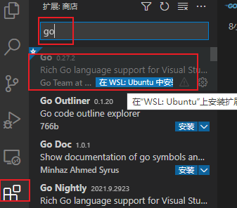
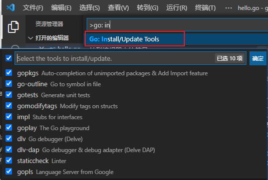

# 环境搭建
# win10 + WSL + VSCode 环境搭建
## 在WSL中安装go
1. 下载安装包: [https://studygolang.com/dl](https://studygolang.com/dl)
2. 解压: `rm -rf /usr/local/go && tar -C /usr/local -xzf goXXXX.linux-amd64.tar.gz`
3. 添加环境变量,并使环境变量生效(source命令): `export PATH=$PATH:/usr/local/go/bin`
4. 检查是否安装成功: `go version`

## 在vscode中安装go插件

安装插件

**配置代理**
```
# 启用 Go Modules 功能
go env GO111MODULE="on"

# 配置 GOPROXY 环境变量
go env GOPROXY="https://goproxy.io"

# 设置不走 proxy 的私有仓库，多个用逗号相隔（可选）
go env GOPRIVATE=*.corp.example.com
```

## import路径
1. 如果import没的查找GOPATH, 则需要将GO111MODULE设置为off:
`go env -w GO111MODULE=off`

2. 对外开放的函数,首字母必须大写

3. import 方式
```
import (
    // 这种方式导入,通过包名lib1使用(eg: lib1.MyApi).(不使用会报错)
    "GolangStudy/5-init/lib1" 

    // 在不需要使用其接口,但需要执行其内部的init方法时使用该方式导包
    // _ "GolangStudy/5-init/lib1" 

    // 命名导入, 通过包名lib2使用(eg: mylib2.MyApi).
    mylib2 "GolangStudy/5-init/lib2" 

    // 导入到当前包, 可直接使用内部的接口(eg: MyApi, 会导致命名冲突. 不推荐)
    //. "GolangStudy/5-init/lib2" 
)
```