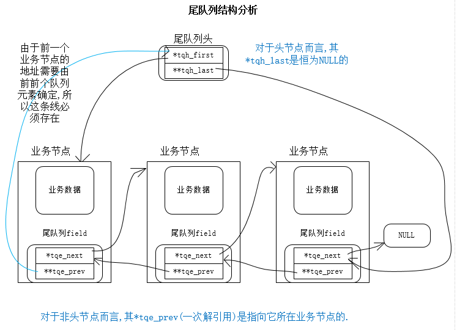

# 尾队列
注: 此处看的是livevent的尾队列(位置: 'libevent-2.1.7/compat/sys/queue.h')



**说明**:
```
尾队列节点中的tqe_next指向下一个业务节点,而tqe_prev指向的是上一个业务节点中的尾队列节点字段(实际上节点中的第一个字段tqe_next),
所以需要通过上上个节点的tqe_next获取上一个业务节点的地址 --  prevBusinessNodeAddr = ((Node*)(((Node*)(curNode->tqe_prev))->tqe_prev))->tqe_next.
因为tqe_prev中存放的是上一个尾队列节点的tqe_next,所以可简写为 prevBusinessNodeAddr = *(((Node*)(curNode->tqe_prev))->tqe_prev).

当前节点的tqe_prev存放的是上一个节点的tqe_next的地址,而上一个tqe_next中存放的是下一个(当前)业务节点的地址;
所以当前节点的*tqe_prev中存放的是当前业务的地址.
```
**注意**: 这里尾队列节点是作用业务节点的一个成员.业务节点通过其尾队列节点成员被队列管理.


尾队列实现(来自livevent)
[queue.h](images_attachments/172873222254790/queue.h)

尾队列使用
[tailQueue_used_gjy.c](images_attachments/172873222254790/tailQueue_used_gjy.c)