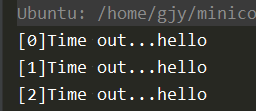
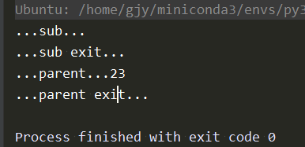
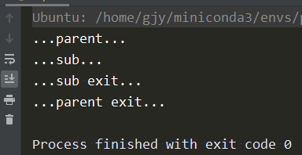
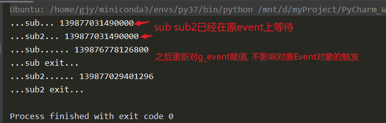

# simpy event

参考文档:
[events.html](https://simpy.readthedocs.io/en/latest/topical_guides/events.html)

## event触发后,如果不重置,触发状态将一直有效
```
import simpy
from simpy import Environment, Event

class MyClock:
    def __init__(self, env: Environment):
        self.env: Environment = env
        self.alarm_clock: Event = env.event()
        self.alarm_procs = env.process(self._alarm_proc())

    def _alarm_proc(self):
        for i in range(5):
            res = yield self.alarm_clock  # 等待event被触发,并获取value
            yield self.env.timeout(45)
            print(f'[{i}]Time out...{res}')
            if i == 2:
                self.alarm_clock = self.env.event()  # 重置event

env = simpy.Environment()
my_clock = MyClock(env)
my_clock.alarm_clock.succeed(value='hello')  # 触发event时可携带value
env.run()

```
输出结果如下


重置(重新赋值`self.alarm_clock = self.env.event()`)并不会影响触发在'原事件上的等待' -- 见附录[event重新赋值](#event重新赋值)

## Process也是event. 
### 同步执行process 
```
from simpy import Environment, Event

def sub(env: Environment):
    print('...sub...')
    yield env.timeout(1)
    print('...sub exit...')
    return 23

def parent(env):
    # Process也是event. 通过yield可同步(阻塞)获取process结果
    ret = yield env.process(sub(env))  # 同步执行process !!!
    print(f'...parent...{ret}')
    yield env.timeout(2)
    print('...parent exit...')

env = Environment()
env.run(env.process(parent(env)))
```
输出结果如下


## 异步执行process
```
from simpy import Environment, Event

def sub(env: Environment):
    print('...sub...')
    yield env.timeout(1)
    print('...sub exit...')
    return 23

def parent(env):
    env.process(sub(env))  # 异步执行process !!!
    print(f'...parent...')
    yield env.timeout(2)
    print('...parent exit...')

env = Environment()
env.run(env.process(parent(env)))

```
输出结果如下



## 附录
### <span id="event重新赋值">重新赋值不会影响原事件的触发</span>
```
from simpy import Environment, Event

env = Environment()
g_event = env.event()

def sub():
    global g_event
    print('...sub...', id(g_event))
    yield g_event
    g_event = env.event()
    print('...sub......', id(g_event))
    print('...sub exit...')

def sub2():
    global g_event
    print('...sub2...', id(g_event))
    yield g_event
    g_event = env.event()
    print('...sub2......', id(g_event))
    print('...sub2 exit...')

def parent(env: Environment):
    env.process(sub())  # 异步执行process
    env.process(sub2())

g_event.succeed()
env.run(parent(env))
```
