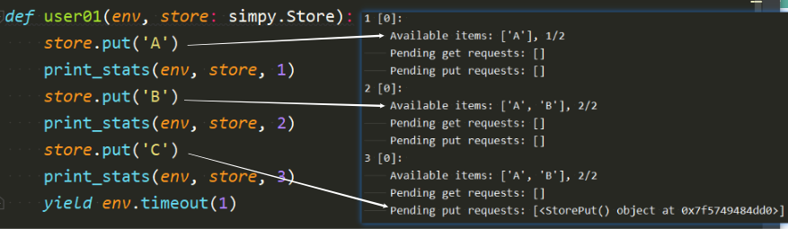
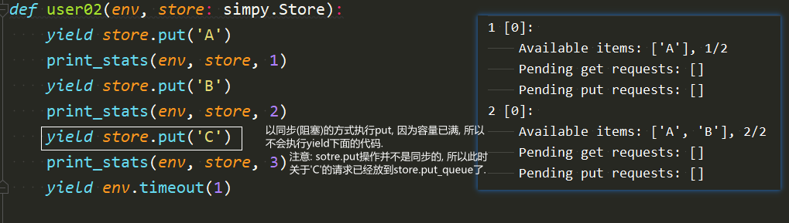
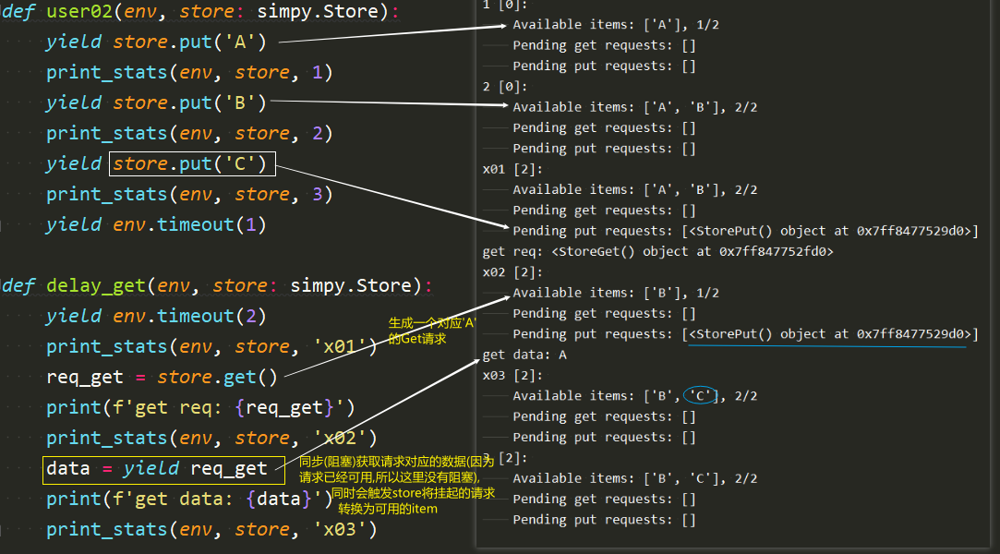
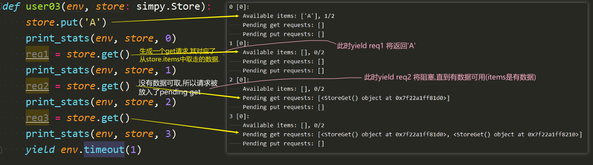
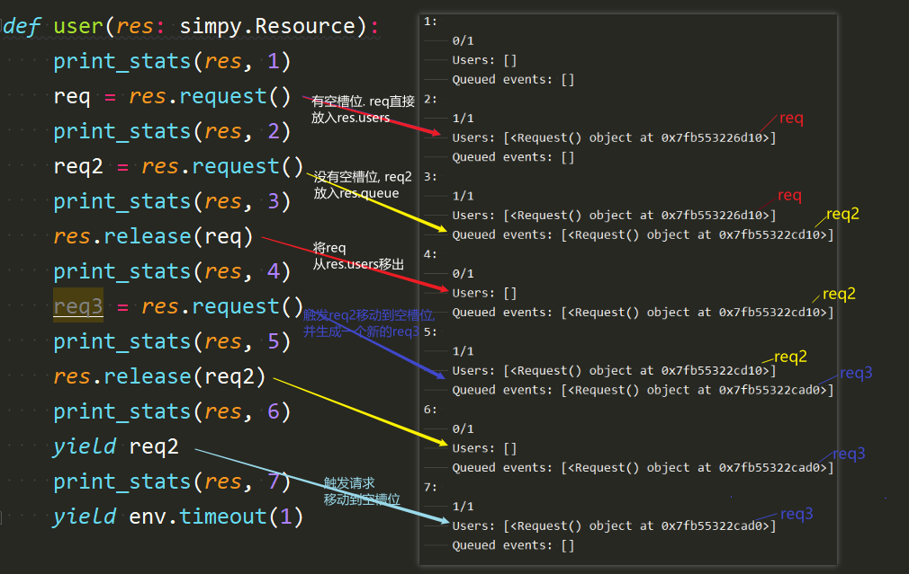
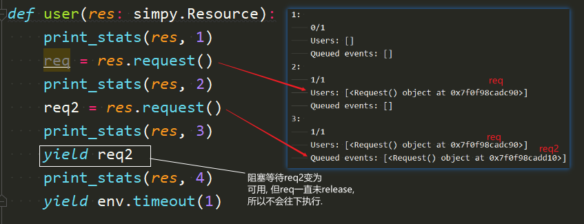
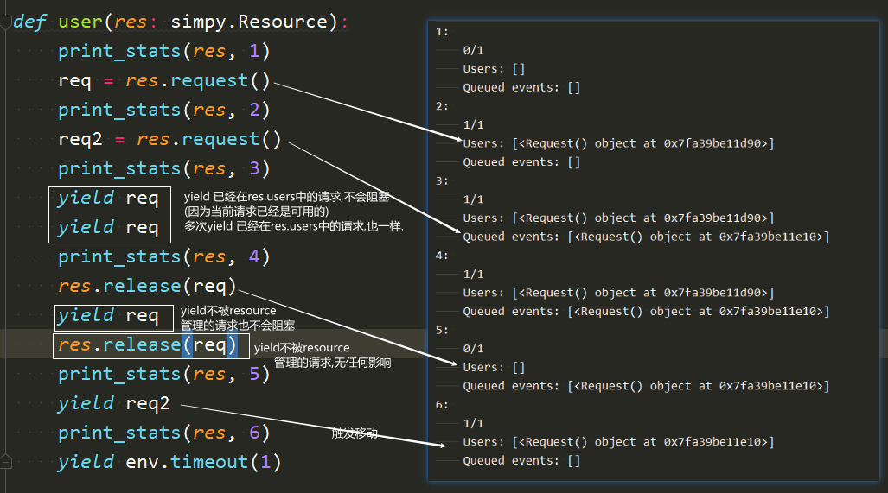

# simpy resources

参考文档:
[resources.html](https://simpy.readthedocs.io/en/latest/topical_guides/resources.html)

**SimPy 定义了三类资源**：
Resources: 一次可以由有限数量的流程使用的资源
Containers: 模拟同质、无差别散装的生产和消费的资源。
Stores : 允许生产和消费 Python 对象的资源

**资源的基本概念**
所有资源都具有相同的基本概念：资源本身是某种容器，具有通常有限的容量。
进程可以尝试 将某些内容放入资源中，也可以尝试将某些内容取出。如果资源已满或为空，则必须排队等待。

这大致是每个资源的外观：
```
BaseResource(capacity):
   put_queue
   get_queue

   put(): event
   get(): event
```
每个Resource都有一个最大容量和两个队列：一个用于想要放入某些东西的进程，一个用于想要取出某些东西的进程。
Put 和 get 方法都返回在相应操作成功时触发的事件.


## Resource
Resource概念上是一个信号量。除了必须的强制参数Environment外, 它还有一个capacity参数(必须是一个正数，默认为 1)
```
import simpy

def resource_user(env, resource):
    for _ in range(5):
        with resource.request() as req:  # 生成资源请求事件
            yield req  # 等待资源可用
            print('...request...')
            yield env.timeout(1)  # do something
            # 离开上下文时释放资源

env = simpy.Environment()
res = simpy.Resource(env, capacity=1)
user = env.process(resource_user(env, res))
env.run()

```


### 资源允许您检索当前用户或排队用户的列表,当前用户的数量和资源的容量

```
import simpy
env = simpy.Environment()
res = simpy.Resource(env, capacity=1)

def print_stats(res, name):
    # 当前使用资源的用户数/资源最大容量
    print(f'{name}: {res.count} of {res.capacity} slots are allocated.')
    print(f'  Users: {res.users}')  #  当前用户
    print(f'  Queued events: {res.queue}')  # 排队用户


def user(res, name):
    print_stats(res, name)
    with res.request() as req:
        print(f"{name}: {req}")
        yield req
        print(f"{name}: yield {req}")
        print_stats(res, name)
    print_stats(res, name)

procs = [env.process(user(res, 'x')), env.process(user(res, 'y'))]
env.run()
```


## Stores
items放item, put_queue放请求
store.items: 当前可用的物品列表. capacity限制的是store.items的大小
store.put_queue: 挂起的*put*请求队列
store.get_queue: 挂起的*get*请求队列
1. put_req = store.put(xxx) 会将数据放入store.items或 将请求放入store.put_queue; 当有空闲容量时直接将数据放入store.items,当槽位被占满时将请求放入store.put_queue.
2. yield put_req: 会阻塞,直到store有空位可以存入put_req对应的item
3. get_req = store.get() 会直接生成对应可用数据的请求(当store.items中有数据时), 此时 yield get_req可直接获取到对应的数据; 或将生成的请求放入pending get队列(当store.items中没有可用数据时), 此时yield get_req将阻塞,直到有可用的数据. 
4. store会自动处理items/put_queue/get_queue的相关转换
[simpy_store.py](images_attachments/5034800170094/simpy_store.py)











## 关于Resource的更多
res.users: List[Request] 当前'正在使用资源的进程的请求事件'列表
res.queue: 挂起的请求事件队列; BaseResource.put_queue的别名

1. res.request() 会将请求放入res.users或res.queue; 当槽位有空闲时放入res.users,当槽位被占满时放入res.queue.
2. res.release(req) 会将请求移出res.users(如果请求在res.users中的话)
3. yield req 将阻塞等待一个请求变的可用(即请求被放入res.users队列)
4. res.request() & yield req 都会触发请求从res.queue移动到res.users(如果res.users中有空闲的槽位的话)

[代码演示simpy_resource.py](images_attachments/5034800170094/simpy_resource.py)

resource相关操作的演示


关于yield req阻塞等待请求变为可用的演示


其他说明

