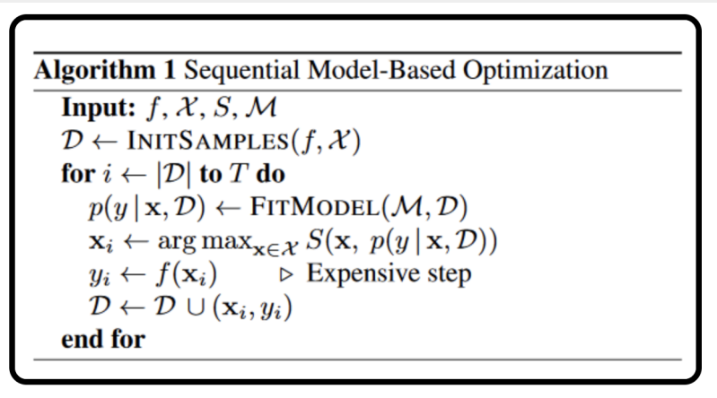
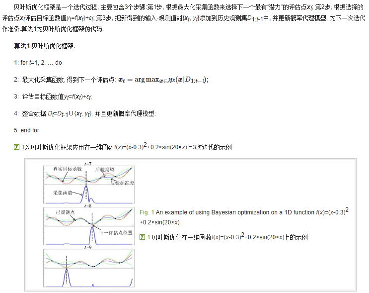

# 特征选择的工程方法
## 变量排名（Variable Ranking）
通过常见的统计检验来选择与输出变量关系最密切的那些特征。
scikit-learn中的SelectKBest就是根据不同的统计测试选取k个分数最高的变量。
```
以下通过线性回归的F值来对各输入变量进行排序，并选出前五个预测效果最好的变量
from sklearn.feature_selection import SelectKBest
from sklearn.feature_selection import f_regression
#应用SelectKBest类来提取5个最好的特征
skb = SelectKBest(score_func=f_regression, k=5)
skb_fit_res = skb.fit(train_X, train_y)

# 按得分排序输出结果. skb_fit_res.scores_中包含各特征对应的得分
print(pd.Series(skb_fit_res.scores_, index=train_X.columns).sort_values(ascending=False))
```

## 相关性矩阵及热图（Correlation Matrix with Heatmap）
```
import seaborn as sns
from matplotlib import pyplot as plt
# 获取特性相关性矩阵
corrmat = train_X.corr()

# 绘制热图
plt.figure(figsize=(20,20))
g=sns.heatmap(corrmat, annot=True, cmap="RdYlGn")
```

## 模型嵌入特征重要性属性（Built-in Feature Importance）
很多机器学习算法自带特征重要性属性。特征重要性(Feature Importance)提供数据中每个特征的得分，得分越高，该特征对输出变量的重要性或相关性就越高。
最常见的就是基于树的回归器自带的特征重要性属性。
```
这里以随机森林（Random Forest）预测方法为例，来选取最优的五个变量
from sklearn.ensemble import RandomForestRegressor
model = RandomForestRegressor(random_state=2020)
model.fit(train_X, train_y)
print(model.feature_importances_) # 输出每个特征的重要度(与train_X.columns对应)
# 绘制特征重要度图
feat_importances = pd.Series(model.feature_importances_, index=train_X.columns)
feat_importances.nlargest(5).plot(kind='barh')
plt.show()
```

## 递归式特征消除 （Recursive Feature Elimination）
递归式特征消除是通过不断递归地删除特征并根据剩余的特征建立模型的方法来优化模型。
递归式特征消除根据特征消除的顺序对特征进行排序。
```
from sklearn.feature_selection import RFE
# Feature extraction
model = RandomForestRegressor(random_state=2020)
rfe = RFE(model, 5) # 指定要选择的特征数量
fit = rfe.fit(train_X, train_y)
print("选择的特征数: {}".format(fit.n_features_))
print("选择的特征掩码: {}".format(fit.support_))
print("选择的特征名: {}".format(train_X.columns[fit.support_]))
print("特征排序(值越小越好): {}".format(fit.ranking_))

```
通过交叉验证（cross validation）让模型自主选择最优特征数
```
from sklearn.svm import SVC
from sklearn.feature_selection import RFECV

# Instantiate RFECV visualizer with a random forest regressor
rfecv = RFECV(RandomForestRegressor(random_state=2020), cv=5)
rfecv.fit(train_X, train_y) 

print("最优特征的数量: %d" % rfecv.n_features_)
print("选择的特征掩码: {}".format(rfecv.support_))
print("选择的特征名: {}".format(train_X.columns[rfecv.support_]))

# 绘制选择的特征数与交叉验证得分曲线
plt.figure()
plt.xlabel("选择的特征数")
plt.ylabel("交叉验证得 (nb of correct classifications)")
plt.plot(range(1, len(rfecv.grid_scores_) + 1), rfecv.grid_scores_)
plt.show()
```

## 特征序列选择 （Sequential Feature Selection）
特征序列选择可以分为以下三种：
前向选择： 该过程从一个空的特性集合开始，并逐个添加最优特征到集合中。
向后消除： 该过程从所有特征集开始。通过逐步删除集合中剩余的最差特征。
前向选择和后向消除的组合： 将前向选择和后向消除方法进行组合，在每个步骤中，选择最佳特征，并从其余特征中消除最差的。
```
# 前向选择的例子
from mlxtend.feature_selection import SequentialFeatureSelector as SFS
from mlxtend.plotting import plot_sequential_feature_selection as plot_sfs

# Build RF regressor to use in feature selection
clf = RandomForestRegressor(random_state=2020)

# 序列法选择特征
# k_features:为整数时,指定要选择的最优特征数
#        为'best'时,表示获取具有最佳交叉验证性能的特征子集
#        为'parsimonious'时,将选择在交叉验证性能的在一个标准误差内的最小特征子集(一般是best的子集)
sfs = SFS(clf,
           k_features=5, # 要选择的最优特征数
           forward=True, # 前向or后向选择
           floating=False,
           verbose=2,
           scoring='neg_mean_squared_error',
           cv=5)
sfs = sfs.fit(train_X, train_y)

print('序列前向选择 (k=5):', sfs.k_feature_names_)
print('CV Score:', sfs.k_score_)

fig = plot_sfs(sfs.get_metric_dict(), kind='std_err')
plt.title('序列前向选择 (w. StdErr)')
plt.grid()
plt.show()
```

# AutoML(自动化超参搜索)

## 贝叶斯调参



参考链接:
    [贝叶斯调参原理总结1](https://www.cnblogs.com/IcarusYu/p/10805467.html)
    [贝叶斯python库github地址](https://github.com/fmfn/BayesianOptimization)
    [贝叶斯调参原理详细介绍](http://www.jos.org.cn/html/2018/10/5607.htm#outline_anchor_5)
    [高斯过程与采集函数关系](https://www.jianshu.com/p/5378ef009cae)
    [暂时没看懂的强大而精致的介绍](https://www.cnblogs.com/yangruiGB2312/p/9374377.html)


后验概率分布描述通过已观测数据集对先验进行修正后未知目标函数的置信度.



## BayesianOptimization贝叶斯超参搜索库
bayes_opt贝叶斯调参库只支持优化最大值,所以在构造贝叶斯的目标函数时返回的应该是**得分(值越大越好)**, 而不是损失(值越小越好). 
每次超参搜索的结果保存在rf_bo.res中, 最好的超参结果保存在rf_bo.max中. 
参考:https://github.com/fmfn/BayesianOptimization
```
# 贝叶斯调参
from bayes_opt import BayesianOptimization

# bayes_opt.maximize()优化以最大化得分函数为目标,来进行参数搜索. 目标函数返回得分，越大越好，
def score_rf_cv(num_leaves, max_depth, subsample, min_child_samples):
    # 由于bayes优化是在连续超参数采集(传入的参数是float)，因此对于离散的超参数需要使用int转换(如最大树深只能是整数)。
    estimator = LGBMRegressor(objective = 'regression_l1',
                    num_leaves=int(num_leaves),
                    max_depth=int(max_depth),
                    subsample = subsample,
                    min_child_samples = int(min_child_samples))
    score = cross_val_score(estimator, X=train_X, y=train_y, verbose=0, cv = 5, 
                            scoring=make_scorer(mean_squared_error, greater_is_better=False)).mean()
    return score

# 设置随机数种子保证在数据和代码相同的情况下,每次贝叶斯优化运行出来的参数组合都一样
rf_bo = BayesianOptimization(
    score_rf_cv,
    {
        'num_leaves': (2, 100),
        'max_depth': (2, 100),
        'subsample': (0.1, 1),
        'min_child_samples' : (2, 100)
    },
    random_state=7,
)

# 以最大化得分的方式进行贝叶斯调参
rf_bo.maximize(n_iter=45, init_points=5) # n_iter:指定贝叶斯优化的步数;init_points:指定随机探索的次数.

# 每次超参搜索的结果保存在rf_bo.res中, 最好的超参结果保存在rf_bo.max中
maxScore = rf_bo.max['target']
minloss = -maxScore # 因为得分对象是通过MSE构建的，所以损失是得分的相反数
print("贝叶斯优化找到的最优得分:{}\n对应的损失为:{}\n参数:{}\n".format(maxScore,minloss,rf_bo.max['params']))


# 由于bayes优化传入bayes目标函数score_rf_cv的实参是float类型,但模型训练时某些参数实际使用的值是取整后的
to_int_f = lambda item: (item[0], int(item[1])) \
                        if item[0] in ['num_leaves', 'max_depth', 'min_child_samples'] \
                        else item
realParam = dict(map(to_int_f, rf_bo.max['params'].items()))
print("实际使用的最优参数为:", realParam)


# 贝叶斯调参损失可视化
# 因为评分对象是通过MSE构建的，所以损失是得分的相反数
loss_lst = list(map(lambda item:-item['target'], rf_bo.res))
ax = sns.lineplot(x=range(len(rf_bo.res)), y=loss_lst)
ax.set_xlabel("超参搜索次数")
ax.set_ylabel("损失MSE")
ax.set_title("贝叶斯调参损失可视化")

# 输出每次搜索的参数与得分
# for i, res in enumerate(rf_bo.res):
#     print("Iteration {}: \n\t{}".format(i, res))
```


```
# # 当我们已经知道有一组或是几组参数较好时，我们可以在较优参数附近进行Explore操作。
# 取三组较好参数，在其附近寻找有没有更好的。
from functools import cmp_to_key, reduce

# 自定义的比较函数. 按字典中'target'键取值升序
def my_cmp(dic1, dic2):
    if dic1['target'] > dic2['target']:
        return 1
    elif dic1['target'] < dic2['target']:
        return -1
    else:
        return 0

# 从rf_bo.res中取三组最好的参数
res_ = rf_bo.res[:] # 格式为: [{'target': 0.7, 'params': {超参1:xxx, 超参2:qqq, ..}}, ...]
res_.sort(key=cmp_to_key(my_cmp))
res_ = res_[-3:]
res_ = list(map(lambda dic:dic['params'], res_)) # 格式为: [{超参1:xxx, 超参2:qqq, ...}, ...]

# 部分超参实际使用的是整数,需要转换
def parm2int_f(dic):
    for item in dic.items():
        if item[0] in ['n_estimators', 'num_leaves', 'max_depth', 'min_child_samples']:
            dic[item[0]] = [int(item[1])]
        else:
            dic[item[0]] = [item[1]]
    return dic
            
res_ = list(map(parm2int_f, res_)) # 格式为: [{超参1:[xxx], 超参2:[qqq], ...}, ...]

# 合并字典
def mergeDic_f(dic1, dic2):
    for key in dic1.keys():
        dic1[key].extend(dic2[key])
    return dic1
res_ = reduce(mergeDic_f, res_) # 格式为: {超参1:[xxx, yyy,...], 超参2:[qqq, hhh,...], ..}

rf_bo.explore( res_ )
```


