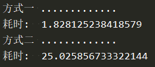

# to_datetime

```
class DateTimeFormat(object):
    """
    兼容的格式:
        FORMAT01 & FORMAT02
    不兼容的格式:
        非标准格式都不兼容. 比如: FORMAT03 & FORMAT04 & FORMAT05
        用FORMAT04格式来读取FORMAT03格式时不异常,但结果错误!
            eg: datetime.strptime('20220927 221701', FORMAT04) -> "2022-09-27 22:17:00.100000"
        用FORMAT03格式来读取FORMAT04格式直接异常.
            eg: datetime.strptime('20220927 221701010', FORMAT03) -> "ValueError: unconverted data remains"
    """
    FORMAT01 = "%Y-%m-%d %H:%M:%S"  # 可不必指定format. 是否指定format速度都差不多
    FORMAT02 = "%Y-%m-%d %H:%M:%S.%f"  # 可不必指定format. 是否指定format速度都差不多
    FORMAT03 = "%Y%m%d %H%M%S"  # 可不必指定format. 用时: 不设置format << format
    FORMAT04 = "%Y%m%d %H%M%S%f"  # 必须指定format
    FORMAT05 = "%Y%m%d%H%M%S%f"   # 必须指定format
    
    @staticmethod
    def to_dt():
        """支持DateTimeFormat的所有格式"""
        # 把精度高的放前面
        TRY_FORMAT_LIST = [DateTimeFormat.FORMAT04, DateTimeFormat.FORMAT05, DateTimeFormat.FORMAT03]
        
        ALL_FORMAT_LIST = [DateTimeFormat.FORMAT01, DateTimeFormat.FORMAT02, DateTimeFormat.FORMAT03,
                           DateTimeFormat.FORMAT04, DateTimeFormat.FORMAT05]
        res_list: List[pd.Series] = []
        dt_str_list: List[pd.Series] = []
        for format in ALL_FORMAT_LIST:
            tmp = [(datetime.now() + timedelta(seconds=i)).strftime(format) for i in range(200000)]
            tmp.extend([None]*5)
            ser = pd.Series(tmp)
            dt_str_list.append(ser)
            res = pd.to_datetime(ser, format=format)
            res_list.append(res)
       
        print("方式一 .............")
        start_t = time.time()
        new_res_list: List[pd.Series] = []
        for i, ser in enumerate(dt_str_list):
            for format in [None, *TRY_FORMAT_LIST]:
                try:
                    res = pd.to_datetime(ser, format=format)
                    new_res_list.append(res)
                    break
                except Exception:
                    continue
        end_t = time.time()
        print("耗时: ", end_t - start_t)
        for i, res in enumerate(res_list):
            x = res.dropna()
            y = new_res_list[i].dropna()
            assert (x == y).all()


        print("方式二 .............")
        def str_to_dt(dt_str):
            if dt_str is None:
                return pd.NaT
            for format in ALL_FORMAT_LIST:
                try:
                    dt = datetime.strptime(dt_str, format)
                    return dt
                except Exception:
                    continue
            return pd.NaT
        
        start_t = time.time()
        new_res_list: List[pd.Series] = []
        for i, ser in enumerate(dt_str_list):
            res = ser.apply(str_to_dt)
            new_res_list.append(res)
        end_t = time.time()
        print("耗时: ", end_t - start_t)
        for i, res in enumerate(res_list):
            x = res.dropna()
            y = new_res_list[i].dropna()
            assert (x == y).all()

if __name__ == '__main__':
    DateTimeFormat.to_dt()

```
方式一的批量操作比方式二的逐个操作快很多



