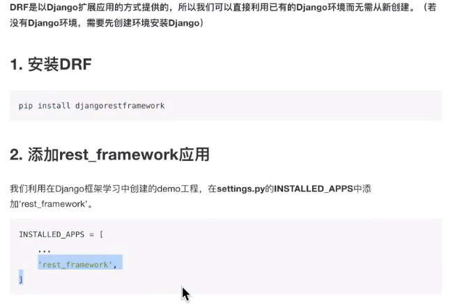
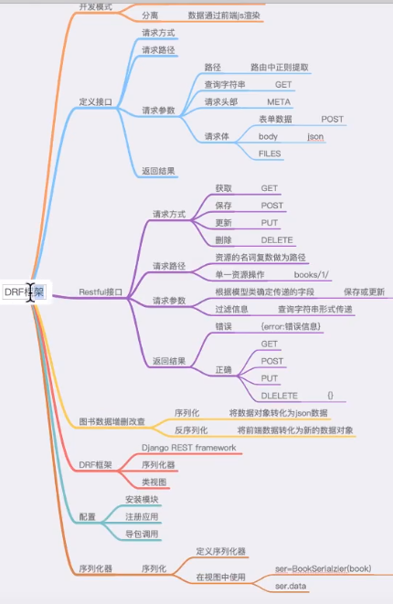
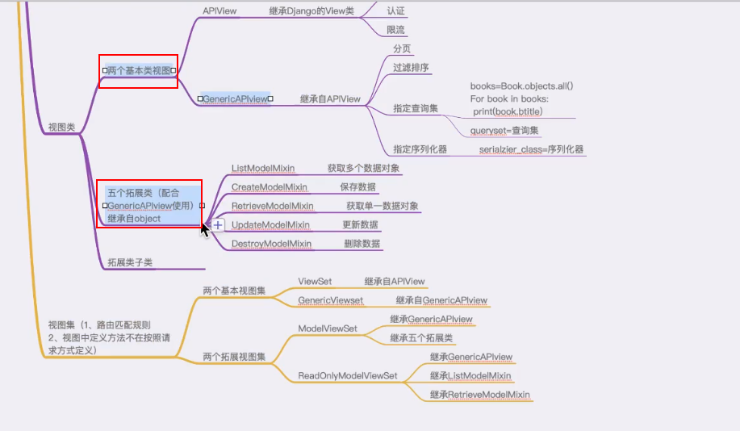
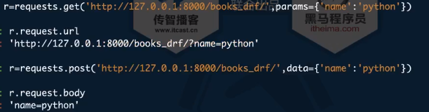
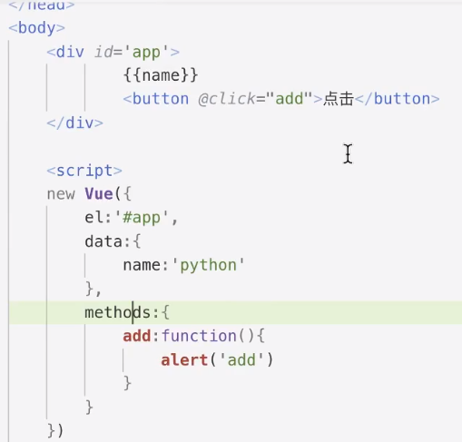

## Python之Django调用API接口开发:
1. 创建django项目: ```django-admin startproject api_pro```
2. 启动django项目: ```python manage.py runserver```
3. 一个项目必须包含一个或多个的应用(app)
    创建django应用: python manage.py startapp appName

django框架中request.body是bytes类型的.需要进行decode.


## 数据库迁移
1. python manage.py makemigrations [app_label]
2. python manage.py sqlmigrate app_label migration_name
3. python manage.py migrate [app_label] [migration_name]

## django rest framework






 


