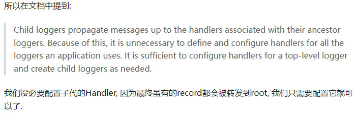

# logging使用&坑
1. logging中的logger是有层次结构的.
2. '子logger'的日志记录是会向'父logger'传播的(当propagate为False时,不传播).
3. logger可以设置Level, 可以设置多个Filter 
  3.1 当调用记录不符合'调用logger'的level时/或被'调用logger'的filter拒绝时,日志记录不会被创建.
  3.2 日志记录在传播过程中不符合logger的level时/或被logger的filter拒绝时,日志记录结束.
4. 一个logger可以设置多个handler; handler可以设置Level, 也可以设置多个Filter.
  4.1 日志记录不符合handler的level时/或被handler的filter拒绝时,日志记录结束.


## 自定义上下文 -LoggerAdapter

[参考](https://www.cnblogs.com/telecomshy/p/10630888.html)
```
import logging
import sys
import time


def test_001():
    # 默认的root logger为WARNING级别
    print("=====root logger====")
    root = logging.root
    print(root, root.parent, root.name, root.propagate)
    assert root is logging.getLogger()

    print("======通过logging.getLogger()获取logger========")
    logger = logging.getLogger('logger')
    print(logger, logger.parent, logger.name, logger.propagate)
    assert logger is logging.getLogger('logger')
    # logger是有层级结构的
    child1 = logging.getLogger('logger.child1')
    print(child1, child1.parent, child1.name, child1.propagate)
    assert child1 is logger.getChild("child1")
    
    child2 = logger.getChild('child2')
    assert child2 == logging.getLogger('logger.child2')
    
    # logger层级结构与getLogger()参数name有关
    l1 = logging.getLogger('aaa.bbb')
    print(l1.parent)
    l2 = logging.getLogger('aaa')
    print(l1.parent)
    assert l1.parent is l2

def test_002():
    # 基本配置
    logger = logging.getLogger('loger002')
    handler = logging.StreamHandler()
    formatter = logging.Formatter("%(asctime)s-%(levelname)s: %(message)s")
    handler.setFormatter(formatter)
    handler.setLevel(logging.INFO)
    logger.addHandler(handler)
    print(logger.handlers)
    logger.setLevel(logging.INFO)
    logger.info('info')

def test_003():
    # 可能会不小心对root logger设置了handler
    root = logging.getLogger()
    assert root.handlers == []
    logging.basicConfig(level=logging.INFO)
    assert len(root.handlers) > 0
    print(root.handlers)

def test_004():
    # 坑: 输出重复内容
    """
    任何自定义的logger对象都是rootLogger的子对象.
    (且logging.getLogger('aaa.bbb')得到的logger是logging.getLogger('aaa')的子logger),
    root
      |- loggerx
      |      |- loggerx.child1
      |      |- ...
      |-...
    而使用自定义的logger记录日志的时候,它会从子到父,由'子->父'链上各logger的所有handler来输出.
    PS: 通过将logger.propagate设置为False来阻断日志信息向上层传播.
    """
    root_logger = logging.getLogger()
    root_logger.setLevel(logging.INFO)
    root_handler = logging.StreamHandler()
    fmt = logging.Formatter("%(name)s-%(levelname)s: %(message)s")
    root_handler.setLevel(logging.INFO)
    root_handler.setFormatter(fmt)
    root_logger.addHandler(root_handler)
    print(root_logger.handlers)
    
    child_logger = logging.getLogger("child")
    child_logger.setLevel(logging.INFO)
    child_handler = logging.StreamHandler()
    child_handler.setLevel(logging.INFO)
    child_handler.setFormatter(fmt)
    child_logger.addHandler(child_handler)
    print(child_logger.handlers)
    child_logger.info('i am child') # 会导出两条记录
    # 日志输出了2次(一条属于root_logger,一条属于child_logger).
    # 但是root_logger输出的记录中name还是子logger的

def test_005():
    # 对比官网用法代码
    FORMAT = '%(asctime)-15s %(clientip)s %(user)-8s %(message)s'
    logging.basicConfig(format=FORMAT)
    d = {'clientip': '192.168.0.1', 'user': 'fbloggs'}
    logger = logging.getLogger('tcpserver')
    logger.warning('Protocol problem: %s', 'connection reset', extra=d)
    # 输出只有一行(由root输出. logger未配置handler).

def test_006():
    # logging.lastResort. 从'该logger->root'的logger链上均未配置handler时使用
    logger = logging.getLogger('child')
    print(logger.handlers)
    print(logging.root.handlers)
    logger.warning('i am child')
    print(logging.lastResort)

def test_007():
    # logging.lastResort.
    # 1. 当传播未被阻断时(propagate==True): 从'该logger->root'的logger链上均未配置handler时,将使用logging.lastResort
    # 2. 当传播被阻断时(propagate==False): 从'该logger->阻断位置'的logger链上均未配置handler时,将使用logging.lastResort
    print("1. ===================")
    logger = logging.getLogger('child')
    assert logger.handlers == []
    assert logging.root.handlers == []
    # print(logging.lastResort)
    logger.warning('i am child') # logger -> root -> logging.lastResort
    
    print("2. ===================")
    time.sleep(0.5)
    logger.propagate = False
    logger.warning('i am child (propagate==False)') # logger -> logging.lastResort

    print("===================")
    time.sleep(0.5)
    logging.lastResort = None
    logger.warning('logging.lastResort=None')

def test_008():
    # 关于日志信息的传播
    # 1. 当从'当前logger'到'rootlogger'路径上的所有logger的'propagate==True'时:
    #    日志信息将从'该logger一直传递到root',并由上传路径上的所有logger的handlers来输出.
    # 2. 当从'当前logger'到'rootlogger'路径上的有logger的'propagate==False'时:
    #    日志信息将从"该logger传递到第一个'propagate==False'的logger", 并由上传路径上的所有logger的handlers来输出.
    #    (若'当前logger'的propagate==False时: 日志信息只由'当前logger'的handlers来输出.)
    fmt = logging.Formatter("%(name)s-%(levelname)s[%(lineno)d]: %(message)s")
    root = logging.getLogger()
    root.setLevel(logging.INFO)
    root_handler = logging.StreamHandler()
    root_handler.setLevel(logging.INFO)
    root_handler.setFormatter(fmt)
    root.addHandler(root_handler)
    
    logger = logging.getLogger('logger')
    logger.setLevel(logging.INFO)
    handler = logging.StreamHandler()
    handler.setLevel(logging.INFO)
    handler.setFormatter(fmt)
    logger.addHandler(handler)
    
    child_logger = logging.getLogger('logger.child')
    child_logger.setLevel(logging.INFO)
    child_handler = logging.StreamHandler()
    child_handler.setLevel(logging.INFO)
    child_handler.setFormatter(fmt)
    child_logger.addHandler(child_handler)
    child_logger.warning('hello') # 输出三次: child_logger->logger->root
    
    # =================
    logger.propagate = False
    child_logger.warning('yeworlds') # 输出两次: child_logger->logger
    
    # =================
    child_logger.propagate = False
    child_logger.warning('yes') # 输出一次: child_logger
    

def test_009():
    # 关于filter
    # 通过filter过滤无关的日志记录.
    def myfilter(record):
        if record.role == "admin":
            return True
        else:
            return False
    
    logger = logging.getLogger("Wechat")
    logger.setLevel(logging.DEBUG)
    handler = logging.StreamHandler(sys.stdout)
    formatter = logging.Formatter(
            '%(asctime)s %(levelname)s: %(message)s Role: %(role)s')
    handler.setFormatter(formatter)
    logger.addHandler(handler)
    logger.addFilter(myfilter)
    # 需要使用extra参数
    logger.info('An info message with %s', 'some parameters',
                extra={"role":"admin"})
    logger.info('An info message with %s', 'some parameters',
                extra={"role":"hacker"}) # 将不会输出
    
def test_010():
    # 关于filter
    # 通过filter给record添加属性
    def myfilter(record):
        record.user = 'telecomshy'
        return True

    logger = logging.getLogger()
    logger.addFilter(myfilter)
    # 在formatter里面使用filter添加的字段
    fmt = logging.Formatter("%(levelname)s-%(asctime)s: %(message)s-%(user)s")
    handler = logging.StreamHandler(sys.stdout)
    handler.setLevel("DEBUG")
    handler.setFormatter(fmt)
    logger.addHandler(handler)
    logger.setLevel("DEBUG")
    logger.info('hello world')


if __name__ == '__main__':
    test_010()
```


第二段示例
```
import logging
import sys
import time


def test_001():
    # logger.LEVEL阻断logRecord传播
    """
    root (INFO, [handler_INFO])
      |- child (WARN, [handler_WARN])
    """
    root_logger = logging.getLogger()
    root_logger.setLevel(logging.INFO)
    root_handler = logging.StreamHandler()
    fmt = logging.Formatter("%(name)s-%(levelname)s: %(message)s")
    root_handler.setLevel(logging.INFO)
    root_handler.setFormatter(fmt)
    root_logger.addHandler(root_handler)
    print(root_logger.handlers)
    
    child_logger = logging.getLogger("child")
    child_logger.setLevel(logging.WARN)
    child_handler = logging.StreamHandler()
    child_handler.setLevel(logging.WARN)
    child_handler.setFormatter(fmt)
    child_logger.addHandler(child_handler)
    print(child_logger.handlers)
    # 日志输出了2次(一条属于root_logger,一条属于child_logger).
    # 但是root_logger输出的记录中name还是子logger的
    child_logger.warning('log record warning')
    
    # 日志输出了0次(日志记录在child_logger处被child_logger.LEVEL阻止了).
    child_logger.info('log record info')
    
def test_002():
    # handler.LEVEL阻断logRecord传播
    """
    root (INFO, [handler_INFO])
      |- child (WARN, [handler_WARN])
          |- child.logger (INFO, [handler_INFO])
    """
    root_logger = logging.getLogger()
    root_logger.setLevel(logging.INFO)
    root_handler = logging.StreamHandler()
    fmt = logging.Formatter("%(name)s-%(levelname)s[%(lineno)d]: %(message)s")
    root_handler.setLevel(logging.INFO)
    root_handler.setFormatter(fmt)
    root_logger.addHandler(root_handler)
    print(root_logger.handlers)
    
    child_logger = logging.getLogger("child")
    child_logger.setLevel(logging.WARN)
    child_handler = logging.StreamHandler()
    child_handler.setLevel(logging.WARN)
    child_handler.setFormatter(fmt)
    child_logger.addHandler(child_handler)
    print(child_logger.handlers)
    
    logger = child_logger.getChild('logger')
    logger.setLevel(logging.INFO)
    logger_handler = logging.StreamHandler()
    logger_handler.setLevel(logging.WARN)
    logger_handler.setFormatter(fmt)
    logger.addHandler(logger_handler)
    print(logger.handlers)
    
    # 日志输出了3次(一条属于logger, 一条属于child_logger, 一条属于root_logger,).
    logger.warning('log record warning')
    
    # 日志输出了1次(日志记录在child_logger处被child_logger.LEVEL阻止了).
    logger.info('log record info')

def test_003():
    # handler.LEVEL阻断logRecord传播
    """
    root (INFO, [handler_INFO])
      |- child (INFO, [handler_INFO, handler_WARN])
          |- child.logger (INFO, [handler_INFO])
    """
    root_logger = logging.getLogger()
    root_logger.setLevel(logging.INFO)
    root_handler = logging.StreamHandler()
    fmt = logging.Formatter("%(name)s-%(levelname)s[%(lineno)d]: %(message)s")
    root_handler.setLevel(logging.INFO)
    root_handler.setFormatter(fmt)
    root_logger.addHandler(root_handler)
    print(root_logger.handlers)
    
    child_logger = logging.getLogger("child")
    child_logger.setLevel(logging.INFO)
    
    child_handler1 = logging.StreamHandler()
    child_handler1.setLevel(logging.INFO)
    child_handler1.setFormatter(fmt)
    child_logger.addHandler(child_handler1)
    
    child_handler2 = logging.StreamHandler()
    child_handler2.setLevel(logging.WARN)
    child_handler2.setFormatter(fmt)
    child_logger.addHandler(child_handler2)
    print(child_logger.handlers)
    
    logger = child_logger.getChild('logger')
    logger.setLevel(logging.INFO)
    logger_handler = logging.StreamHandler()
    logger_handler.setLevel(logging.WARN)
    logger_handler.setFormatter(fmt)
    logger.addHandler(logger_handler)
    print(logger.handlers)
    
    # 日志输出了4次(1条属于logger, 2条属于child_logger, 1条属于root_logger,).
    logger.warning('log record warning')
    
    # 日志输出了2次(1条属于logger, 1条属于child_logger; 日志记录在child_logger处被hander2.LEVEL阻止了).
    logger.info('log record info')

def test_004():
    # logger.filter
    """
    root (INFO, [handler_INFO])
      |- child (INFO, [handler_INFO], myfilter)
    """
    def myfilter(record):
        if record.role == "admin":
            return True
        else:
            return False
        
    root_logger = logging.getLogger()
    root_logger.setLevel(logging.INFO)
    root_handler = logging.StreamHandler()
    fmt = logging.Formatter("%(name)s-%(levelname)s[%(lineno)d]: %(message)s")
    root_handler.setLevel(logging.INFO)
    root_handler.setFormatter(fmt)
    root_logger.addHandler(root_handler)
    print(root_logger.handlers)
    
    child_logger = logging.getLogger("child")
    child_logger.setLevel(logging.INFO)
    child_handler = logging.StreamHandler()
    child_handler.setLevel(logging.INFO)
    child_handler.setFormatter(fmt)
    child_logger.addHandler(child_handler)
    print(child_logger.handlers)
    child_logger.addFilter(myfilter)
    # 日志输出了2次(1条属于child_logger, 1条属于root_logger).
    child_logger.info('An info message with %s', 'some parameters',
                extra={"role":"admin"})
    
    # 日志输出了0次(日志记录在child_logger处被child_logger.filter阻止了).
    child_logger.info('An info message with %s', 'some parameters',
                extra={"role":"hacker"})
    


if __name__ == '__main__':
    test_004()
```


# 推荐用法
1. 不使用Logger的层次结构. 为'要使用的logger'配置handler,但将propagate设置为False. 即将logger当作无层次结构作用.

2. 使用logger的层次结构, 不为'使用logger'配置handler, 将propagate设置为True. 所有的handler配置在root中.
在子logger中配置level/filter等.
