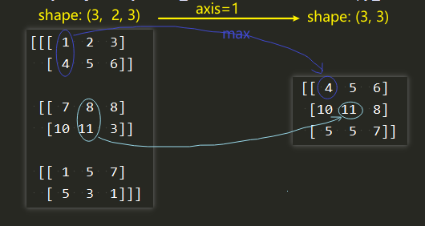
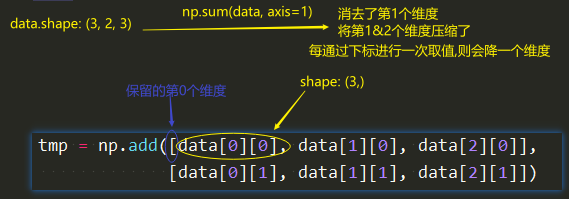

# numpy笔记

## 关于axis
当我们要对某个ndarray进行np.sum/np.max等方式的处理时, 我们可以想象axis是我们要针对的纬度.
最直观的体现就在于, 比如一个shape为(a,b,c)的矩阵mtx. 
如果我用np.sum(mtx)处理, 那么当axis = 0的时候,输出的shape就为(b,c); 同理,当axis=2的时候,输出的shape就成为(a,b).

```
import numpy as np
# data.shape == (3,2,3)
data = np.array([[[1,2,3],
				      [4,5,6]],
				     [[7,8,8],
				      [10,11,3]],
				     [[1,5,7],
				      [5,3,1]]])

output = np.max(data, axis=1)
# 根据第一段，我们知道output.shape一定是(3,3)
# output[i,j] = np.max([data[i, axis_k, j] for axis_k in range(data.shape[axis])])
```


理解: np.sum/np.max等函数的axis表示的是要操作的维度(该维度在操作后将消失).
shape: (X, Y, Z) --axis=1--> shape: (X, Y)
[numpy_axis.py](images_attachments/1415237249393/numpy_axis.py)

```
# 新的理解
import numpy as np
# data.shape == (3,2,3)
data = np.array([[[1,2,3],
				      [4,5,6]],
				     [[7,8,8],
				      [10,11,3]],
				     [[1,5,7],
				      [5,3,1]]])
output = np.max(data, axis=1)

# axis=N 即消去第N个维度 ==等价于== 保留前N-1个维度, 直接对第N个维度的元素(元素是N+1维)进行操作, 操作结果是原第N个维度消失.
# shape: (A, B, C, D) ==axis=1==> (A, C, D)
# output1.shape: (3,3)
output1 = np.sum(data, axis=1)  # 消去了第1个维度
print(output1)
print("===")
tmp = np.add([data[0][0], data[1][0], data[2][0]],
             [data[0][1], data[1][1], data[2][1]])
print(np.array(tmp))
print("**********")
```


## 广播(Broadcasting)
广播是一种强大的机制，它允许numpy在执行算术运算时使用不同形状的数组.
将两个数组一起广播遵循以下规则：
1. 如果数组不具有相同的rank，则将较低等级数组的形状添加1，直到两个形状具有相同的长度。
2. 如果两个数组在维度上具有相同的大小，或者如果其中一个数组在该维度中的大小为1，则称这两个数组在维度上是兼容的。
3. 如果数组在所有维度上兼容，则可以一起广播。
4. 广播之后，每个阵列的行为就好像它的形状等于两个输入数组的形状的元素最大值。
5. 在一个数组的大小为1且另一个数组的大小大于1的任何维度中，第一个数组的行为就像沿着该维度复制一样


**广播规则说明:**
```
X = np.array([[1], [2]]) # X.shape -- (2, 1)
v = np.array([-1, -2, -3]) # v.shape -- (3,)
```
X + v #将对v进行广播,使其形状与X相同
1. X的shape为(2, 1), 而v的shape为(3,), 它们的rank不同, 将低等级数组v的shape形状加1; 得到形状为(1,3)的v1.  --v1 = np.reshape(v, (1, 3)) -- [[-1, -2, -3]]
2. 维度兼容判断: (维度上的大小相同 或其中一个在该维度上的大小为1, 则认为在该维度上兼容)
   X的shape为(2, 1), v的shape为(1, 3),
   v在第一个维度上大小为1 --所以它们在第一个维度上是兼容的; 
   X在第二个维度上大小为1 --所以它们在第二个维度上是兼容的.
3. 由2可知X与v在所有维度上兼容,所以X和v可以一起广播
4. X,v广播后的形状为X和v的形状的最大值. 
   第一个维度形状的最大值为2, 所以广播后的形状的第一个维度为2
   第二个维度形状的最大值为3, 所以广播后的形状的第二个维度为3
   --因此广播后的形状为(2, 3)
5. 在一个数组的大小为1且另一个数组的大小大于1的任何维度中，第一个数组的行为就像沿着该维度复制一样.
   因为X在第二个维度大小为1,所以其广播是沿着第二个维度复制; 广播后结果如下X_broadcast:
   np.array([[1, 1, 1],
             [2, 2, 2]])
   v在第一个维度的大小为1, 所以其广播是沿着第一个维度复制;广播后结果如下v_broadcast:
   np.array([[-1, -2, -3],
             [-1, -2, -3]])
```
X + v # 即 X_broadcast + v_broadcast:
array([[ 0, -1, -2],
       [ 1,  0, -1]])
```


### 切片的'后边界'问题
```
lst = np.array([1,2,3,4])
lst[0:-1] #[1,2,3]不包含最后一个元素
lst[0:] #[1,2,3,4]包含最后一个元素
```

## Where 函数
1. where()函数可以用于获取满足条件的值的索引
2. where() 函数是一个根据条件返回数组中的值的有效方法。只需要把条件传递给它，它就会返回一个使得条件为真的元素的列表。

```python
# np.where(cond) # 返回满足条件cond的元素的索引
# np.where(cond,x,y) # 满足条件cond输出x，不满足输出y

my_array = np.array([[0, 1, 2],
                     [3, 4, 5],
                     [6, 7, 8]])

# 获取值小于5的元素的索引
indexes = np.where(my_array<5) # [第一个维度的索引, 第二个维度的索引, ...]
indexes # list(zip(*indexes))

my_array = np.where(my_array<5, my_array, 100) #条件cond将作用于my_array的每个元素
print(my_array)

# 为True的元素人第二个参数中取,为False的元素从第三个参数中取
np.where([[True, False], [True, True]], 　
         [[1111, 22222], [3333, 4444]], 
         [[6666, 77777], [8888, 9999]]) 
```