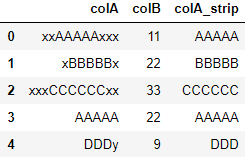
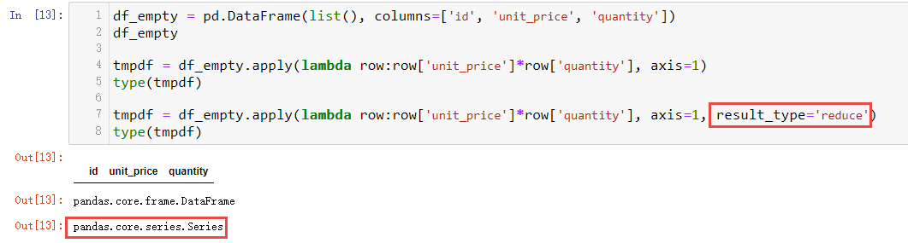
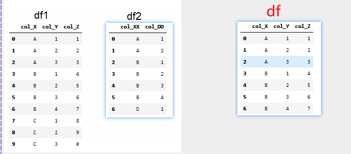

# pandas使用记录

## Series的map(),apply()方法
**map(func)方法工作在Series对象(即DataFrame的单列或单行)之上**。
迭代Series对象的每一个**元素**，并对其运行函数func(也就是说函数func的实参是Series对象的元素).
返回: 一个与调用map函数的Series所有相同index的新的Series对象。
```
data = {'colA':['xxAAAAAxxx', 'xBBBBBx', 'xxxCCCCCCxx', 'AAAAA', DDDy], 
        'colB':[11, 22, 33, 22, 9]}
df = pd.DataFrame(data)
strip_f = lambda s: s.strip("xy")  # 去掉前后的字符'x'或'y'
df['colA_strip'] = df['colA'].map(strip_f) #对指定列的元素运用strip_f函数
df
```


Series对象上的apply()方法与map()功能类似。

## DataFrame的apply(),transform(),applymap()方法

**DataFrame的apply()方法在指定的axis上应用某个函数,传递给函数的实参是Series对象。**
df.apply(func, axis=0): axis=0时,apply会依次取df的各列作为实参传给func.
    
    可以理解成: row1=[1,2], row2=[3,4]; axis=0时，每次从各行中取一个值组成Series对象作为实参传入func.
    第1次调用func时, 实参为[row1[0], row2[0]]
    第2次调用func时, 实参为[row1[1], row2[1]]
    应用apply函数后得到的结果是符合行规范的。

df.apply(np.sum, axis=1): axis=1时,apply会依次取df的各行作为实参传给func.应用apply函数后得到的结果是符合列规范的。
    

**DataFrame的transform()方法在指定的axis上应用某个函数,传递给函数的实参是Series对象。**
transform()方法的使用与apply()方法的使用类似.
    

**DataFrame的applymap()方法DataFrame的所有数据单元上,传递给函数的实参是元素对象**
```
data = {'A':[1, 2, 3],
        'B':[4, 5, 6]}
df = pd.DataFrame(data)

def add1(item):
    print(type(item)) # int
    return item+1

df.applymap(add1)
```


**DataFrame的Groupby()方法**
```
# eg: 分组求和
data = {'colA':['A', 'B', 'C', 'A', 'B'], 
        'colB':[11, 22, 33, 22, 9]}
df = pd.DataFrame(data)
df.groupby('colA').sum()
```

**DataFrame的agg()方法**
DataFrame的agg()方法有指定的axis上进行一个或多个聚合操作。
agg()方法可与groupby()方法配套使用。
```
df = pd.DataFrame([[1, 2, 3],
                   [4, 5, 6],
                   [7, 8, 9],
                   [np.nan, np.nan, np.nan]],
                  columns=['A', 'B', 'C'])

df.agg(['sum', 'min'], axis=0)
df.agg(['sum', 'min'], axis=1)
df.agg({'A' : ['sum', 'min'], 'B' : ['min', 'max']}, axis=0)
```


## DataFrame转置
转置: df.T 或 result1.stack().unstack(0)
```
data = {'A':[1, 2, 3], 
        'B':[4, 5, 6]}
df = pd.DataFrame(data)
print(df)
df_t = df.stack().unstack(0) # 得到df的转置
print(df_t)

# PS
print(df.stack().index)
```


## 索引相关操作
### 获取列colName中取值为val的索引
idx = df.index[df['colName']==val]
```
datax = {'colA':['A', 'B', 'C', 'A', 'B'], 
        'colB':[11, 22, 33, 22, 9]}
df = pd.DataFrame(datax)

# colB列取值为22的元素的索引
idx_val_22 = df.index[df['colB']==22]

# colB列取值为11或22的元素的索引
idx_val_11or22 = df.index[df['colB'].isin([11, 22])]

# colB列取值为11或22的元素的索引,对应的所有行组成的DataFrame
df2 = df.loc[idx_val_11or22]
idx = df2.index[df2['colA'] == 'A']
df2.loc[idx]
```


## 通过调整数据类型，帮助我们减少数据在内存中占用的空间
```
# 通过调整数据类型，帮助我们减少数据在内存中占用的空间
def reduce_mem_usage(df):
    """ 遍历dataframe的所有列并修改数据类型以减少内存使用. """
    start_mem = df.memory_usage().sum() 
    print('DataFrame占用内存 {:.2f} KB'.format(start_mem/1000))
    
    for col in df.columns:
        col_type = df[col].dtype
        
        if col_type != object:
            c_min = df[col].min()
            c_max = df[col].max()
            if str(col_type)[:4] == 'uint':
                uint_type_lst = [np.uint8, np.uint16, np.uint32, np.uint64]
                for uint_type in uint_type_lst:
                    if c_min > np.iinfo(uint_type).min and c_max < np.iinfo(uint_type).max:
                        df[col] = df[col].astype(uint_type)
                        break
            elif str(col_type)[:3] == 'int':
                int_type_lst = [np.int8, np.int16, np.int32, np.int64]
                for int_type in int_type_lst:
                    if c_min > np.iinfo(int_type).min and c_max < np.iinfo(int_type).max:
                        df[col] = df[col].astype(int_type)  
                        break
            else:
                float_type_lst = [np.float16, np.float32]
                for float_type in float_type_lst:
                    if c_min > np.finfo(float_type).min and c_max < np.finfo(float_type).max:
                        df[col] = df[col].astype(float_type)
                        break
        else:
            df[col] = df[col].astype('category')

    end_mem = df.memory_usage().sum() 
    print('优化后的内存占用量为: {:.2f} KB'.format(end_mem/1000))
    print('减少内存占用 {}, {:.1f}%'.format((start_mem-end_mem)/1000, (start_mem-end_mem)*100/start_mem))
    return df
```

## 索引访问DataFrame需知
df.loc[行标][列标]  --行标在前,列标在后 
    --!!!这种方式作为左值时并不会真的修改df的指定元素
    
df[列标][行标]　--列标在前,行标在后
    --这种方式做为左值时可以修改df的指定元素,但会有SettingWithCopyWarning告警

**通过索引修改元素时的推荐方式**
df.loc[行标, 列标]

PS: 上面的行标、列标　可以是单个index,也可以是切片,或者是index列表.

## 使用Series对DataFrame某列的特定行进行赋值.
使用Series赋值时需要注意index保持一致.
```
tmp_data = [2.0, 4, 6, 8, 10]
df1 = pd.DataFrame(tmp_data, index=['a', 'b', 'c', 'd', 'e'], columns=['colA'], dtype=np.float)

tmp_data2 = [1, 1, 2, 4]
series1 = pd.Series(tmp_data2, index=['a', 'b', 'c', 'd'], dtype=np.float)
df1

# df.loc[行标][列标]  --行标在前,列标在后
df1.loc[['a', 'b', 'c', 'd']]['colA'] = series1 # !!!这种方式并不会真的修改df1的指定元素
df1

# df[列标][行标]　--列标在前,行标在后
df1['colA'][['a', 'b', 'c', 'd']] = series1
df1
```


### 'if i in series' 与 'if i in series.values' 及 'for i in series'
'if item in series' 与 'if item in series.values' 有什么区别?
    in做判断时,比较的是key(对应Series的index)。
    if item in series　等价与 if item in series.index
    if item in series.values 等价也　if item in series.tolist()

'for item in series' 与 'for item in series.tolist()' 有什么区别?
    in做遍历时, 迭代的是series的值.
    for item in series　等价与　for item in series.values 等价于　for item in series.tolist()

在使用in时最好显式指定keys或values。
```
tmp_data2 = [1, 2, 3, 4]
series1 = pd.Series(tmp_data2)
series1
series1.index  # RangeIndex(start=0, stop=4, step=1)
series1.values # array([1, 2, 3, 4], dtype=int64)
series1.tolist() # [1, 2, 3, 4]

0 in series1  # True
0 in series1.index # True
0 in series1.values # False
0 in series1.tolist() # False

for i in series1: # 1 2 3 4
    print(i)
```


## pd.concat()连接多个df
pd.concat(objs, axis, join, ignore_index)  --只列出了常用参数
常用参数：
objs: 要连接的df列表(如:[df1, df2])
axis: 在这个轴上进行连接(axis＝0：将增加行; axis＝1：将增加列)
join: 连接方向(参考数据库)
ignore_index: 是否忽略要连接df的index(为False时保留原index进行连接;　为True时index将重置)
```
data1 = {'colA':['A', 'B', 'C', 'A'], 
         'colB':[11, 22, 33, 22]}
df1 = pd.DataFrame(data1)

data2 = {'colA':['A2', 'B2'], 
         'colB':[111, 222]}
df2 = pd.DataFrame(data2)

df = pd.concat([df1, df2], axis=0, ignore_index=False) 
df_resetIdx = pd.concat([df1, df2], axis=0, ignore_index=True)
```


## 数据透视表(pd.pivot_table)可以实现与分组(df.groupby)类型的功能
类似分组聚合功能
pd.pivot_table(df, values=[要透视的列], index=[作为索引的列], 
               aggfunc=对透视数据进行的操作, 
               dropna=数据透视时是否删除nan)
注: aggfunc的参数是Series
```
## 按分组收集元素
datax = {'colA':['A', 'B', 'C', 'A', 'B'], 
         'colB':[11, 22, 33, 22, 9],
         'colC':[111, 222, 333, 222, 99]}
df = pd.DataFrame(datax)

# def aggfunc_f(series):
#    print(type(series))
#    return items.tolist()

# 使用数据透视表pivot_table按分组收集元素
pd.pivot_table(df, values=['colB'], index=['colA'], 
               aggfunc=lambda series:series.tolist(), 
               dropna=False)

# 使用groupby按分组收集元素
df3 = df.groupby('colA').agg(lambda items:items.tolist())
df3
```

### 分组聚合(分组透视)
```
data = {
    'class': ['one', 'one', 'one', 'one', 'one', 'one', 'one', 'one', 'two', 'two'],
    'name': ['A', 'A', 'A', 'B', 'B', 'B', 'C', 'C', 'A', 'A'],
    'course': ['语文', '数学', '英语', '语文', '数学', '英语', '语文', '数学', '数学', '英语'],
    'score': [90, 95, 96, 87, 99, 98, 59, 88, 95, 59],
    'time': [60, 80, 65, 70, 70, 65, 55, 60, 65, 50]
}
long_df = pd.DataFrame(data)
long_df
# 透视
pivot_df = long_df.pivot_table(index=['class'], columns='course' , 
               values=['score', 'time'], aggfunc='mean', fill_value=0)
pivot_df

pivot_df.columns = [ls if isinstance(ls, str) else '_'.join(l for l in ls if l) for ls in pivot_df.columns.values]
pivot_df
```


# 一行拆多行

# 行转列(长表变宽表)
```
data = {
    'name': ['A', 'A', 'A', 'B', 'B', 'B', 'C', 'C'],
    'course': ['语文', '数学', '英语', '语文', '数学', '英语', '语文', '数学'],
    'score': [90, 95, 96, 87, 99, 98, 59, 88],
    'time': [60, 80, 65, 70, 70, 65, 55, 60]
}
long_df = pd.DataFrame(data) # 长df
long_df

# 行转列
mulit_level_df = long_df.set_index(['name', 'course']) # 列转index
mulit_level_df
wide_df = mulit_level_df.unstack(level=1, fill_value=None) # 将指定层次的index转为column
wide_df

# 行转列
# wide_df = long_df.pivot(index='name', columns='course', values=['score', 'time'])

# 列索引扁平化
wide_df.columns = [ls if isinstance(ls, str) else '_'.join(l for l in ls if l) for ls in wide_df.columns.values]
wide_df
```


#### 一个更复杂的例子

```
data = {
    'class': ['one', 'one', 'one', 'one', 'one', 'one', 'one', 'one', 'two', 'two'],
    'name': ['A', 'A', 'A', 'B', 'B', 'B', 'C', 'C', 'A', 'A'],
    'course': ['语文', '数学', '英语', '语文', '数学', '英语', '语文', '数学', '数学', '英语'],
    'score': [90, 95, 96, 87, 99, 98, 59, 88, 95, 59],
    'time': [60, 80, 65, 70, 70, 65, 55, 60, 65, 50]
}
long_df = pd.DataFrame(data)
long_df

# Note: 为df.pivot构建(index, columns)组成的惟一entries
long_df['id'] = long_df.apply(lambda row: (row['class'], row['name']), 
                         axis=1, result_type="reduce")
wide_df = long_df.pivot(index='id', columns='course', values=['score', 'time']).reset_index()
wide_df
wide_df.columns = [ls if isinstance(ls, str) else '_'.join(l for l in ls if l) for ls in wide_df.columns.values]
wide_df
wide_df[['class', 'name']] = wide_df[['id']].apply(lambda row: row['id'], axis=1, result_type='expand')
wide_df

wide_df = wide_df.drop(columns=['id']).set_index(['class', 'name'])
wide_df

# PS:  使用'class'+'name'构建'id'列,是为了避免pd.pivot报如下错误．
# ValueError: Index contains duplicate entries, cannot reshape
# df.pivot中的index和columns参数都只能传入单个列名，且参数index与columns的组合必须是惟一的
```

```
# df.pivot中的index和columns参数都只能传入单个列名，且参数index与columns必须是惟一的
data = {
    'name': ['A', 'A', 'B', 'B'],
    'course': ['语文', '数学', '语文', '数学'],
    'score': [90, 95, 96, 87]
}
long_df = pd.DataFrame(data)
wide_df = long_df.pivot(index='name', columns='course', values=['score']).reset_index() # ok
wide_df
# =================================

# error: df.pivot中参数index与columns的组合不是惟一的
data = {
    'name': ['A', 'A', 'A', 'B'],
    'course': ['语文', '数学', '语文', '数学'],
    'score': [90, 95, 96, 87]
}
long_df = pd.DataFrame(data)
# ValueError: Index contains duplicate entries, cannot reshape
wide_df = long_df.pivot(index='name', columns='course', values=['score']).reset_index() # error
wide_df
```

# 列转行(宽表变长表)
```
data = {
 'class': ['one', 'one', 'one', 'two'],
 'name': ['A', 'B', 'C', 'A'],
 '数学': [95.0, 99.0, 88.0, 95.0],
 '英语': [96.0, 98.0, None, 59.0],
 '语文': [90.0, 87.0, 59.0, None]
}
wide_df = pd.DataFrame(data)
wide_df

# 将 DataFrame 从宽格式转为长格式
long_df = wide_df.melt(id_vars=['class', 'name'], 
             value_vars=["数学", "英语", "语文"],
             var_name='course', value_name='score')
long_df
```
**df.melt**说明
id_vars: 固定的列(可理解为"从宽格式转为长格式"过程中的index)
value_vars: 要取消透视的列(即要转换成行的列)
var_name/value_name: 取消透视后,值展开对应的两个列名


## 对Series计算平均值时,列中的nan对平均值无影响
```
datax = {'colA':['A', 'B', 'C', 'A', 'B'], 
         'colB':[11, 22, 33, np.nan, 9],
         'colC':[111, 222, 333, 222, np.nan]}
df = pd.DataFrame(datax)
df[['colB', 'colC']].mean()

df2 = df.dropna(axis=0, subset=['colB'], inplace=False)
df2[['colB']].mean()

df3 = df.dropna(axis=0, subset=['colC'], inplace=False)
df3[['colC']].mean()
```


## Series的众数series.mode
series.mode()获取到的众数有多个,如果要使用众数填充nan,需要取第一个,否则无法填充成功。

```
datax = {'colA':['A', 'B', np.nan, 'A', 'B'], 
         'colB':[11, 22, 33, np.nan, 9]}
df = pd.DataFrame(datax)

# 无法正常填充colA列的nan
df['colA'].fillna(df['colA'].mode(), inplace=True)
df['colA'].isnull().sum() # 1

# 可以正常填充colA列的nan
df['colA'].fillna(df['colA'].mode()[0], inplace=True)
df['colA'].isnull().sum() # 0
```


## pd.cut()分桶
```
bin = [0, 17, 65, 79, 150]
df['年龄段'] = pd.cut(data['age'], bin, right=True, labels=['未成年人', '青年人', '中年人', '老年人'])

PS: bin设置为int常数时，将进行等宽分桶. 将max-min分成指定段。
```


## 使用groupbyColName列的均值信息来填充useMeanFillCols指定的列簇
```
# 使用groupbyColName列的均值信息来填充useMeanFillCols指定的列簇
# 当useMeanFillCols中包含多个列时, 要求这些列产生缺失的位置相同(即相同样本产生的缺失).
# useMeanFillCols: 需要使用均值填充的列簇--list类型
# groupbyColName: 用于产生统计信息的特征名--string类型
def useMeanFillCols_4_SpecifyGroupbyCol(df, useMeanFillCols, groupbyColName):
    # 按useMeanFillCols列删除缺失值对应的行
    df2 = df.dropna(axis=0, subset=useMeanFillCols, inplace=False)

    # 平均数信息
    groupby_areaName_mean_df = df2[[groupbyColName]+useMeanFillCols]\
                                .groupby(groupbyColName).mean()

    print('按 {} 填充缺失前, 有 {} 个缺失值'.format(groupbyColName, 
                                             df[useMeanFillCols[0]].isnull().sum()))
    # 先找到需要填充元素对应的分组列名
    idx_missCol2gbColName = df[groupbyColName][df.index[df[useMeanFillCols[0]].isnull()]].drop_duplicates()
    for gbCol_val in idx_missCol2gbColName:
        if gbCol_val in df2[groupbyColName].drop_duplicates().values:
            idx = df.index[df[groupbyColName] == gbCol_val] # 找到满足条件的元素对应的索引
            df_tmp = df.loc[idx]

            for fea in useMeanFillCols:
                idx2 = df_tmp.index[df_tmp[fea].isnull()] #找到需要填充的位置索引
                if not idx2.empty:
                    df.loc[idx2, fea] = df[fea][idx2]\
                                                .map(lambda item: groupby_areaName_mean_df[fea][gbCol_val])

    print('按 {} 填充缺失信息后, 还有 {} 个缺失值'.format(groupbyColName, df[useMeanFillCols[0]].isnull().sum()))
```

## 数据预处理.使用colB的分组统计信息来填充其它列的缺失
```
# 使用groupbyColName列的众数信息来填充useModeFillCols指定的列簇
# 当useModeFillCols中包含多个列时, 要求这些列产生缺失的位置相同(即相同样本产生的缺失).
# useModeFillCols: 需要使用众数填充的列簇--list类型
# groupbyColName: string类型
def useModeFillColA_4_SpecifyGroupbyColB(useModeFillCols, groupbyColName):
    global full_data
    # 按useModeFillCols列删除缺失值对应的行
    full_data2 = full_data.dropna(axis=0, subset=useModeFillCols, inplace=False)

    # 众数信息
    groupby_areaName_mode_df = full_data2[[groupbyColName]+useModeFillCols]\
                                .groupby(groupbyColName)\
                                .agg(lambda x: x.value_counts().index[0])
    

    print('按 {} 填充缺失前, 有 {} 个缺失值'.format(groupbyColName, full_data[useModeFillCols[0]].isnull().sum()))
    # 先找到需要填充元素对应的分组列名
    idx_missCol2gbColName = full_data[groupbyColName][full_data.index[full_data[useModeFillCols[0]].isnull()]].drop_duplicates()
    for gbCol_val in idx_missCol2gbColName:
        if gbCol_val in full_data2[groupbyColName].drop_duplicates().values:
            idx = full_data.index[full_data[groupbyColName] == gbCol_val] # 找到特定小区名的元素对应的索引
            df_tmp = full_data.loc[idx]

            for fea in useModeFillCols:
                idx2 = df_tmp.index[df_tmp[fea].isnull()] # 找到特定小区名 且 地铁线路为空的元素的索引
                if not idx2.empty:
                    full_data.loc[idx2, fea] = full_data[fea][idx2]\
                                                .map(lambda item: groupby_areaName_mode_df[fea][gbCol_val])
    print('按 {} 填充缺失信息后, 还有 {} 个缺失值'.format(groupbyColName, full_data[useModeFillCols[0]].isnull().sum()))
```


## series.cumsum()累积求和
```
series = df['薪资'].sort_index()
series.cumsum()/series.sum()
```
## 对DataFrame的列计算加权平均
```
import numpy as np
import pandas as pd

datax = {'colA':[-1, -2, -3, -4, -5], 
         'colB':[1, 2, 3, 4, 5],
         'colC':[11, 22, 33, 44, 55]}
df = pd.DataFrame(datax)
# 对DataFrame的列计算加权平均
wigth = np.array([0.2, 0.3, 0.5])
df['wavg'] = (df[['colA', 'colB', 'colC']].to_numpy() * wigth).sum(axis=1)/wigth.sum()
df
```

## 训练集＆测试集的合并与拆分
```
# 合并训练集和测试集, 统一进行处理. 合并后Test部分的Label为null,而Train部分的Label非null。
full_data = pd.concat([Train_data, Test_data], axis=0, ignore_index=True)
...
# 从合并后的全量数据集中提取出训练集和测试集的index
def get_trainIdx_and_testIdx(label='Label'):
    global full_data
    test_idx = full_data.index[full_data['Label'].isnull()]
    
    train_idx = set(full_data.index) - set(test_idx)
    return train_idx,test_idx
    
# 从合并后的全量数据集中提取出训练集和测试集
def get_trainData_and_testData_byIdx(train_idx, test_idx):
    global full_data
    Test_data = full_data.loc[test_idx]
    Test_data.drop('Label', axis=1, inplace=True)
    
    Train_data = full_data.loc[train_idx]
    return Train_data,Test_data
```

## 对指定列进行分桶
```
# 对指定列进行分桶. 处理桶边界(不然会产生nan)
def cut_bucket(bin_lst, colName, trace=1e-5):
    global full_data
    idx = full_data.index[full_data[colName] > bin_lst[-1]]
    if not idx.empty:
        full_data.loc[idx, colName] = bin_lst[-1] - trace # 
    
    idx = full_data.index[full_data[colName] <= bin_lst[0]] # 桶不包含左边界
    if not idx.empty:
        full_data.loc[idx, colName] = bin_lst[0] + trace
    
    # right=True时桶包含右边界
    full_data[colName] = pd.cut(full_data[colName], bin, right=True, labels=False)
```

## 将DataFrame列名中的中文替换成英文
```
import re
# 将列名中的中文替换成英文
# orgColNames：原始列名列表, 列名中的中文只允许出现在　开头、结尾、或中间以'_'分隔(如"中文_xx_中文_xxx_中文")
# ch2en_dic:中文到英文的词表
def get_zh2en_colName(orgColNames, ch2en_dic):
    old2new_col_dic = dict()
    for feaName in orgColNames:
        newFeaName = feaName
        for ch in ch2en_dic.keys():
            pattern = r'(?:^{placeholder}$|^{placeholder}_|_{placeholder}$|_{placeholder}_)'.format(placeholder=ch)
            ret = re.search(pattern, feaName)
            if ret:
                print(ch)
                pattern_dic = {r'^{placeholder}$'.format(placeholder=ch): ch2en_dic[ch],
                               r'^{placeholder}_'.format(placeholder=ch): ch2en_dic[ch]+'_',
                               r'_{placeholder}$'.format(placeholder=ch): '_'+ch2en_dic[ch],
                               r'_{placeholder}_'.format(placeholder=ch): '_'+ch2en_dic[ch]+'_'}
                
                for pattern,newStr in pattern_dic.items():
                    newFeaName = re.sub(pattern, newStr, newFeaName)
        old2new_col_dic[feaName] = newFeaName
 
    return old2new_col_dic

# test
ch2en_dic = {
        '位置': 'place',
        '区': 'region',
        '小区名': 'house_estate_name',
        '楼层': 'floor',
        '朝向': 'orientations'
    }
orgColNames = ['区', '区_', '区_小区名', '小区名', '小区名_', '_小区名xxx', '_小区名_xxx']
get_zh2en_colName(orgColNames) #'_小区名xxx'不符合要求无法完成替换
```


## 使用df.sample()对DataFrame进行采样
一般df中一行表示一个样本,一列表示一个特征.

df.sample(n=None, frac=None, axis=None, replace=False,  weights=None, random_state=None）
n/frac: 采样的 个数or比例,不能同时指定这两个参数
axis: 对 行or列 进行采样, 0:行采样(样本采样)--默认, 1:列采样(特征采样)
replace: 是否进行有放回采样
weights: 采样权重, 需要与指定的轴长度相同。默认为等权采样
可以对df的 行or列 进行采样, 并可以指定, 以及可以指定采样的权重(一般对列).
指定数目或指定比例的样本
```
# 采样30%的样本
df1 = df.sample(frac=0.3, axis=0, replace=False, random_state=2020)

# 采样1000个样本
df2 = df.sample(n=1000, axis=0, replace=False, random_state=2020)

# 打混后数据集, frac取1
df = df.sample(frac=1)
```

## 关于DataFrame的行索引(index)
DataFrame的行索引分为标签索引和下标索引。（列类似）
标签索引：
    对应于pandas的Index对象.
    df.index得到的是标签索引; df.loc[],df.drop(index=xxx)是通过标签索引进行操作;
    即使标签索引取值是数值也不要将其将其与下标索引混淆,标签索引更像是字典的key.
    使用标签索引进行切片时包含右边界。
下标索引：
    从0开始计算的数字索引,总是保持连接性。
    df.iloc[]是通过下标索引进行操作的。
    使用下标索引进行切片时不包含右边界。
PS: 当标签索引取值为数值时,尤其要注意标签索引和下标索引的区别。
　　尽量使用标签索引进行操作,以明确操作的是哪些行。
　　当要获取指定数目的样本时,使用下标索引(如获取前N行df.iloc[0:N+1])
```
# 一个关于标签索引和下标索引的例子
datax = {'colA':['A', 'B', 'C', 'A', 'B'], 
         'colB':[11, 22, 33, np.nan, 9],
         'colC':[111, 222, 333, 222, np.nan]}
df = pd.DataFrame(datax)
df.index   # 标签索引RangeIndex(start=0, stop=5, step=1)
df.loc[2]  # 通过标签索引进行操作
df.iloc[2] # 通过下标索引进行操作
df.drop(index=[2], inplace=True) # 通过标签索引进行删除
# df.loc[2] # KeyError--因为这个标签索引对应的行已经被删除了
df.iloc[2] # 下标索引依然可以进行操作(但操作的行已经与原来不同了)
```


## 对空的DataFrame使用df.apply()需要注意的地方(坑) --pandas无法自动推断类型
df[newColName] = df[selCols].apply(func) 
使用该方式来给df新增列时;如果df为空,则会出错.
原因是:df为空时,func实际上并不会执行;而我们没有指定result_type参数,因此pandas无法推断出df.apply的返回类型.
解决方法:
    指定df.apply的result_type参数为'reduce'
```
df_empty = pd.DataFrame(list(), columns=['id', 'unit_price', 'quantity'])
df_empty

# 通过df.apply来统计多列信息,并试图给df添加新的列
df_empty['total_price'] = df_empty.apply(lambda row:row['unit_price']*row['quantity'], axis=1)
df_empty
```


```
df_empty = pd.DataFrame(list(), columns=['id', 'unit_price', 'quantity'])
df_empty

# df为空时,df.apply设置result_type='reduce'可正常添加新列
df_empty['total_price'] = df_empty.apply(lambda row:row['unit_price']*row['quantity'], axis=1, result_type='reduce')
df_empty
```





# 关于MultiIndex
## 按条件取某一层的索引
```
data = { 'class': ['一班', '一班', '二班', '二班', '一班', '一班'],
         'name': ['张三', '张三', '李四', '李四', '王五', '王五'], 
         'subject': ['语文', '数学', '语文', '数学', '语文', '数学'], 
         'score': [70 , 90, 92, 80, 87, 85] }
# 构造一个多重索引的df
df = pd.DataFrame(data=data).set_index(['class', 'name', 'subject'])
df

df.reset_index() # 默认移除所有层级的索引
df.reset_index(level=2) # 移除层级为2的索引
df.reset_index(level=1) # 移除层级为1的索引
df.reset_index(level=[1,2]) # 移除层级[1,2]的索引


# 获取任意一科成绩达到90的学生姓名
mindx = df.index[df['score']>=90]
filterDf = set(map(lambda midx:midx[1] , set(mindx)))
filterDf
```


注: **作用多个分组条件的df.groupby(..)返回的DF就是一个MultiIndex的DataFrame.**


## DataFrame经过groupby后的列名问题
### df.groupby未设置as_index=False参数时,根据多列进行聚合且使用自定义聚合函数时遇到空df会有问题．

```
import pandas as pd

############问题复现#############
# 订单-产品表
order_product_data_empty = {'op_id': [],
                            'account_id': [],
                              'order_id': [],
                              'product_id': [],
                              'unit_price': [],
                              'quantity': []}
df_empty = pd.DataFrame(order_product_data_empty)
df_empty['order_product_price'] = df_empty['unit_price'] * df_empty['quantity']
df_empty

# df.groupby未设置as_index=False参数(默认as_index=True),根据多列进行聚合:
#    在df空时,应用agg聚合后再进行reset_index操作得到的df2.columns是不包含用于分组的列的. 
df2_ = df_empty.groupby(['account_id', 'order_id'])\
        .agg({ 'product_id': lambda ser:ser.tolist(), # 使用自定义聚合函数时
               'order_product_price': 'sum',
               'quantity': 'count'})\
        .reset_index()
df2_.rename(columns={'order_product_price':'order_price',
                    'quantity':'order_product_totalNum',
                    'product_id': 'product_ids'}, inplace=True)
df2_
```


**注**： df非空时，或agg中只使用pandas内置的聚合函数时，列名正常－－－不演示．


### 解决方法［df.groupby设置as_index=False参数］
```
import pandas as pd

############解决方法［df.groupby设置as_index=False参数］#############
# 订单-产品表
order_product_data_empty = {'op_id': [],
                            'account_id': [],
                              'order_id': [],
                              'product_id': [],
                              'unit_price': [],
                              'quantity': []}
df_empty = pd.DataFrame(order_product_data_empty)
df_empty['order_product_price'] = df_empty['unit_price'] * df_empty['quantity']
df_empty

# df.groupby设置as_index=False参数,根据多列进行聚合:
#    在df空时,应用agg聚合后再进行reset_index操作得到的df2.columns是包含用于分组的列的. 
df2_ = df_empty.groupby(['account_id', 'order_id'], as_index=False)\
        .agg({ 'product_id': lambda ser:ser.tolist(), # 使用自定义聚合函数时
               'order_product_price': 'sum',
               'quantity': 'count'})\
        .reset_index()
df2_.rename(columns={'order_product_price':'order_price',
                    'quantity':'order_product_totalNum',
                    'product_id': 'product_ids'}, inplace=True)
df2_
```


**注**： 多出来的index是因为执行了reset_index();　groupby设置as_index=False时,可以不用执行reset_index()．


## DataFrame Merge问题
### 用于merge的列在两个df中的类型要一致
```
##### 问题复现 ####
data1 = {'COM': [1, 2, 3],
        'X': ['x', 'y', 'z']}
df1 = pd.DataFrame(data1)
df1


data2 = {'COM': ['1', '1', '2'],
        'Y': ['xx', 'yy', 'zz']}
df2 = pd.DataFrame(data2)
df2

# ValueError: You are trying to merge on int64 and object columns. If you wish to proceed you should use pd.concat
df = df1.merge(df2, how='left', on=['COM'])
```


**原因**: 用于merge的列'COM'在df1和df2中的类型不一致．
**解决方法**: 将类型修改成一致即可
```
df2['COM'] = df2['COM'].astype(np.int64)
df = df1.merge(df2, how='left', on=['COM'])
df
```


### 分组后取指定列的众数
```
data = {'id': [1, 2, 3, 4, 5, 6, 7],
        'A': [1, 1, 1, 1, 1, 2, 2],
        'B': [1, 1, 2, 2, 2, 1, 1]}
# 对A列进行分组,并取出组内B列的众数
df = pd.DataFrame(data)
group_cols = ['A']
count_df = df.groupby(group_cols+['B'], as_index = False).agg({'id': 'count'})\
             .sort_values(by='id', ascending = False).rename(columns={'id':'B_mode'}).drop('B', axis = 1)
mode_df = count_df.groupby(group_cols).head(1)
mode_df
```


# pandas
## df.apply
df.apply(func, axis)
axis=0时,df.apply返回与df的row同形的Series. 此时每次func接收到的是df的一列
axis=1时,df.apply返回与df的col同形的Series. 此时每次func接收到的是df的一行
```
data = {'product_id': [1, 2, 3, 4, 5], 
        'order_id': [1, 1, 2, 2, 2, ], 
        'price':[15.5, 22.0, 23.0, 5.0, 6.9]}
product_df = pd.DataFrame(data=data)

product_df.apply(lambda row:"{}-{}".format(row['price'],row['order_id']), axis=1)

product_df.apply(lambda col:np.sum(col), axis=0)
```
### df.apply的坑
当df为空时,使用df['newcol'] = df.apply(..)方式对df增加列时会出现KeyError. 原因是df为空时pandas无法自动推断apply的返回类型
```
data = {'order_id': [], 
        'product_id': [], 
        'unit_price':[],
        'quantity': []}
df_empty = pd.DataFrame(data=data)

# KeyError: 'total_price'
df_empty['total_price'] = df_empty.apply(lambda row:row['unit_price']*row['quantity'], axis=1)

# type(df_empty.apply(lambda row:row['unit_price']*row['quantity'], axis=1))
# type(df_empty.apply(lambda row:row['unit_price']*row['quantity'], axis=1, result_type='reduce'))

# 可以正常工作
df_empty['total_price'] = df_empty['unit_price'] * df_empty['quantity']
df_empty['total_price'] = df_empty.apply(lambda row:row['unit_price']*row['quantity'], axis=1, result_type='reduce')
```


## df.group().agg(...)
### pd.NamedAgg对相同列进行多次聚合,并指定新的列名
```
data = {'product_id': [1, 2, 3, 4, 5], 
        'order_id': [1, 1, 2, 2, 2, ], 
        'price':[15.5, 22.0, 23.0, 5.0, 6.9]}
df = pd.DataFrame(data=data)
df

# pd.NamedAgg对相同列进行多次聚合,并指定新的列名
gdf = df.groupby(['order_id']).agg(
        price_sum=pd.NamedAgg(column="price", aggfunc='sum'),
        price_mean=pd.NamedAgg(column='price', aggfunc='mean'))
gdf

gdf.reset_index()

gdf.drop(columns=['price_sum'], inplace=True)
```

### pd.NamedAgg的坑
#### 当df为空时，group().agg(pd.NamedAgg)后的newdf的列名会异常
```
df_empty = pd.DataFrame(list(), columns=["order_id", "product_id", "price"])
gdf = df_empty\
      .groupby(['order_id', 'product_id'], as_index=True)\
      .agg(total_price=pd.NamedAgg(column="price", aggfunc='sum'))\
      .rename(columns={'total_price':'total_price111'})
gdf
gdf.reset_index()
```


**保持列名正常的方法**
不在df.agg中使用pd.NamedAgg，
```
df_empty = pd.DataFrame(list(), columns=["order_id", "product_id", "price"])
df_empty
gdf = df_empty\
      .groupby(['order_id', 'product_id'], as_index=False)\
      .agg({"price":'sum'})\
      .rename(columns={'price':'total_price111'})

gdf
gdf.reset_index()
```


## pandas分区
``` #
    def get_last_time_stock_info(self):
        # 从不大于collect_date的最大的分区中读取上一次的库存信息
        stock_part_lst = [item for item in os.listdir(self.stock_info_dir) if item<'collect_date={}'.format(self.cur_collect_date) ]
        stock_part_lst.sort(reverse=True) # 降序
        last_time_part = stock_part_lst[0]
        last_time_stock_path = os.path.join(self.stock_info_dir, last_time_part)
        print_msg("从{}中读取上一次迭代的库存信息".format(last_time_stock_path))
        stock_info_df = pd.read_parquet(path=last_time_stock_path)
        print_debug(stock_info_df.columns)
        stock_info_df.drop(columns='a_collect_time', inplace=True)
        return stock_info_df
```


## 从df1中找出df1.col_X的值出现在df2.col_XX的行(列值的交集)
```python
data = {
    'col_X': ['A', 'A', 'A', 'B', 'B', 'B', 'B', 'C', 'C', 'C'],
    'col_Y': [1, 2, 3,    1, 2, 3, 4,            1, 2, 3      ],
    'col_Z': ['1', '2', '3', '4', '5', '6', '7', '8', '9', '0'],
}
df1 = pd.DataFrame(data)

data = {
    'col_XX': ['A', 'A', 'B', 'B', 'B', 'B', 'D'],
    'col_DD': [1, 2,     1, 2, 3, 4,         1],
}
df2 = pd.DataFrame(data)

# 方法一
# 找出df2中col_XX列的取值集合
tmp_df = df2['col_XX'].drop_duplicates().to_frame()
tmp_df['tmp_col'] = 1
# 通过关联再排除取值不再集合中的记录来获取满足条件的行
df = df1.merge(tmp_df, how='left', left_on=['col_X'], right_on=['col_XX'])\
        .dropna(axis=0, how='all', subset=['tmp_col'])\
        .drop(axis=1, columns=['tmp_col', 'col_XX'])

# 方法二: 使用isin()判断是否在集合中
df = df1[df1['col_X'].isin( set(df2['col_XX'].drop_duplicates()))]
```



## 判断df列的取值中是否包含某子串"ser.str.contains(substr)"
```python
data = {
    "orders_code": ['CA2020090883464', 'CA2020092517060', 'YA202010092045'],
    "product_id": [14008552, 54017258, 59021117]
}
df = pd.DataFrame(data)
df
df['orders_code'].str.contains('202009') # 订单号中是否包含"202009"
```
输出：


