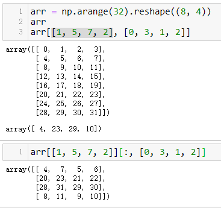

# 04.NumPy基础：数组和矢量计算

调用astype总会创建一个新的数组（一个数据的备份），即使新的dtype与旧的dtype相同。

数组切片是原始数组的视图。这意味着数据不会被复制，视图上的任何修改都会直接反映到源数组上。

如果你想要得到的是ndarray切片的一份副本而非视图，就需要明确地进行复制操作，例如arr[5:8].copy()。

转置是重塑的一种特殊形式，它返回的是源数据的视图（不会进行任何复制操作）。

