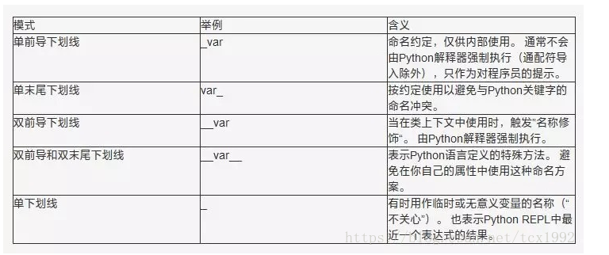

# python

## Python下划线命名模式


## 最大/最小值
如果你只需要一个比其他数字更大的数字，你可以使用
float('inf')
以类似的方式，比其他所有人都小：
float('-inf')

## 推导式
```
# String
s = "hello"
print(s.capitalize())  # 大写第一个字母 ---"Hello"
print(s.upper())       # 转换成大写 --- "HELLO"
print(s.rjust(7))      # 右对齐, 使用空格填充 --- "  hello"
print(s.center(7))     # 居中对齐, 使用空格填充" hello "
print(s.replace('l', '(ell)'))  # 将'l'字符串替换成'(ell)'  --- "he(ell)(ell)o"
print('  world '.strip())  # 剥去前导和尾部空格 --- "world"

# 列表推导式
nums = [0, 1, 2, 3, 4]
squares = [x ** 2 for x in nums]
print(squares)

# 列表推导还可以包含条件：
nums = [0, 1, 2, 3, 4]
even_squares = [x ** 2 for x in nums if x % 2 == 0]
print(even_squares)  # Prints "[0, 4, 16]"


# 字典推导式
nums = [0, 1, 2, 3, 4]
even_num_to_square = {x: x**2 for x in nums if x%2 == 0}
print(even_num_to_square) 

# 集合(Sets)
# 集合是不同元素的无序集合

# 遍历集合的语法与遍历列表的语法相同；但是，由于集合是无序的，因此不能假设访问集合元素的顺序：
animals = {'cat', 'dog', 'fish'}
for idx, animal in enumerate(animals):
    print('#%d: %s' % (idx + 1, animal))
    
    
# 集合推导式
from math import sqrt
nums = {int(sqrt(x)) for x in range(30)}
print(nums)
```

# 时间操作
## arrow库:
    .shift 偏移
    .span  跨度
dt = arrow.now(tz="Asia/Shanghai") # 当时时间
dt2 = dt.format("YYYY-MM-DD 12:00:00+08:00") # 格式化为字符串
d1 = arrow.get(df2).shift(days=-1)
d2 = arrow.get(df2).shift(days=1)
np.timedelta64(d2-d1)/np.timedelta64(1, 'h')


# 文件/目录操作:
1. os.walk("目录") -- 遍历目录
    返回: 一个3-tuple生成器> (dirpath, dirnames, filenames)
    
2. os.path.splitext
    拆分文件名与扩展名
    os.path.splitext("aaa/zzz.xxx") ==> ('aaa/zzz', '.xxx')


# JSON
```
# strict默认是True,它将严格控制内部字符串，将其设置为False,便可以允许你\n \r。
json.loads(json_data, strict=False)
```

## 将list按第一个维平铺开
```
import itertools
lst = [[1, 2], [3, 4, 5]]]
list(itertools.chain(*lst)) # [1, 2, 3, 4, 5]
```

## 使用列表推导式对list进行过滤
```
lst = ['aa', 'aa1', 'b', 'bc']
lst2 = [itm for itm in lst if itm.startswith('aa')]
lst2
```

## np.nan应该使用is进行判断
```
np.nan == np.nan # False
np.nan is np.nan # True
```


```
from itertools import count
from collections import defaultdict
d = count(0)
defDic = defaultdict(lambda: next(d))
defDic['a'] = 'a'
defDic['b'] = 'b'
defDic['a'] 
defDic['c'] # 查询不存在的key,会使用生成器插入defDic['c']=0
defDic['b']
defDic['d'] # 查询不存在的key,会使用生成器插入defDic['d']=1
defDic['c'] # 此时'c'这个键已经存在了,不会再重新插入了
```


## 自定义排序规则--functools.cmp_to_key 
```
import functools 

lst = ['a', 'B', 'c', 'DD']

# 自定义的基于小写的比较函数
def my_cmp(str_x, str_y):
    str_x = str_x.lower()
    str_y = str_y.lower()
    if str_x > str_y:
        return 1
    elif str_x < str_y:
        return -1
    else:
        return 0

lower_lst = [str(x) for x in lst]
lower_lst.sort(key=functools.cmp_to_key(my_cmp))
res = ''.join(lower_lst)
print(res)
```

functools.cmp_to_key将C语言格式的cmp函数转换成python sort key可用的类型.


## bisect
```
import bisect

lst_sort = [18, 25, 30, 35, 40, 45, 50, 55, 60, 65]
x = 26

# 以二分查找的方法获取age在AGE_BOUNDARIES中的可插入的位置,存在相同位置上返回右侧的位置.
bisect.bisect(lst_sort, x) 

# bisect.bisect_right, bisect.insort_left, bisect.insort_right
```


## re, json
```
attr = """
{"key1":"valu  e1",
 "key2": "23"24inch",
 "key3": "15"50 "30inch"
}
 """

# attr是非标准格式的json(key-value中的value的引号使用没有正确转义),
# 需要对attr中value错误使用的引号进行转义(处理成类似attr2json_str),使其能使用json模块正常loads.

pattern_redundant_quote = re.compile(r'(?::\s*")(.*?".*?)(?:"\s*[,}])') 
redundant_quote_values = pattern_redundant_quote.findall(attr)
attr_org = attr
for redundant_quote_str in redundant_quote_values:
    attr = attr.replace(redundant_quote_str, redundant_quote_str.replace(r'"', r'\"'))
attr_json = json.loads(attr, strict=False)

print("原始:", attr_org)
print("转义后:", attr)
print("Json:", attr_json)
```

## python终端tab代码补全(对pyspark终端也适用)
1. vim ~/.pythonstartup.py
```
import readline, rlcompleter
readline.parse_and_bind("tab: complete")
```
2. vim ~/.bashrc
```
export PYTHONSTARTUP=~/.pythonstartup.py # 每次启动 python 会先执行这个脚本
```
3. python终端tab代码补全


