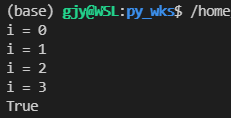
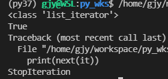
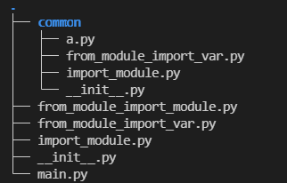
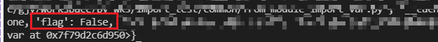
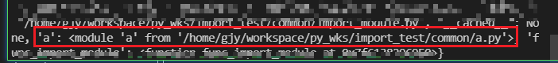

# python中的坑
## int
int(float_val) int对浮点数是向0取整
即int(正数)向下取整， int(负数)向上取整

## in操作遇上生成器
使用in操作判断对象是否在生成器中时, 相当于连续调用next(gen_obj)直接找到相等的元素或迭代器终止.
**结论**: 不要使用in操作判断对象是否在生成器中.

```python
def gen_func_test():
    for i in range(5):
        print(f'i = {i}')
        yield i

gen_obj = gen_func_test()
print(3 in gen_obj) # 会多次触发gen_obj执行
# print(next(gen_obj))
```


PS: iter函数返回的是一个生成器.
```python
it = iter([1, 2, 1, 3])
print(type(it)) # <class 'list_iterator'>
print(3 in it) # True
print(next(it)) # Exception StopIteration
```



## 多重列表初始化中的坑(可变类型&不可变类型)
```
    注意: 使用乘法扩充的列表,进行针对元素的是浅复制(类似与C++的引用)
    当列表元素为不可变类型时,使用乘法扩充列表没有问题:
        x1, x2 = 0, 1
        list0 = [x1, x2]
        # 对list0的元素(数值类型)进行2次浅copy得到list1
        list1 = list0 * 2  # [x1, x2, x1, x2]
        # id(x1) == id(list1[0]) == id(list1[2]) --可以证明是元素的浅copy
        # id(x2) == id(list1[1]) == id(list1[3])
        list1[2] = 10 # 因为列表元素为不可变类型,所以赋值后原引用不受影响
        # id(x1) == id(list1[0]) != id(list1[2])

    当列表元素为可变类型时,使用乘法扩充列表容易出问题:
        当列表元素为可变类型时(如元素类型也为列表),由于是基于元素进行浅copy,
        因此修改其中一个,所有引用均被修改
        list3 = [0, 1]
        list4 = [2, 3]

        # 列表元素为可变类型(列表)
        list_2d = [list3, list4]  #[[], []]
        # 对list_2d_new的元素(数值类型)进行2次浅copy得到list_2d_new
        list_2d_new = list_2d*2 # [list3, list4, list3, list4]
        # 其中list_2d_new[0], list_2d_new[2]均是list3的引用,它们的id相同,修改其中任何一个,都会影响其它几个.
        #     list_2d_new[1], list_2d_new[3]均是list4的引用,它们的id相同,修改其中任何一个,都会影响其它几个.
        list_2d_new[0][0] = 9 # list3[0]将会被修改,list_2d_new[2][0]也将会被修改--实际上它们对应同一份数据

    常见错误用法, 二维列表(数组)初始化:
        matrix = [[0]*2]*3
        matrix # [[0, 0], [0, 0], [0, 0]]
        matrix[0][0] = 1 # !!!这里改变的是matrix所有行的第0列!!!
        matrix # [[1, 0], [1, 0], [1, 0]]

    正确的初始化方式:
        matrix = [[0]*2 for i in range(3)]
        matrix[0][0] = 1 # 这里改变的只是matrix第0行的第0列


    lst*N是将lst的元素复制N份(引用复制); 
    当lst是list of int时, lst的元素是int类型-是不可变对象, 所以*N时是产生了新空间的, 此时操作不存在共享的问题. 
    当lst是list of list时,lst的元素是list对象-是可变对象, 所以*N时直接使用的是lst元素的引用--存在空间共享问题.
```


## 从多模块文件共享变量看import导包时的命名空间问题
'import xxx' 和'from ... import xxx'的区别


文件"common/a.py"
```common/a.py
falg = "XXX"

def show():
    print("show: ", flag)
```

### 无法跨文件共享(form ... import var)
文件"common/from_module_import_varj.py"
```from_module_import_var.py
from a import flag
"""
'from a import flag'相当于
from a
flag = a.flag
在当前模块中引入一个flag名称的变量,其与a.flag指向同一个内容.
在此处修改flag的引用,并不会影响到a.flag.
-- 即'from module import var'会在当前模块中引入一个变量.
"""
flag = "YYY" # 修改当前模块中flag的指向,并不影响a.flag．
print(globals()) # globals()获取当前模块的全局变量信息
```

文件"./from_module_import_var.py"
```from_module_import_var.py
from common.a import falg
a.flag = "ZZZ" # 修改当前模块中flag的指向,并不影响a.flag．
print(globals())
```


**对象级别导入的导入不能正常跨文件共享**, 因为其在当前模块新建一个变量,改变这个变量的指向不影响原模块的变量.

### 正常跨文件共享(form ... import module / import module)
文件"common/import_module.py"
```common/import_module.py
import a
"""
'import flag'导入的是模块名a--在sys.modules记录,
此时不会引入多余的变量名.
"""
a.flag = "QQQ" # 改变的就是a.flag
print(globals())
```

文件"./from_module_import_module.py"
```./from_module_import_module.py
from common import a

def func_from_module_import_module():
    a.flag = "RRRR" # 改变的就是a.flag
    print(globals())

if __name__ == "__main__":
    func_from_module_import_module()
```

文件"./import_module.py"
```./import_module.py
import common.a

def func_import_module():
    common.a.flag = "SSSS"
    print(globals())

if __name__ == "__main__":
    func_import_module()
```


'import a'和''from comon import a'的命名空间是一样的,都是模块级的.
**导入到模块级别能够正常跨文件共享**, 因为模块级别的命名是存放在sys.module中的(全局惟一的)，通过模块名访问变量是全局惟一的,修改引用也是直接修改的.
Python import 包的机制是, 所有import的module都放在sys.module中. 每个module只会import一次.


**结论**:
当需要跨文件共享变量时, 
不要使用'不可变类型'的全局变量(其在'from ... import xxx'情况下无法跨文件共享).
**推荐使用'可变类型'的全局变量,且只更新内容,不改变指向(无论使用哪种导入方式都不会出错).**
一定要修改跨文件共享变量的指向时,必须使用'import xxx'的方式导入.

参考: 
[https://www.jianshu.com/p/4bb742d7d6729](https://www.jianshu.com/p/4bb742d7d672)
[https://www.tianqiweiqi.com/python-import-or-import-from.html](https://www.tianqiweiqi.com/python-import-or-import-from.html)
