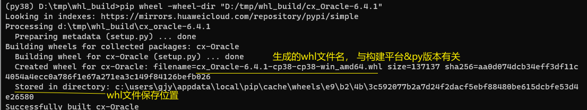

#下载whl包: 
下载指定的包及相关依赖whl, 会按照执行环境的平台&py版本进行下载
```pip download PKG_NAME
        
# 可以指定平台和py版本.  指定平台时需要同时指定--only-binary参数
pip3 download --only-binary=:all: --python-version=3.7  cx-Oracle==6.4.1
可以指定多个--platform, 其取值可用: manylinux1_x86_64, linux_x86_64, any, win_amd64
        
# 使用docker下载包
docker run -it centos7-miniconda
pip3 download pandas==1.4.2
tar -zcvf /tmp/pandas142.tar pandas1.4.2/
docker cp 容器ID:/tmp/pandas142.tar ./
tar -xvf ./pandas142.tar
```

# 构建whl
[构建whl参考](https://cloud.tencent.com/developer/article/1702289)
命令: `pip wheel ...`
查看帮助: `pip help wheel`

参数: 
```
-w, --wheel-dir <dir>: 指定要构建whl的目录
```

示例: 在windows上使用py38构建cx_oracle-6.4.1的whl
`pip wheel -w D:\whl_build\cx_Oracle-6.4.1`



**用什么平台&什么版本的python构建就会生成对应平台&版本的whl文件(会在文件名中体现).**

想用whl打包功能，可能需要vc++运行库，如果遇到
 Microsoft Visual C++ 14.0 is required 报错，