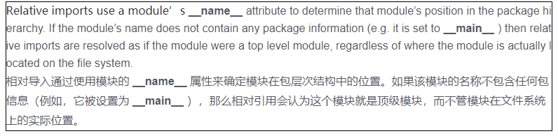

# python导包的问题
使用相对导包方式时常见的两个报错:
```
报错1： ModuleNotFoundError: No module named '__main__.src_test1'; '__main__' is not a package
报错2： ImportError: attempted relative import with no known parent package 
```

从 PEP 328 中，关于 the relative imports（相对引用）的介绍


代码结构如下:
```
pro_test
│
├─pkg_import
│  │  __init__.py
│  │
│  ├─module01
│  │  │  test01.py
│  │  └─__init__.py
│  │
│  └─my_module
│     │  test1.py
│     │  test2.py
│     │  test_import_outer.py
│     └─__init__.py
```

module01/test1.py
```
print(f"module01: {__name__}")
class AAA(object):
    def __init__(self):
        print(__name__)
```

my_module/test1.py
```
print("my_module.test1: ", __name__)
def func_test01():
    print('func_test01')
```

my_module/test2.py
```
print("my_module.test2: ", __name__)
from .test1 import func_test01
from ..module01.test01 import AAA

def func_test02():
    func_test01()
    print("func_test01")

if __name__ == '__main__':
    # 从该模块作为入口执行时error. 因为此时该模块__name__=='__main__'不包含任何包信息,无法作为相对路径的起点.
    # 'from .test1'报错'ImportError: attempted relative import with no known parent package'
    func_test02()
```

my_module/test_import_outer.py
```
from pkg_import.my_module.test2 import func_test02
if __name__ == '__main__':
    # 从该模块作为入口执行时正常
    func_test02()

```
**结论**:
0. relative import实际上是先通过model.__package__计算出它的绝对路径,然后再进行absolute import. 所以它只能在package里面的module中使用,当它作为'main module load'时将会报错.
1. 作为入口的模块('__main__'), 不能使用相对导包
   如: `python my_module/test2.py` ==> ERROR

2. 如果你使用Python的-m选项来执行脚本，相对导入将会正确运行
  如: `python -m pkg_import.my_module.test2` ==> OK 因为此时test2的模块名不再是'__main__'


# 参考
[import_submodules_by_relative_names](https://python3-cookbook.readthedocs.io/zh_CN/latest/c10/p03_import_submodules_by_relative_names.html)