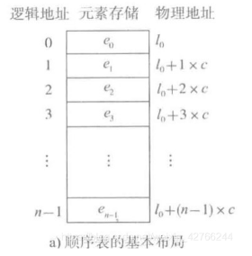
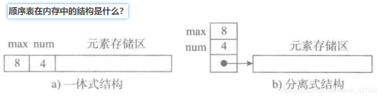
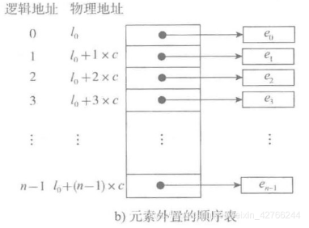
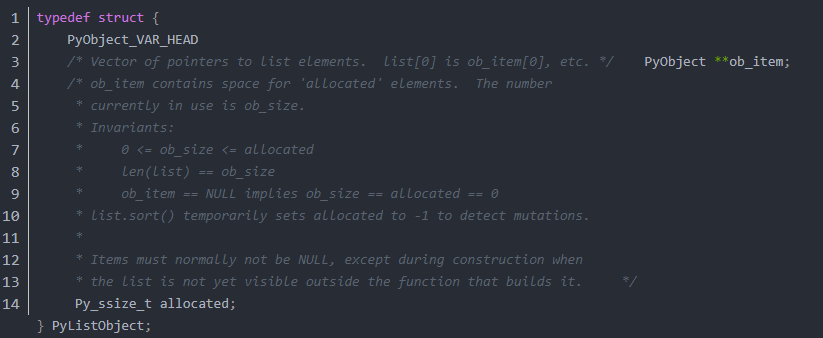

[toc]

# python常用数据结构

# List
## 基本存储结构
### 连续存储


### 顺序表在内存中的结构
一体式 和 分离式


一体式结构： 整体性强，易于管理。但是由于数据元素存储区域是表对象的一部分，顺序表创建后，元素存储区就固定了，不方便扩充。
分离式结构： 对象里只保存与整个对象有关的信息（即容量和元素个数），实际数据元素存放在另一个独立的元素存储区里，方便扩充。

### 不同类型的数据集合在内存中的存储



### python中的list。
1. 元素有位置下标，可以通过索引获取元素 --> 连续的存储空间，计算偏移量获取元素。
2. 元素无论如何改变，表对象都不变 --> 分离式结构，表头和元素内容分开存储。这样在更改list时，表对象始终是同一个，只是指向的地址不同
3. 元素可以是任意类型 --> 既要求连续存储，又可以存储不同类型的数据，用的是元素外置的方式，存储的只是数据地址的引用
4. 可以任意添加新元素 --> 动态扩充的策略

**list源码如下**


list 本质上是一个长度可变的连续数组。 其中 ob_item 指向一个指针列表（里边的每一个指针都指向列表中的元素），而 allocated 则用于存储该列表目前已被分配的空间大小。

## 常用方法
append -- 尾部追加
clear -- 移除所有
copy -- 浅拷贝
count -- 对某元素计算出现次数
extend -- 尾部追加另一个可迭代对象的元素
index -- 取索引
insert -- 根据索引插入
pop -- 根据索引弹出(默认弹出尾部元素)
remove -- 根据元素进行移除
reverse -- 原地逆转
sort -- 原地排序. key参数可指定排序函数，reverse参数可指定升降序。
 

```python

lst = ['a', 'b', 'c', 'b', [11, 22]]
lst

assert len(lst) == 5 # 计算列表长度

lst.append('e') # 在尾部追加元素
lst

lst2 = lst.copy() # 列表浅拷贝
assert id(lst2) != id(lst)
assert id(lst2[4])== id(lst[4]) # 浅拷贝时要注意内部的复杂类型

lst2.clear() # 清空列表(移除所有元素)
assert lst2 == []
assert lst == ['a', 'b', 'c', 'b', [11, 22], 'e']


lst.count(1) # 计算元素出现的次数


lst.extend(range(20, 23)) # 通过可迭代对象向列表尾部追加元素
assert lst == ['a', 'b', 'c', 'b', [11, 22], 'e', 20, 21, 22]

lst.index('b') # 获取元素的第一个索引(列表中无此元素时ValueError)

lst.insert(2, 10) # 在索引的前面插入元素(插入后的元素对就索引index)
assert lst == ['a', 'b', 10, 'c', 'b', [11, 22], 'e', 20, 21, 22]


item = lst.pop(2) # 根据索引弹出元素(默认弹出尾部元素)
assert lst == ['a', 'b', 'c', 'b', [11, 22], 'e', 20, 21, 22]
item = lst.pop() 
assert lst == ['a', 'b', 'c', 'b', [11, 22], 'e', 20, 21]

lst.remove(20) # 根据元素值进行移除
assert lst == ['a', 'b', 'c', 'b', [11, 22], 'e', 21]

lst2 = lst.copy()
lst2.reverse() # 原地逆转
assert lst2 == [21, 'e', [11, 22], 'b', 'c', 'b', 'a']


lst = ['a', 'b', 'c', 'b']
lst.sort(reverse=True) # 原地排序(reverse: True降序, False升序)
assert lst == ['a', 'b', 'b', 'c']
lst = [('a', 4), ('b', 3), ('c', 2), ('d', 1)]
lst.sort(key=lambda item:item[1]) # key指定排序方式
lst


```


# Dict
```python


```


