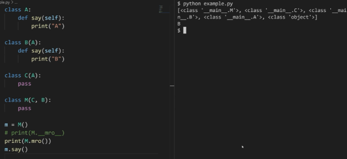
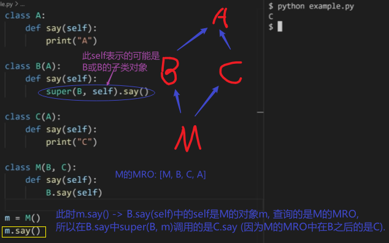

# MRO

MRO确定了python从继承结构中查询方法或数据的顺序

使用`类名.mro()` 可以查看该类的mro

# super
[python super()详解](https://www.bilibili.com/video/BV1FL4y1E7xK)
创建一个Super对象
super(cls, obj) 会从obj的mro中获取**cls的下一个**类, 并实例化.
需要注意的是: 在特殊情况下obj的mro中的下一个类,未必是我们期望的父类.

