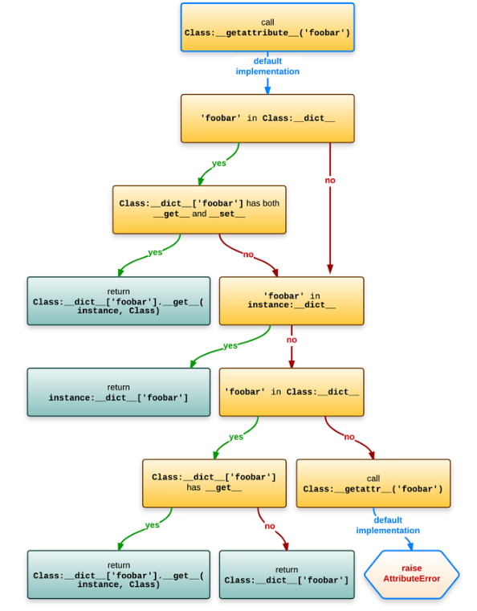

# descriptor
[descriptor.html](https://docs.python.org/3/howto/descriptor.html)

[descriptor学习视频](https://www.bilibili.com/video/BV1pT4y1a7dd)

[descriptor参考](https://stackoverflow.com/questions/30961069/what-is-the-python-attribute-get-and-set-order)

python class instance 查看attribute过程:

总结：
一个obj是否为descriptor, 是由其是否具有__get__ 方法决定的.
当通过obj.attr访问属性时, 其获取attr的流程如下:
0. 从obj的Type中,获取cls.attr
1. 如果cls.attr是一个descriptor(具有`__get__`), 且其具有`__set_`_方法时, 返回`__get__`的返回值;
2. 如果cls.attr是一个descriptor, 但没有`__set__`方法时，从obj.dict找attr,找到则返回;
3. 如果cls.attr是一个descripto, 但没有`__set__`方法, 且ob.dict也没有该attr时，返回cls.attr desc `__get__`的返回值
4. cls.attr不是一个descriptor, 返回cls.attr
