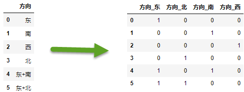

Sklearn三大模型: Transformer & Estimator & Pipeline
    Transformer(转换器):
        StandardScaler,MinMaxScaler,...
        可以理解为特征工程，即：特征标准化、特征正则化、特征离散化、特征平滑、onehot编码
    
    Estimator(估计器):
        LinearRegression,LogisticRegression,LASSO,Ridge,...
        即各种模型，所有模型fit进行训练之后，都要经过测试集进行predict所有，有一个predict的公共方法。
    
    Pipeline(管道):
        将Transformer,Estimator 组合起来成为一个大模型.
        管道:  输入--> Transformer-->Transformer-->***-->Estimator -->输出
        管道的目的是组装几个步骤,这些步骤可以在设置不同参数的同时交叉验证.
        为此,它可以使用各个步骤的名称和以"__"分隔的参数名称来设置各个步骤的参数.
        
        管道依次连接多个Transformer和一个最终Estimator.
        管道的中间步骤必须是"Transformer" --也就是说,它们必须实现fit和transform方法.
        最终估算器只需实现拟合
    
    
# 问题
## 区分模型的损失(loss) ＆ 优化目标(objective) ＆ 模型的评分(scoring) ?
1. 可以简单的认为 模型的损失(loss) ＆ 优化目标(objective) 是一致的, 机器学习中loss＆objective都是越小越好. 
   objective是加了正则化项的loss.
2. scoring与loss不同,得分一般是越大越好。

## sklearn中的GridSearchCV是依据什么来选取最优参数的?
GridSearchCV根据estimator的score()方法或scoring参数指定的得分函数来计算得分; 得分越高则模型越优。

GridSearchCV常用参数有:
    estimator：要调参的估计器. 如果estimator未实现score()方法，
                        　　　则必须设置scoring参数--网格搜索基于这个得分来选择最优的模型参数.
        参数scoring优先级高于estimator.score().
    param_grid：要搜索的参数及搜索范围构成的字典
    scoring=None： 用于评估测试集上的得分,并以此来选择更好的参数。为None时使用estimator的score()方法来评估。
        可指定多个评分函数, 如：{'r2': 'func_r2', 'neg_log_loss':'neg_log_loss'}
        需要保证的是:这个scoring指定的得分函数,得分越高代表模型越优。
    cv=None: 交叉验证的折数, 默认为5-fold


PS: cross_val_score(): 进行KFold交叉验证并评分。返回K折验证的评分列表。
    也是使用scoring参数指定的评分器 or estimator的score()方法来进行评分的。
PS: make_scorer(): 从性能度量或损失函数中创建一个评分对象。
    应该使make_scorer()生成的对象具有如下性质：
        得分越高代表模型越优---这与模型的损失函数(目标函数)是相反的,损失函数值越小表示模型越优。
    此工厂函数生成的得分对象以用于GridSearchCV和cross_val_score。
    make_scorer常用参数有:
        score_func: 具有如下签名的得分函数(或损失函数) --score_func(y, y_pred, **kwargs)
        greater_is_better: 表示score_func中的大值是否对应更优的模型(即score_func中指定的是否为得分函数); default=True
           当score_func是得分函数时（高表示好）: greater_is_better=True
           当score_func是损失函数时（低表示好): greater_is_better=False
               --此时make_scorer将对score_func的结果进行取反,以满足得分高与模型优的对应。

网格搜索是对超参的不同组合进行搜索;KFold交叉验证是对同一组超参,按照KFold方式训练K个模型(超参相同样本不同),并在验证集上评估这组超参的效果。
KFold交叉验证的评分看平均值,网格搜索取评分最大的那组超参。


## multi-hot(sklearn的MultiLabelBinarizer)
```
import pandas as pd
from sklearn.preprocessing import MultiLabelBinarizer
data = {"方向":['东', '南', '西', '北', '东+南', '东+北']}
data_df = pd.DataFrame(data)

orientations_df = data_df['方向'].map(lambda s:s.split('+'))
mlb = MultiLabelBinarizer()
orientations_df = mlb.fit_transform(orientations_df)
multiHot = pd.DataFrame(orientations_df, columns=list(map(lambda s:"方向_"+s,mlb.classes_)))
data_df = pd.concat([data_df, multiHot], axis=1)
data_df.drop('方向', axis=1, inplace=True)
data_df
```



## 数据归一化
```
# 使用MinMaxScaler对DataFrame的中特定列簇进行归一化
from sklearn.preprocessing import MinMaxScaler
numerical_cols = ['colNameA', 'colNameB']
scaler_maxmin = MinMaxScaler()
scaler_maxmin.fit(Train_data[numerical_cols].values)
scaler_maxmin_data = scaler_maxmin.transform(full_data[numerical_cols].values)
df = pd.DataFrame(scaler_maxmin_data, index=full_data.index, columns=numerical_cols)
full_data[numerical_cols] = df # 使用归一化后的数据替换原数据
```

```
# 自定义方式--与上面的MinMaxScaler等价
def max_min(train_series, full_series):
    # 统计信息只从训练集中获取
    _max,_min = np.max(train_series), np.min(train_series)
    full_series = (full_series - _min) / (_max - _min)
    return full_series

# 对构造的统计量特征做归一化
for fea in numerical_cols:
    full_data[fea] = max_min(Train_data[fea], full_data[fea])
```


## sklearn的自动特征选择

大致方法如下：
```
from mlxtend.feature_selection import SequentialFeatureSelector as SFS
from sklearn.linear_model import LinearRegression
sfs = SFS(LGBMRegressor(n_estimators=1000, objective='mae' ),
           k_features=50,
           forward=True,
           floating=False,
           cv = 0)

sfs.fit(X_data, Y_data)
print(sfs.k_feature_names_)
```

