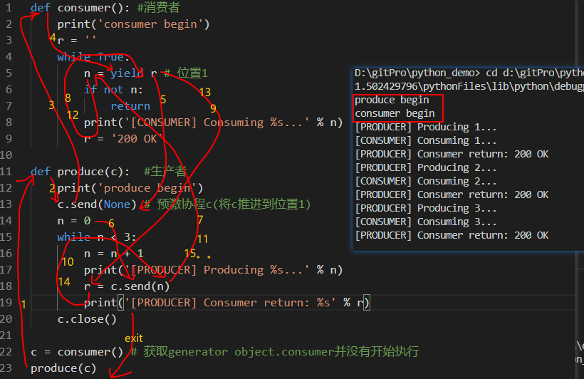
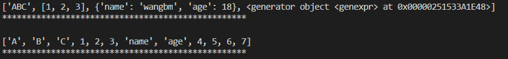
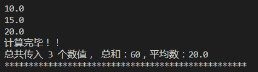

# 协程

## field
```python
def consumer(): #消费者
    print('consumer begin')
    r = ''
    while True:
        n = yield r # 【位置1】
        if not n:
            return
        print('[CONSUMER] Consuming %s...' % n)
        r = '200 OK'

def produce(c):  #生产者
    print('produce begin')
    c.send(None) # 预激协程c(将c推进到【位置1】)
    n = 0
    while n < 3:
        n = n + 1
        print('[PRODUCER] Producing %s...' % n)
        r = c.send(n)
        print('[PRODUCER] Consumer return: %s' % r)
    c.close()

c = consumer() # 获取generator object.注意，此时consumer并没有开始执行。
produce(c)
```
输出结果如下:


**Note**: 因为consumer函数中存在yield语句, python会把它当成一个generator(生成器,注意：生成器和协程的概念区别很大，千万别混淆了两者), 因此在运行这条语句后, python并不会像执行函数一样,而是返回了一个generator object。c.send(None)这条语句的作用是将consumer(即变量c，它是一个generator)中的语句推进到第一个yield语句出现的位置(可以理解为【位置1】的"n = yield r"执行了右侧的"yield r", 赋值操作将等到下一次c.send后执行--如果没有赋值可当作'_ = yield r'理解)。

## field from
[Python并发编程之深入理解yield from语法](https://www.cnblogs.com/wongbingming/p/9085268.html)

### field 与 field from的区别
```python
astr='ABC'
alist=[1,2,3]
adict={"name":"wangbm","age":18}
agen=(i for i in range(4,8))

def gen_yield(*args, **kw):
    for item in args:
        yield item

new_list=gen_yield(astr, alist, adict, agen)
print(list(new_list))
print("*****"*10, '\n')

# =============================================== #
def gen_yieldfrom(*args, **kw):
    for item in args:
        yield from item

new_list=gen_yieldfrom(astr, alist, adict, agen)
print(list(new_list))
print("*****"*10, '\n')
```
输出结果如下:


**Note**: yield from后面加上可迭代对象, 他可以把可迭代对象里的每个元素一个一个的yield出来.

### yield from的用法详解
复杂应用：yield from 嵌套生成器
1. 调用方：调用委派生成器的客户端（调用方）代码
2. 委托生成器：包含yield from表达式的生成器函数
    委托生成器的作用是：在调用方与子生成器之间建立一个双向通道
    调用方可以通过send()直接发送消息给子生成器; 而子生成器yield的值，也是直接返回给调用方
    (子生成器yield回来的值不会被委托生成器拦截)
3. 子生成器：yield from后面加的生成器函数
```python
# 子生成器
def average_gen():
    total = 0
    count = 0
    average = 0
    while True:
        new_num = yield average
        if new_num is None:
            break
        count += 1
        total += new_num
        average = total/count

    # 每一次return，都意味着当前协程结束。
    return total,count,average

# 委托生成器
def proxy_gen():
    while True:
        # 只有子生成器要结束（return）了，yield from左边的变量才会被赋值，后面的代码才会执行。
        total, count, average = yield from average_gen()
        print("计算完毕！！\n总共传入 {} 个数值， 总和：{}，平均数：{}".format(count, total, average))

# 调用方
def main():
    calc_average = proxy_gen()
    next(calc_average)            # 预激协程; calc_average.send(None)也可达到预激协程的作用
    print(calc_average.send(10))  # 打印：10.0
    print(calc_average.send(20))  # 打印：15.0
    print(calc_average.send(30))  # 打印：20.0
    calc_average.send(None)      # 结束协程
    # 如果此处再调用calc_average.send(10)，由于上一协程已经结束，将重开一协程

main()
print("*****"*10, '\n')
```
输出如下


### 为什么要使用yield from
* 迭代器（即子生成器）产生的值直接返还给调用者
* 任何使用send()方法发给委派生产器（即外部生产器）的值被直接传递给迭代器。如果send值是None，则调用迭代器next()方法；如果不为None，则调用迭代器的send()方法。如果对迭代器的调用产生StopIteration异常，委派生产器恢复继续执行yield from后面的语句；若迭代器产生其他任何异常，则都传递给委派生产器。
* 子生成器可能只是一个迭代器，并不是一个作为协程的生成器，所以它不支持.throw()和.close()方法,即可能会产生AttributeError 异常。
* 除了GeneratorExit 异常外的其他抛给委派生产器的异常，将会被传递到迭代器的throw()方法。如果迭代器throw()调用产生了StopIteration异常，委派生产器恢复并继续执行，其他异常则传递给委派生产器。
* 如果GeneratorExit异常被抛给委派生产器，或者委派生产器的close()方法被调用，如果迭代器有close()的话也将被调用。如果close()调用产生异常，异常将传递给委派生产器。否则，委派生产器将抛出GeneratorExit 异常。
* 当迭代器结束并抛出异常时，yield from表达式的值是其StopIteration 异常中的第一个参数。
* 一个生成器中的return expr语句将会从生成器退出并抛出 StopIteration(expr)异常。

