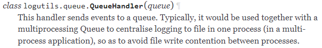
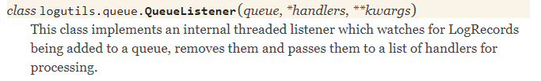

# logging
提供了一些对日志记录的支持。但是请注意，该logging 包不使用进程共享锁，因此（取决于处理程序类型）来自不同进程的消息可能会混淆。

[multiprocessing.html#logging](https://docs.python.org/3/library/multiprocessing.html#logging)


## 从多个进程记录日志到单个文件的参考实现
[从多个进程记录日志到单个文件的参考实现](https://docs.python.org/dev/howto/logging-cookbook.html#logging-to-a-single-file-from-multiple-processes)

[logging-cookbook.html#dealing-with-handlers-that-block](https://docs.python.org/dev/howto/logging-cookbook.html#dealing-with-handlers-that-block)

logging.handlers.QueueListener 在一个线程中运行日志消费者
[logging.handlers.QueueListener](https://pythonhosted.org/logutils/queue.html#logutils.queue.QueueListener)

思路：QueueHandler + QueueListener
QueueHandler作为日志生产者, QueueListener作为日志消费者.
日志生产者 & 日志消费者 使用的依旧是logging的接口.
只是生产者不再直接写文件，生产者logger将只配置一个QueueHandler， 负责将日志record obj存放到queue; 
消费者从queue中获取record, 并通过其配置的handler完成记录.

示例: 多进程写日志到同一个文件, 日志消费者在一个单独的进程中执行。

```
import logging
import logging.handlers
import multiprocessing

from random import choice, random
import time

# 日志消费者
def listener_configurer():
    root = logging.getLogger()
    h = logging.handlers.RotatingFileHandler('D:/tmp/debug/logs/mptest.log', 'a', 300, 3)
    f = logging.Formatter('%(asctime)s %(processName)-10s %(name)s %(levelname)-8s %(message)s')
    h.setFormatter(f)
    root.addHandler(h)

def listener_process(queue, configurer):
    configurer()
    while True:
        try:
            record = queue.get()
            if record is None:  # We send this as a sentinel to tell the listener to quit.
                break
            logger = logging.getLogger(record.name)
            logger.handle(record)  # 消费者不设置日志level&filter, 由生产者进行level&filter控制
        except Exception:
            import sys, traceback
            print('Whoops! Problem:', file=sys.stderr)
            traceback.print_exc(file=sys.stderr)

LEVELS = [logging.DEBUG, logging.INFO, logging.WARNING, logging.ERROR, logging.CRITICAL]

LOGGERS = ['a.b.c', 'd.e.f']

MESSAGES = [
    'Random message #1',
    'Random message #2',
    'Random message #3',
]

# 日志生产者
def worker_configurer(queue):
    h = logging.handlers.QueueHandler(queue)  # 生产者只需要配置一个QueueHandler
    root = logging.getLogger()
    root.addHandler(h)
    root.setLevel(logging.INFO)  # 设置生产者日志级别

def worker_process(queue, configurer):
    configurer(queue)
    name = multiprocessing.current_process().name
    print('Worker started: %s' % name)
    for i in range(10):
        time.sleep(random())
        logger = logging.getLogger(choice(LOGGERS))
        level = choice(LEVELS)
        message = choice(MESSAGES)
        logger.log(level, message)
    print('Worker finished: %s' % name)

def main():
    queue = multiprocessing.Queue(-1)
    listener = multiprocessing.Process(target=listener_process, args=(queue, listener_configurer))
    listener.start()
    workers = []
    for i in range(10):
        worker = multiprocessing.Process(target=worker_process, args=(queue, worker_configurer))
        workers.append(worker)
        worker.start()
    for w in workers:
        w.join()
    queue.put_nowait(None)
    listener.join()

if __name__ == '__main__':
    main()

```

