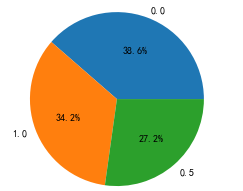

# 绘图


## 散点图
```
def plt_scatter(df, xcolName, ycolName, figsize=None):
    fig = plt.figure(figsize=figsize)
    ax1 = fig.add_subplot(111)
    ax1.set_title(xcolName+'-'+ycolName)
    plt.xlabel(xcolName)
    plt.ylabel(ycolName)
    ax1.scatter(x=df[xcolName], y=df[ycolName], c='r', marker='x')
    plt.legend(xcolName+'-'+ycolName)
    plt.show()

# '房屋面积'与'Label'散点关系图
plt_scatter(df, '房屋面积', 'Label', figsize=(10, 10))
```


## 饼图
```
def plt_pie(df, col):
    plt.clf()
    fig,axs=plt.subplots(1,1)
    val_count_ser = df[col].value_counts()
    axs.pie(val_count_ser.values,
            labels=val_count_ser.index,
            autopct='%1.1f%%')
```



## pandas图
### dataframe
```
df.plot.bar(x='列名x', y='列名y', color='green', title='标题')
plt.tight_layout()
plt.show()
```

### Series
```
ser.plot.bar(color='green', title='标题') //x=ser.index, y=ser.values, 
plt.tight_layout()
plt.show()
```


