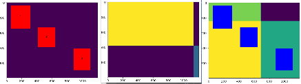

[toc]

# matplotlib的几个概念区分
fig & axes ?
plt.xxx, 与 ax.xxx 的区别？

# matplotlib绘制动图(通过清理重绘实现)

```
plt.ion(): 打开交互模式
plt.ioff(): 关闭交互模式
plt.clf(): 清除当前的Figure对象(会清除当前fig上的所有axes,导致所有的axes不可用; 但fig还可使用)
plt.cla(): 清除当前的Axes对象(清除轴上的图像,轴还可重复使用)
plt.pause(): 暂停功能
```

示例代码:
```python
import numpy as np
import matplotlib.pyplot as plt
from matplotlib.animation import FuncAnimation   
from matplotlib.widgets import RectangleSelector
import random

rect_count = 0
MAX_RECT_NUM = 3

hight = 1000
width= 1200
grid = np.zeros((hight, width))

fig, ax = plt.subplots()
plt.imshow(grid)

# 通过鼠标绘制选择矩形区域
center_points = [(0, 0)] * MAX_RECT_NUM # 矩形中心
rects_record = []
def on_select(eclick, erelease):
    global rect_count 
    
    (x1, y1), (x2, y2) = zip(sorted([eclick.xdata, erelease.xdata]), 
                             sorted([eclick.ydata, erelease.ydata]))
    rect = plt.Rectangle((x1, y1), x2-x1, y2-y1, facecolor='red', alpha=1.0)
    ax.add_patch(rect)

    center_point = ((x1+x2)//2, (y1+y2)//2)
    center_points[rect_count] = center_point
    rect_count += 1
    plt.text(center_point[0], center_point[1], rect_count, ha='center')
    rects_record.append([(x1, y1), (x2, y2)])
    if rect_count >= MAX_RECT_NUM: # 若已经绘制了指定数目的矩形框则取消激活
        on_select.rect_sel.set_active(False)

on_select.rect_sel = RectangleSelector(ax, on_select, drawtype='box', spancoords='pixels')
for i in range(MAX_RECT_NUM+1):
    plt.ginput(1) # 阻塞


for i in range(10):
    row_split = random.randint(0, grid.shape[0])
    col_split = random.randint(0, grid.shape[1])
    grid[0:row_split, 0:col_split] = random.randint(1, 6)
    grid[0:row_split, col_split:] = random.randint(1, 6)
    grid[row_split:, 0:col_split] = random.randint(1, 6)
    grid[row_split:, col_split:] = random.randint(1, 6)

    # plt.clf() # 如果使用plt.clf()清除了fig上的所有axes, 那么后面就无法再使用原ax进行绘制了
    plt.cla()
    plt.imshow(grid)
    plt.pause(0.2)
    print(i)

# 把初始矩形加上
for (x1, y1), (x2, y2) in rects_record:  
    rect = plt.Rectangle((x1, y1), x2-x1, y2-y1, facecolor='blue', alpha=1.0)
    ax.add_patch(rect)

plt.pause(5)
```
效果如下：



# matplotlib绘制动图(通过animation实现)
**FuncAnimation参数如下**：
fig: matplotlib 中的 figure 对象
func: 帧更新函数
frames: 整个动画过程中帧的取值范围，而本质上是一个数据发生器
init_func: 初始函数，用来初始 figure 的画面
fargs: 附加给 func 回调函数的参数，可以为 None
save_count: 是缓存的数量
kwargs包括:
    interval:  帧间隔(ms)，默认200
    repeat_delay： 如果 animation 是重复播放的话, 这个值就是每次播放之间的延迟时间(ms)。
    repeat: 动画是否重复播放(默认True)
    blit: 控制绘制的优化(默认False)

```python
import numpy as np
import matplotlib.pyplot as plt
import matplotlib.animation as animation

fig, ax = plt.subplots()
xdata, ydata = [], []
ln, = plt.plot([], [], 'ro',animated=True)

def init_():
    ax.set_xlim(-np.pi,np.pi)
    ax.set_ylim(-1, 1)
    return ln,

def update(frame):
    xdata.append(frame)
    ydata.append(np.sin(frame))
    ln.set_data(xdata, ydata)
    return ln,

anim = animation.FuncAnimation(fig, update, frames=np.linspace(-np.pi,np.pi, 90), init_func=init,\
            interval=20, repeat=False, blit=True)
plt.show()

# 生成gif动图,需要安装 ImageMagicK
# anim.save('./test_animation.gif',writer='imagemagick')
```


## 鼠标事件
```
MouseEvent:
x, y
    mouse x and y position in pixels from left and bottom of canvas
    基于画布左下角计算的像素值（会受到画布大小的影响）

xdata, ydata
    mouse x and y position in data coordinates, if the mouse is over an axes
    基于axes左上角计算的坐标值（不会受到画布缩放的影响）
```