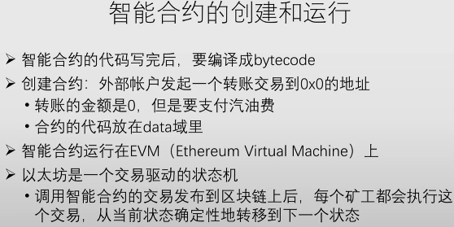
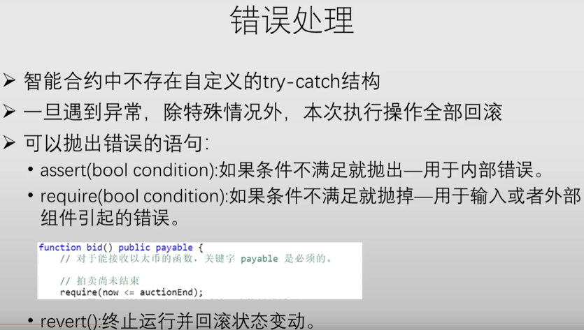
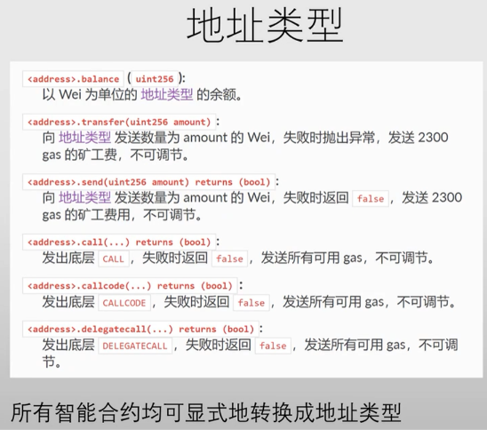

# 区块链技术与应用

## 数据结构

铸币交易影响Merkle Root, ==>进而影响H(block header) ==> 影响挖矿结果

## 全节点&轻节点

## BTC脚本

input_script是当前交易的来源, output_script是上一个交易的去向. (BTC跟踪的是交易)

# ETH
## 状态树

 

## 挖矿伪代码 ethash

## 挖矿难度调整

## 权益证明(proof of stake)
pass

## 智能合约

