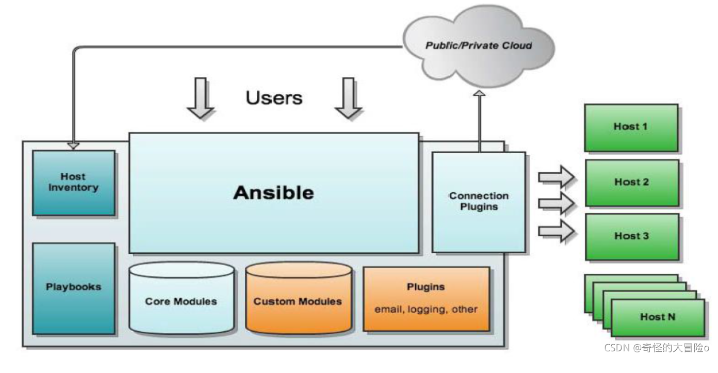

# ansible

[ansible使用教程](https://blog.csdn.net/A_art_xiang/article/details/120524817)


## 安装
rpm包安装: EPEL源  `yum install ansible`
检查是否安装成功: `ansible --version`


## 相关文件
1.配置文件
```
/etc/ansible/ansible.cfg  主配置文件,配置ansible工作特性(一般无需修改)
/etc/ansible/hosts        主机清单(将被管理的主机放到此文件)
/etc/ansible/roles/       存放角色的目录
```

###  主机清单详解
Inventory 主机清单
ansible的主要功用在于批量主机操作，为了便捷地使用其中的部分主机，可以在inventory file中将其分组命名 
默认的inventory file为/etc/ansible/hosts
inventory file可以有多个，且也可以通过Dynamic Inventory来动态生成
可以在每个主机后面指定用户名+密码：ansible_ssh_user='xxx' ansible_ssh_pass='password'
/etc/ansible/hosts文件格式
inventory文件遵循INI文件风格，中括号中的字符为组名。可以将同一个主机同时归并到多个不同的组中；
```
    ntp.magedu.com   ＃ 不分组,直接加
    
    [webservers]     # webservers组
    www1.magedu.com:2222  # 可以指定端口
    www2.magedu.com
    
    [dbservers]
    db[1:3].magedu.com  # 主机名称遵循相似的命名模式,可以使用列表的方式标识各主机
```

### 配置文件详解
Ansible 配置文件/etc/ansible/ansible.cfg （一般保持默认）
vim /etc/ansible/ansible.cfg
```
[defaults]
#inventory     = /etc/ansible/hosts      # 主机列表配置文件
#library       = /usr/share/my_modules/  # 库文件存放目录
#remote_tmp    = $HOME/.ansible/tmp      # 临时py命令文件存放在远程主机目录
#local_tmp     = $HOME/.ansible/tmp      # 本机的临时命令执行目录  
#forks         = 5                       # 默认并发数,同时可以执行5次
#sudo_user     = root                    # 默认sudo 用户
#ask_sudo_pass = True                    # 每次执行ansible命令是否询问ssh密码
#ask_pass      = True                    # 每次执行ansible命令是否询问ssh口令
#remote_port   = 22                      # 远程主机的端口号(默认22)

建议优化项： 
host_key_checking = False               # 检查对应服务器的host_key，建议取消注释
log_path=/var/log/ansible.log           # 日志文件,建议取消注释
module_name   = command                 # 默认模块
```

## ansible命令使用
ansible通过ssh实现配置管理、应用部署、任务执行等功能，
建议配置ansible端能基于密钥认证的方式联系各被管理节点
```
ansible <host-pattern> [-i 指定hosts文件路径] [-e 指定变量文件路径] [-m module_name] [-a args]
ansible +被管理的主机(ALL) +模块  +参数
--version              显示版本
-i INVENTORY, --inventory INVENTORY: 指定要使用的hosts文件的路径
-m module              指定模块，默认为command
-v                     详细过程 –vv -vvv更详细
--list-hosts           显示主机列表，可简写 --list
-k, --ask-pass         提示输入ssh连接密码,默认Key验证
-C, --check            检查，并不执行
-T, --timeout=TIMEOUT  执行命令的超时时间,默认10s
-u, --user=REMOTE_USER 执行远程执行的用户
-b, --become           代替旧版的sudo切换
    --become-user=USERNAME 指定sudo的runas用户,默认为root
-K, --ask-become-pass  提示输入sudo时的口令
```

### 练手初步
ansible all --list  列出所有主机
ping模块: 探测网络中被管理主机是否能够正常使用  走ssh协议; 如果对方主机网络正常,返回pong
ansible-doc -s ping   查看ping模块的语法 

检测所有主机的网络状态
1. 默认情况下连接被管理的主机是ssh基于key验证,如果没有配置key,权限将会被拒绝
    因此需要指定以谁的身份连接,输入用户密码,必须保证被管理主机用户密码一致
    ansible all -m ping -k
2. 或者实现基于key验证 将公钥ssh-copy-id到被管理的主机上 , 实现免密登录
   ansible all -m ping

### ansible命令执行过程
ansible命令执行过程
1. 加载自己的配置文件 默认/etc/ansible/ansible.cfg
2. 加载自己对应的模块文件，如command
3. 通过ansible将模块或命令生成对应的临时py文件，并将该文件传输至远程服务器的对应执行用户$HOME/.ansible/tmp/ansible-tmp-数字/XXX.PY文件
4. 给文件+x执行
5. 执行并返回结果
6. 删除临时py文件，sleep 0退出

执行状态：
    绿色：执行成功并且不需要做改变的操作
    黄色：执行成功并且对目标主机做变更
    红色：执行失败


## ansible免密登录
由于ansible使用的是ssh登录，所以可以设置ssh免密登录，以后使用命令可以不需要加-k参数。
1. 在主控机上，使用命令"ssh-keygen -t rsa"。需要填写生成密钥保存位置、密码等等，直接回车即可。 
    其中公共密钥保存在 ~/.ssh/id_rsa.pub
    私有密钥保存在 ~/.ssh/id_rsa
2. 然后改一下 .ssh 目录的权限，使用命令 "chmod 755 ~/.ssh"
3. 之后把公钥复制到你要访问的机器上去，并保存为   ~/.ssh/authorized_keys
4. 这样就大功告成了。之后再用ssh scp sftp 之类的访问那台机器时，就不用输入密码了。


## ansible常用模块
文档：[modules_by_category.html](https://docs.ansible.com/ansible/latest/modules/modules_by_category.html)
修改默认模块    
```
vim /etc/ansible/ansible.cfg
module_name = shell
```

每个模块的具体参数，可以通过命令 `ansible-doc  MODEL_NAME` 查看
Example 之后会列出当前模块的使用方法

### command模块
Command：在远程主机执行命令，默认模块，可忽略-m选项
```
ansible srvs -m command -a 'ls /etc'
```

### shell模块
Shell：和command相似，用shell执行命令
```
ansible all -m shell  -a 'getenforce'  # 查看SELINUX状态
复杂操作可以写到脚本时，copy到远程执行，再把需要的结果拉回执行命令的机器
```

### script模块
Script：在远程主机上运行ansible服务器上的脚本
```
ansible websrvs -m script -a /data/test.sh
```

### copy模块
Copy：从主控端复制文件到远程主机
copy src|content  dest  mode  backup 
      src : 源文件,指定拷贝文件的本地路径  (如果以/ 则拷贝目录内容,比拷贝目录本身)
      content: 用指定的内容生成目标文件
      dest: 指定目标路径
      mode: 设置权限
      backup: 备份源文件
```
# 如果目标存在，默认覆盖，此处指定先备份
ansible websrvs -m copy -a "src=/root/test1.sh dest=/tmp/test2.sh owner=wang mode=600 backup=yes"
        
# 指定内容，直接生成目标文件
ansible websrvs -m copy -a "content='test content\nxxx' dest=/tmp/test.txt"
```
### fetch模块
Fetch：从远程主机提取文件至主控端，会生成每个被管理主机不同编号的目录,不会发生文件名冲突;
目前不支持目录,可以先打包,再提取文件
```
ansible all -m shell -a 'tar jxvf test.tar.gz /root/sh_dir'
ansible all -m fetch -a 'src=/root/test.tar.gz dest=/data/'
```

### unarchive模块
unarchive：解包解压缩，有两种用法：
1. 将ansible主机上的压缩包传到远程主机, 并解压缩至特定目录，设置copy=yes.
2. 将远程主机上的压缩包解压缩到指定路径下，设置copy=no

常见参数：
    copy：默认为yes，当copy=yes，拷贝的文件是从ansible主机复制到远程主机上，
            如果设置为copy=no，会在远程主机上寻找src源文件
    src： 源路径，可以是ansible主机上的路径，也可以是远程主机上的路径，
            如果是远程主机上的路径，则需要设置copy=no
    dest：远程主机上的目标路径
    mode：设置解压缩后的文件权限
```
# 默认copy为yes,将本机文件传送到远程主机websrvs, 并解压到目标主机对应目录
ansible websrvs -m unarchive -a 'src=foo.tgz dest=/var/lib/foo'  

# 解压被管理主机的foo.zip到data目录下, 并设置权限777
ansible websrvs -m unarchive -a 'src=/tmp/foo.zip dest=/data copy=no mode=0777' 
ansible websrvs -m unarchive -a 'src=https://example.com/example.zip dest=/data copy=no'
```

### archive模块
Archive：打包压缩
将远程主机目录打包 
    path:   指定路径
    dest:   指定目标文件
    format: 指定打包格式
    owner:  指定所属者
    mode:   设置权限
```
ansible all -m archive -a 'path=/etc/sysconfig dest=/data/sysconfig.tar.bz2 format=bz2 owner=wang mode=0777'
```

### service模块
Service：管理服务
```
ansible srv -m service -a 'name=httpd state=stopped'  # 停止服务
ansible srv -m service -a 'name=httpd state=started enabled=yes' #启动服务,并设为开机自启
ansible srv -m service -a 'name=httpd state=reloaded'  ＃重新加载
ansible srv -m service -a 'name=httpd state=restarted' # 重启服务
```


## ansible-playbook
ansible-playbook: 可以引用按照标准的yml语言写的脚本, 执行playbook
示例: ansible-playbook hello.yml
```
cat hello.yml
- hosts: websrvs
    remote_user: root
    tasks:
    - name: hello world
        command: /usr/bin/wall hello world
```

什么是playbook
> playbook是由一个或多个"play"组成的列表
> play的主要功能在于将预定义的一组主机，装扮成事先通过ansible中的task定义好的角色。
  Task实际是调用ansible的一个module，将多个play组织在一个playbook中，
  即可以让它们联合起来，按事先编排的机制执行预定义的动作
> Playbook采用YAML语言编写

用户通过ansible命令直接调用yml语言写好的playbook,playbook由多条play组成
每条play都有一个任务(task)相对应的操作,然后调用模块modules，应用在主机清单上,通过ssh远程连接
从而控制远程主机或者网络设备


### playbook核心元素
Hosts          执行的远程主机列表(应用在哪些主机上)
Tasks          任务集
Variables      内置变量或自定义变量在playbook中调用
Templates模板  可替换模板文件中的变量并实现一些简单逻辑的文件
Handlers和notify结合使用，由特定条件触发的操作，满足条件方才执行，否则不执行
tags标签       指定某条任务执行，用于选择运行playbook中的部分代码。
                ansible具有幂等性，因此会自动跳过没有变化的部分，
                即便如此，有些代码为测试其确实没有发生变化的时间依然会非常地长。
                此时，如果确信其没有变化，就可以通过tags跳过此些代码片断
                ansible-playbook -t tagsname useradd.yml

### 运行playbook
运行playbook的方式
`ansible-playbook <filename.yml> ... [options]`
常见选项
    --check -C       只检测可能会发生的改变，但不真正执行操作 
                     (只检查语法,如果执行过程中出现问题,-C无法检测出来)
                     (执行playbook生成的文件不存在,后面的程序如果依赖这些文件,也会导致检测失败)
    --list-hosts     列出运行任务的主机
    --list-tags      列出tag  (列出标签)
    --list-tasks     列出task (列出任务)
    --limit 主机列表 只针对主机列表中的主机执行
    -v -vv -vvv      显示过程

示例
    ansible-playbook hello.yml --check 只检测
    ansible-playbook hello.yml --list-hosts  显示运行任务的主机
    ansible-playbook hello.yml --limit websrvs  限制主机


## 使用role
可以从网上下载现成的role

### roles目录结构
每个角色，以特定的层级目录结构进行组织
roles目录结构：

playbook.yml  调用角色
```
roles/
    project/ (角色名称,项目名称)
        files/: 存放由copy或script模块等调用的文件
        templates/: template模块查找所需要模板文件的目录
        tasks/: 定义task,role的基本元素,至少应该包含一个名为main.yml的文件;
                其它的文件需要在此文件中通过include进行包含
        handlers/: 至少应该包含一个名为main.yml的文件;
                其它的文件需要在此文件中通过include进行包含
        vars/: 定义变量,至少应该包含一个名为main.yml的文件;
            其它的文件需要在此文件中通过include进行包含
        meta/: 定义当前角色的特殊设定及其依赖关系,至少应该包含一个名为main.yml的文件,
            其它文件需在此文件中通过include进行包含
        default/: 设定默认变量时使用此目录中的main.yml文件
```


# 测试
hosts文件
```
# vim test_hosts
[harbor]
192.168.56.101

[k8s_master]
192.168.56.[201:203]

[k8s_worker]
192.168.56.[211:212]

[k8s_all:children]
k8s_master
k8s_worker

[all:vars]
ansible_ssh_user=root
ansible_ssh_pass="gujiayuan"

[debug_hosts]
192.168.56.201
192.168.56.202

[debug_hosts:vars]
var_ansible_default_ipv4_addr="{{ ansible_enp0s8.ipv4.address }}"  E 获取指定网口的ipv4地址
```

## 获取ansible facts的信息
playbook文件
```
# vim debug.yaml
- name: mydebug...
  hosts: debug_hosts
  gather_facts: yes 
  tasks: 
    - debug: var=ansible_enp0s3.ipv4.address
    - debug: var=ansible_enp0s8.ipv4.address
    - debug: var=ansible_default_ipv4.address
    - debug: var=(var_ansible_default_ipv4_addr)  # 获取变量的值
```
执行playbook获取返回结果: `ansible-playbook -i .test_hosts debug.yaml`


## 执行shell
```
# vim debug02.yaml
- name: mydebug...
  hosts: debug_hosts
  gather_facts: no
  tasks: 
    - name: get date
      shell: date +"%Y-%m-%d %H:%M:%S"
      register: shell_result
 
    - debug: # 返回上一步的控制台输出
        var: shell_result.stdout_lines
```