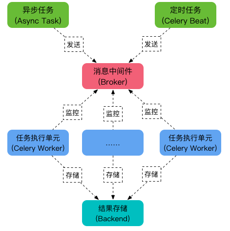

# Celery

Celery是一个异步任务的调度工具. Celery 是 Distributed Task Queue--分布式任务队列

1. 任务模块 Task
包含异步任务和定时任务。其中，异步任务通常在业务逻辑中被触发并发往任务队列，
而定时任务由 Celery Beat 进程周期性地将任务发往任务队列。

2. 消息中间件 Broker
Broker，即为任务调度队列，接收任务生产者发来的消息（即任务），将任务存入队列。
Celery 本身不提供队列服务，官方推荐使用 RabbitMQ 和 Redis 等。

2. 任务执行单元 Worker
Worker 是执行任务的处理单元，它实时监控消息队列，获取队列中调度的任务，并执行它。

4. 任务结果存储 Backend
Backend 用于存储任务的执行结果，以供查询。同消息中间件一样，存储也可使用 RabbitMQ, redis 和 MongoDB 等。