# k8s网络
[Kubernetes网络三部曲之一～Pod网络](https://blog.csdn.net/yang75108/article/details/101101384)
[Kubernetes网络三部曲之二～Service网络](https://blog.csdn.net/yang75108/article/details/101267444)
[Kubernetes网络三部曲之三 ~ NodePort vs LoadBalancer vs Ingress](https://blog.csdn.net/yang75108/article/details/101268208)

## Pod网络
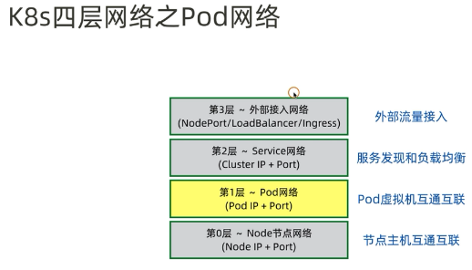**

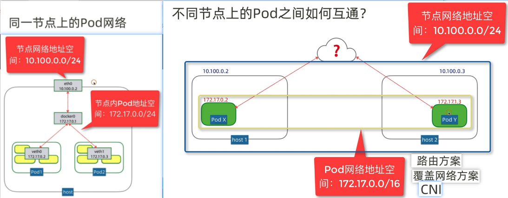

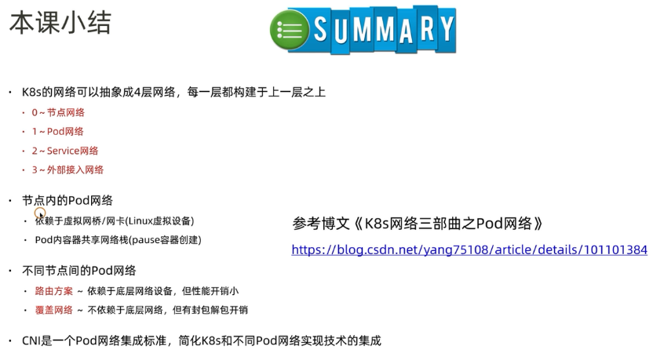

## Service网络概念模型
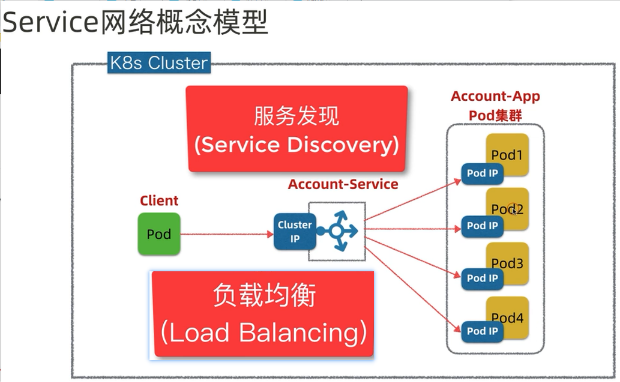

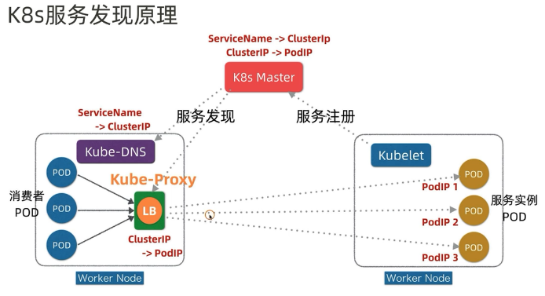
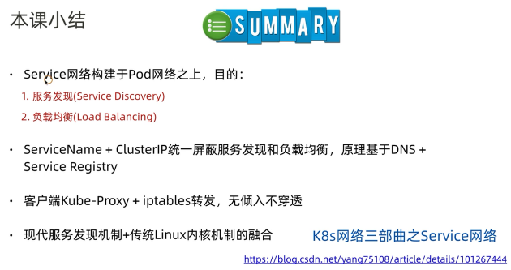

##  NodePort vs LoadBalancer vs Ingress
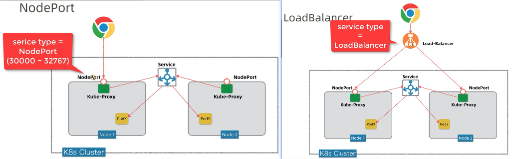
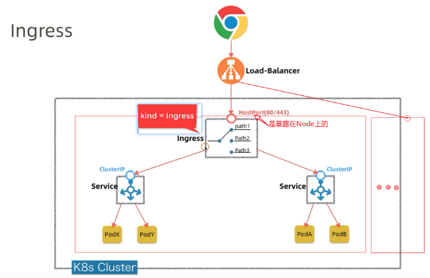

调试时可使用如下方法:
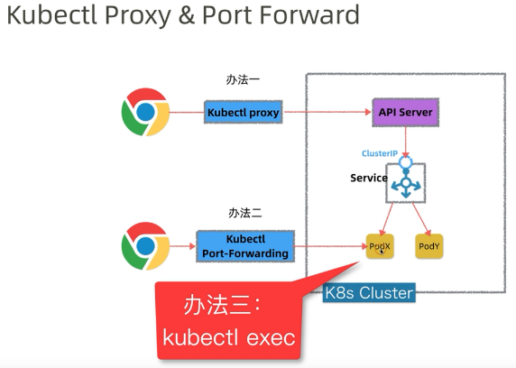

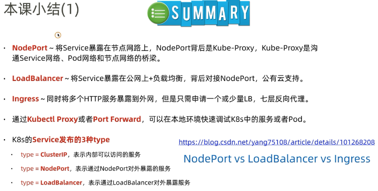
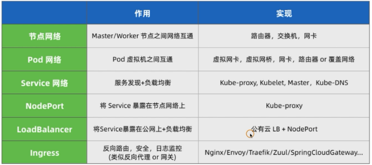

