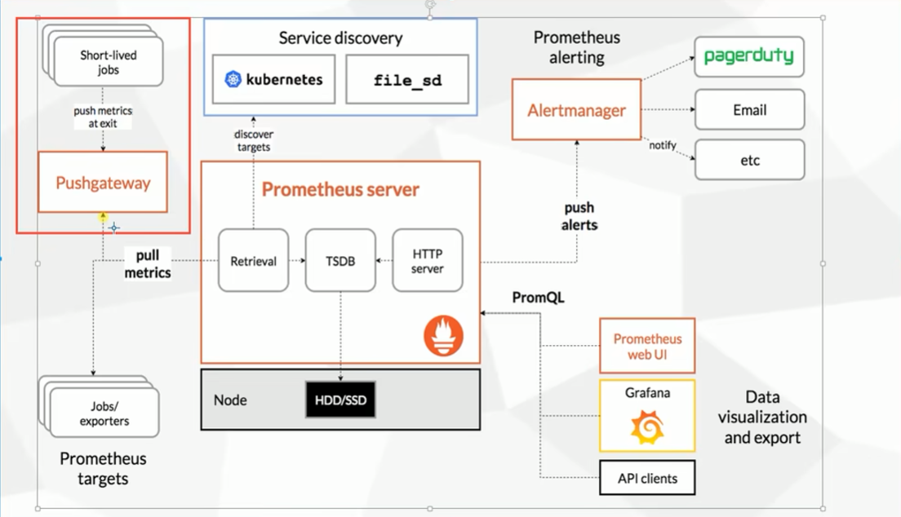
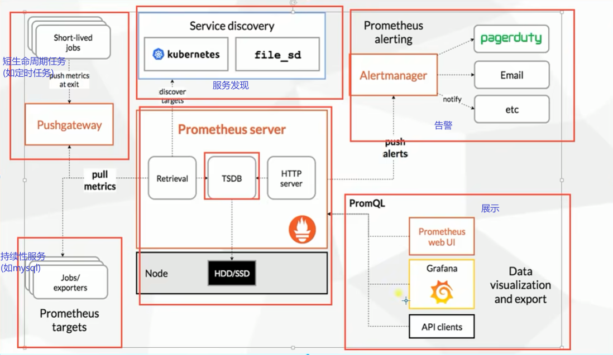
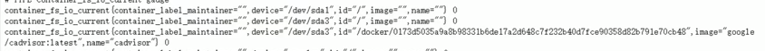
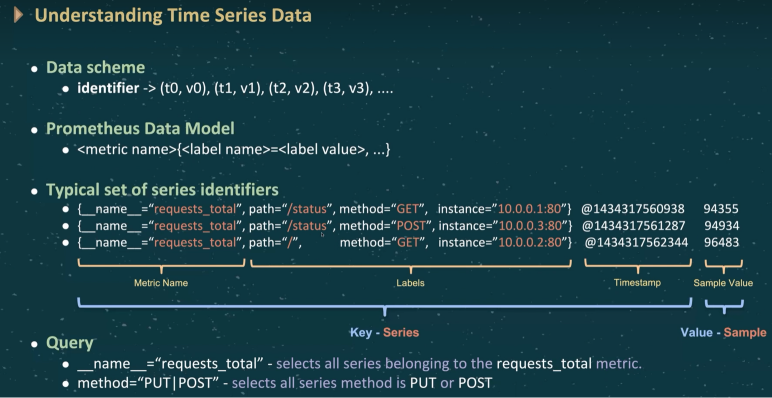
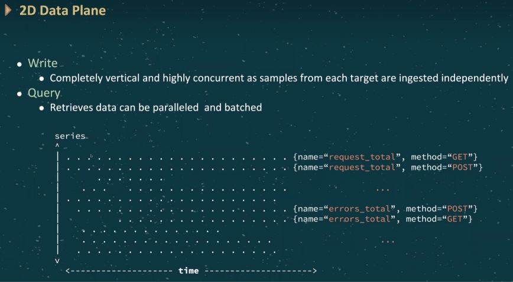

# prometheus(普罗米修斯监控)

[容器监控：cAdvisor use-prometheus-monitor-container](https://yunlzheng.gitbook.io/prometheus-book/part-ii-prometheus-jin-jie/exporter/commonly-eporter-usage/use-prometheus-monitor-container)

[grafana官方仪表盘库](https://grafana.com/solutions/)
Docker主机监控模板: 193
Linux主机监控模板: 9276

格式示例:

