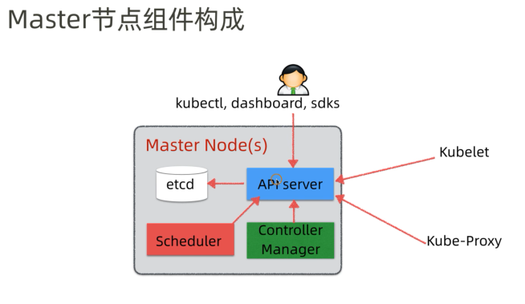
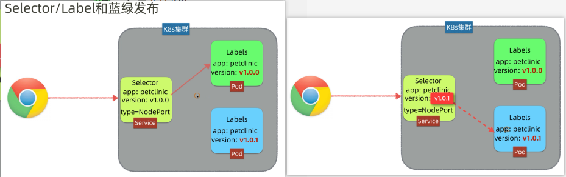
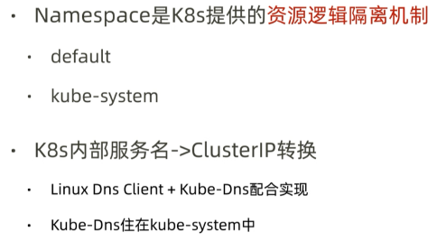
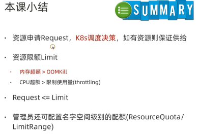
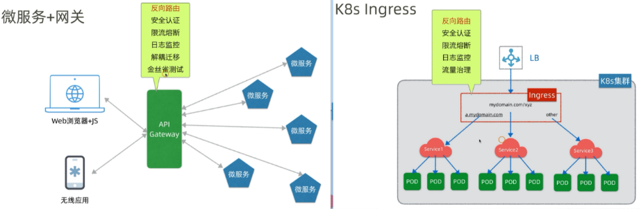

# 基础概念
## 架构概览

## master节点构成

## worker节点构成

## 流程样例

## k8s总体架构

## 小结

# Pod

# NodePort Service

# 蓝绿发布

# ClusterIP 

# Namespace

# ConfigMap

# Secret

# PV/PVC

# 资源限额 request/limit

# Metrics Server
使用top命令查看node/pod的资源占用情况时,需要部署'metrics-server'
* kubectl top nodes  -n NAMESPACE
* kubectl top pods  -n NAMESPACE

# 获取kubernetes-dashboard的token
1. get secret -n kubernetes-dashboard
2. kubectl describe secret SECRET_NAME -n kubernetes-dashboard

# 就绪探针 & 存活探针

# 微服务 & Ingress

## ingress-nginx
1. 安装 Nginx IngressController
2. 发布ingress

## SwitchHosts工具设置本地DNS
https://github.com/old/SwitchHosts

# Prometheus
# 常用命令
* kubectl get all -n NAMESPACE
* kubectl apply -f xxx-pod.yaml  # kubectl apply -f .
* kubectl get nodes  -n NAMESPACE
* kubectl get node  -n NAMESPACE
* kubectl describe node  -n NAMESPACE
* kubectl get pods  -n NAMESPACE
* kubectl get pod podName  -n NAMESPACE
* kubectl get servers  -n NAMESPACE
* kubectl top nodes  -n NAMESPACE
* kubectl top pods  -n NAMESPACE
* kubectl logs POD_NAME -n NAMESPACE
* kubectl exec -it POD_NAME [-c CONTAINERE_NAME]  -n NAMESPACE /bin/bash
* kubectl exec -it POD_NAME --entrypoint /bin/bash
