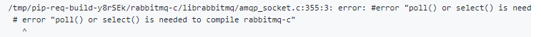
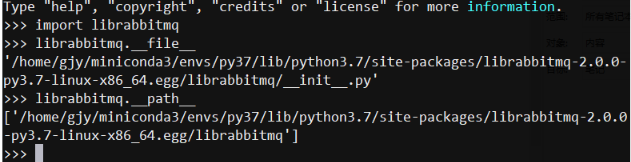

[toc]
# librabbitmq的编译

librabbitmq依赖于rabbitmq-c， 需要先编译rabbitmq-c.
如果直接编译librabbitmq会报如下错误：


1. rabbitmq-c的编译
rabbitmq-c是一个 使用RabbitMQ broker 2.0+的C语言AMQP客户端库。
[rabbitmq-c构建与使用参考](https://github.com/alanxz/rabbitmq-c)


```
1. 下载并解压 rabbitmq-c的最新稳定版本
[rabbitmq-c的最新稳定版本](https://github.com/alanxz/rabbitmq-c/releases/latest)
2. 构建
mkdir build && cd build
cmake ..
cmake --build . [--config Release]

3. 安装库（可以选择指定安装位置)
cmake -DCMAKE_INSTALL_PREFIX=/usr/local ..
cmake --build . [--config Release] --target install

4. 测试
在运行example之前，要起Rabbitmq服务，监听在 localhost的5672端口，然后下面的操作才能正常工作
apt-get install erlang-nox # 安装erlang(rabbitMq需要erlang语言的支持)
sudo apt-get install rabbitmq-server # 安装rabbitmq-server
sudo rabbitmq-server # 启动rqbbitmq-server

开始测试：
./examples/amqp_listen localhost 5672 amq.direct test
./examples/amqp_sendstring localhost 5672 amq.direct test "hello world"
# 事实上'./examples/amqp_listen localhost 5672 amq.direct test'并不是真正起一个rabbitmq的服务(监听localhost:5672); 而是模拟rabbitmq server(如果在5672端口收到正确的数据，则打印相应的信息)。这个模拟的server可以不用起也可以成功往localhost:5672 发数据。
```


2. 构建librabbitmq
方法一: 直接安装 `pip install librabbitmq` 
方法二: 手动安装
```
1. 下载源码 git clone git://github.com/celery/librabbitmq.git
2. make rebuild
```
如果失败，则先安装下如下工具:
    apt-get install -y --no-install-recommends \
            autoconf \
            automake \
            pkg-config \
            libtool
            
安装成功为可在python中正常import 


