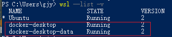
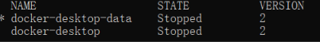

# wsl_docker
环境: win10 + WSL2 + 'Docker Desktop'

安装参考： [wsl-containers 安装参考](https://learn.microsoft.com/zh-cn/windows/wsl/tutorials/wsl-containers)

默认情况下，Docker Desktop for Window会创建如下两个发行版（distro)

其默认保存路径为: `C:\Users\xxx\AppData\Local\Docker\wsl`
```
docker-desktop (对应distro/ext4.vhdx)
docker-desktop-data （对应data/ext4.vhdx）
按官网提示：vhdx文件最大支持256G，超出大小会有异常[1]
```

将docker移动到其他目录,即是将这两个`DISTRO-NAME`迁移到其它目录, 参考[迁移安装的wsl发行版.md](./迁移安装的wsl发行版.md)

docker-desktop-data对应了image的存放：

1. 停止`DISTRO-NAME`
    右键单击Docker Desktop图标关闭Docker桌面，然后选择退出Docker桌面: `wsl --list -v`确保两个状态都已停止


2. 将docker-desktop-data导出到文件中:
    `wsl --export docker-desktop-data "./docker-desktop-data.tar"
3. wsl取消注册docker-desktop-data: `wsl --unregister docker-desktop-data`
Note: 'C:\Users\xxx\AppData\Local\Docker\wsl\data\ext4.vhdx'将被自动删除
4. 将导出的docker-desktop-data再导入回wsl:`wsl --import docker-desktop-data "D:\wsl" "./docker-desktop-data.tar"`
5. 启动Docker Desktop，验证
